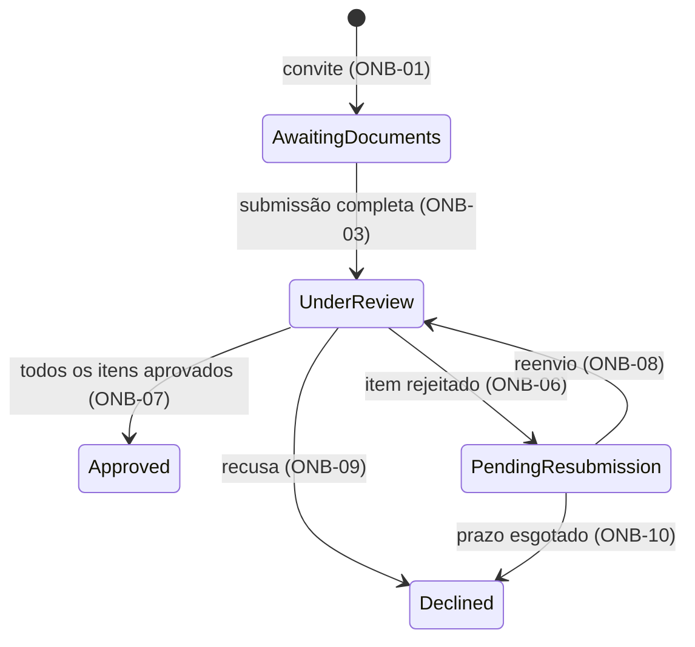

# Exemplo de PRD no formato-alvo

PRD tier complexa de um único contexto (sem PRD 0000). Leia quando houver dúvida sobre a forma de uma seção; não é template a copiar. As regras que ele aplica estão em writing.md. Os números (lead time, percentuais, prazos) são ilustrativos; as referências normativas foram lidas na data indicada e a Circular BCB aparece como `[PREMISSA]` porque o artigo não foi conferido no texto.

````markdown
<!-- prd-tier: complexa -->
# Verificação Assíncrona de Documentos para Onboarding

| | |
|---|---|
| **Status** | Rascunho |
| **Autor** | A. Souza |
| **Data** | 2026-09-05 |
| **Contexto Originário** | Customer Onboarding (primário); afeta Account Activation e Compliance Review |
| **Confiança** | Média — uma premissa crítica em validação |

Prefixo dos requisitos: `ONB`. Contexto único; não há PRD 0000.

## Resumo Executivo

O onboarding de clientes PJ depende de troca de e-mails entre operações e compliance para verificar documentos: lead time de 5 dias úteis e retrabalho recorrente por submissão fora do padrão. Substituir por um caso de verificação com estado explícito: a submissão acontece sem depender da agenda de compliance, cada item é validado contra critério definido e a elegibilidade de ativação deriva do estado do caso. Métrica primária: lead time da submissão completa à ativação em até 1 dia útil.

## Alinhamento Estratégico

Time-to-revenue é o objetivo do trimestre; concorrentes ativam em D+1 e o gargalo de verificação é a maior parcela do nosso lead time. Digitalizar o fluxo é pré-condição para o self-service de v2.

## Contexto e Problema

[FATO] A verificação é manual: e-mail e planilha entre operações e compliance. Lead time médio de 5 dias úteis; 30% dos casos voltam por documento fora do padrão.

[FATO] A ativação da conta só ocorre depois da aprovação de compliance, e hoje essa aprovação é uma mensagem de e-mail sem registro estruturado.

[PREMISSA-CRÍTICA] O lead time é causado pela troca manual e pela espera, não pela complexidade da análise. Se falsa, a análise continua custosa depois da digitalização, o ganho é marginal e a iniciativa não se paga; validar medindo o tempo efetivo de análise em 20 casos antes de aprovar.

## Usuário-alvo / JTBD

- Analista de compliance: validar cada documento contra critério definido, com rastro, sem coordenar por inbox.
- Operador de onboarding: saber em que pé está cada cliente e o que falta, sem perguntar a compliance.
- Account Activation (contexto consumidor): saber se o cliente está elegível para ativação sem interpretar e-mails.

## Solução Proposta

Um caso de verificação por cliente, com itens (um por documento exigido) e uma máquina de estados explícita. Rótulos citam o requisito que governa a transição.



| Estado | Identificador | Significado |
|---|---|---|
| Aguardando documentos | `AwaitingDocuments` | Convite ativo; itens exigidos ainda não submetidos por completo |
| Em análise | `UnderReview` | Todos os itens submetidos; compliance valida |
| Com pendência | `PendingResubmission` | Pelo menos um item rejeitado; só esses aceitam reenvio |
| Aprovado | `Approved` | Todos os itens aprovados; elegível para ativação; terminal |
| Recusado | `Declined` | Recusa de compliance ou prazo esgotado; terminal |

Armazenamento de documentos, notificação, filas e desenho de tela são downstream.

## Glossário de Domínio

| Termo | Definição |
|---|---|
| Caso de verificação | Conjunto de itens exigidos de um cliente e o estado resultante. Um por cliente por onboarding. |
| Item | Um documento exigido pelo checklist, com estado próprio: pendente, aprovado, rejeitado. |
| Checklist | Lista de itens exigidos por tipo de cliente. Definida por compliance (ONB-05). |
| Submissão completa | Instante em que todo item do checklist tem documento anexado (ONB-03). |
| Elegibilidade de ativação | Propriedade derivada do estado do caso (ONB-11); não é decisão do operador. |

## Functional Requirements

Cada requisito é uma condição verificável.

### Submissão

- **ONB-01 (Must)** Todo caso nasce em Aguardando documentos a partir de um convite ativo; não há criação em outro estado.
- **ONB-02 (Must)** Na v1 o operador de onboarding submete os documentos em nome do cliente, a qualquer momento enquanto o convite está ativo, independentemente da disponibilidade de compliance.
- **ONB-03 (Must)** O caso passa a Em análise no instante em que todo item do checklist tem documento anexado.
- **ONB-04 (Must)** Submissão de item fora do padrão (formato ou tamanho fora do checklist) é rejeitada no ato, informando o critério violado.

### Validação

- **ONB-05 (Must)** O checklist por tipo de cliente é definido por compliance e versionado; o caso usa a versão vigente no convite.
- **ONB-06 (Must)** Rejeição de item exige motivo entre os critérios do checklist e leva o caso a Com pendência.
- **ONB-07 (Must)** O caso passa a Aprovado quando todo item está aprovado; Aprovado é terminal.
- **ONB-08 (Must)** Em Com pendência, só itens rejeitados aceitam reenvio; o reenvio leva o caso a Em análise.
- **ONB-09 (Must)** Compliance pode recusar o caso em Em análise com motivo registrado; Recusado é terminal.
- **ONB-10 (Must)** Caso em Com pendência por mais de 10 dias úteis passa a Recusado com motivo "prazo esgotado".

### Ativação e auditoria

- **ONB-11 (Must)** Elegibilidade de ativação é verdadeira se e somente se o caso está Aprovado.
- **ONB-12 (Must)** Toda submissão, validação e transição registra autor, instante e motivo, consultável por caso e por cliente.

## Non-functional Requirements

- **ONB-NFR-01** Submissão completa é refletida como Em análise em até 1 minuto.
- **ONB-NFR-02** Documentos de caso Recusado são retidos por no máximo 30 dias após a recusa, salvo obrigação legal de guarda, que prevalece pelo prazo que ela fixar.
- **ONB-NFR-03** Dados pessoais não aparecem em rastros de execução; identificadores de caso e de item bastam.

## Considerações Regulatórias

Textos lidos em 2026-09-05.

- [PREMISSA] Circular BCB 3.978/2020, art. 2º: identificação e qualificação do cliente antes do início do relacionamento → ONB-05, ONB-11. Validar com compliance se o checklist atual cobre a qualificação.
- [FATO] LGPD, art. 15, I: o tratamento termina quando a finalidade é alcançada → ONB-NFR-02.
- [FATO] LGPD, art. 16, I: conservação permitida para cumprimento de obrigação legal → exceção de ONB-NFR-02.
- [LACUNA] Regulação setorial além de KYC e LGPD para o segmento PJ; validar com compliance.

## Não-objetivos

- Onboarding de outros segmentos (consumidor, enterprise com contrato customizado).
- Assinatura digital de contrato.
- Self-service do cliente para atualização contínua de cadastro.
- Revisão do mérito das regras do checklist.

## Trade-offs Declarados

- **v1 sem self-service direto do cliente (ONB-02).** *Custo:* operações continua intermediária no upload; carga humana parcialmente preservada. *Razão:* validar o fluxo internamente antes de expor reduz risco reputacional e regulatório; self-service é v2.
- **Checklist modelado a partir do processo atual, sem revisitar o mérito.** *Custo:* regra legada de baixo valor persiste no fluxo digital. *Razão:* revisitar mérito cruza a fronteira de compliance e expande escopo; é iniciativa separada depois da baseline digital.
- **Prazo de pendência fixo em 10 dias úteis.** *Custo:* cliente lento é recusado e precisa de novo convite. *Razão:* caso aberto sem fim inflaria o lead time medido e o estoque de compliance.

## Métricas de Sucesso

- Leading: 80% dos onboardings iniciados pelo novo fluxo em 30 dias; resposta de compliance em até 4 h após Em análise.
- Lagging: lead time da submissão completa à ativação em até 1 dia útil em 90% dos casos após 60 dias; zero retrabalho por documento fora do padrão.
- Guardrails: taxa de rejeição em auditoria pós-onboarding no baseline ou abaixo; tickets de suporte abertos pelo cliente durante o onboarding no baseline ou abaixo; tempo efetivo de análise estável (o ganho vem de eliminar espera, não de acelerar análise).

## Critérios de Aceitação

Checklist com 3 itens, prazo de pendência de 10 dias úteis.

| Caso | Entrada | Intermediários | Ramo | Resultado |
|---|---|---|---|---|
| Submissão completa | 3 itens anexados às 10h00 | todos no padrão | ONB-03 | Em análise até 10h01 (ONB-NFR-01) |
| Item fora do padrão | item 2 em formato não aceito | critério violado: formato | ONB-04 | item recusado no ato; caso segue Aguardando documentos |
| Rejeição parcial | itens 1 e 3 aprovados, 2 rejeitado | motivo do checklist | ONB-06 | Com pendência; só o item 2 aceita reenvio (ONB-08) |
| Reenvio parcial com dois rejeitados | itens 2 e 3 rejeitados, só o 2 reenviado | item 3 continua rejeitado | ONB-08 | caso permanece Com pendência; reenvio do item 1 (aprovado) é rejeitado |
| Aprovação | reenvio do item 2 aprovado | 3 de 3 aprovados | ONB-07 | Aprovado; elegibilidade verdadeira (ONB-11) |
| Prazo esgotado | Com pendência há 11 dias úteis | sem reenvio | ONB-10 | Recusado, motivo "prazo esgotado"; elegibilidade falsa |

- **Dado** um cliente Aprovado, **quando** um auditor consulta o histórico, **então** vê toda submissão, validação e transição com autor, instante e motivo (ONB-12).

## Dependências e Riscos

| Item | Tipo | Impacto |
|---|---|---|
| Definição do checklist por tipo de cliente | Dependência de negócio | Bloqueante: sem checklist não há caso |
| Account Activation lê a elegibilidade | Acoplamento entre contextos | ONB-11 é o contrato; mudança de estado sem aviso quebra a ativação |
| Migração de clientes em onboarding | Risco | Casos em curso precisam de estado inicial equivalente |

## Perguntas em Aberto

- Blocker de aprovação: a `[PREMISSA-CRÍTICA]` do Contexto (lead time causado pela espera, não pela análise). Dono: operações; resolve com a medição do tempo efetivo de análise em 20 casos.
- Há regulação setorial além de KYC e LGPD para o segmento PJ que acrescente itens ao checklist (ONB-05)? `[LACUNA]` de Considerações Regulatórias. Dono: compliance; resolve com parecer por escrito antes de o PRD passar a Em Revisão.

## Ponto de Maior Fragilidade

A decisão de **modelar o checklist a partir do processo atual sem revisitar o mérito das regras** (Trade-offs).

*Vetor de ataque:* digitalizar um processo manual ruim entrega um processo digital ruim, mais rápido. Se uma fração relevante das rejeições atuais vem de regra legada dispensável, "zero retrabalho" não é alcançável sem tocar no mérito, e adiar a revisão para "iniciativa separada" protege a causa-raiz.

*Desafie antes de aprovar:* há evidência de que o checklist atual é majoritariamente valor real e não cerimônia herdada? Sem ela, mova uma triagem mínima de mérito para a v1 ou rebaixe a meta de retrabalho até a baseline digital existir.

## Referências

- [Circular BCB 3.978/2020](https://www.bcb.gov.br/estabilidadefinanceira/exibenormativo?tipo=Circular&numero=3978), art. 2º. Lida em 2026-09-05.
- [Lei 13.709/2018 (LGPD)](https://www.planalto.gov.br/ccivil_03/_ato2015-2018/2018/lei/l13709.htm), arts. 15 e 16. Lida em 2026-09-05.
````
