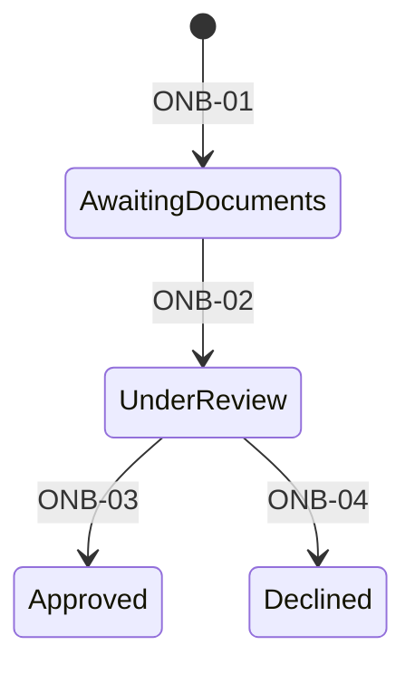

# Exemplo de PRD

Exemplo didático de um único contexto, sem PRD 0000. Todos os números e comportamentos pertencem ao cenário fictício; não representam decisões deste repositório. Consulte apenas a seção necessária. O bloco pode ser extraído e validado como `0001-customer-onboarding-document-verification.md`.

````markdown
# Verificação de documentos no cadastro

| | |
|---|---|
| **Originating Context** | Customer Onboarding |

Requirement prefix: `ONB`. Exemplo com um único contexto.

## Executive Summary

A verificação depende de trocas manuais entre operação e análise. A capacidade proposta mantém um caso com documentos, estado e histórico consultáveis, permitindo acompanhar o resultado da revisão. A meta do cenário é concluir 90% das verificações em um dia útil após o envio completo.

## Context and Problem

Neste cenário fictício, a operação consulta mensagens para descobrir documentos pendentes. O histórico disperso dificulta identificar quem decidiu e qual critério foi aplicado.

## Target User / JTBD

- Operador: enviar os documentos e acompanhar o resultado.
- Analista: verificar cada documento pelo critério vigente e registrar a decisão.

## Proposed Solution

Um caso reúne os documentos e permite acompanhar a decisão. As transições são governadas por ONB-01 a ONB-04.



| Estado | Identifier | Significado |
|---|---|---|
| Aguardando documentos | `AwaitingDocuments` | Caso iniciado conforme ONB-01 |
| Em análise | `UnderReview` | Envio completo conforme ONB-02 |
| Aprovado | `Approved` | Resultado de ONB-03 |
| Recusado | `Declined` | Resultado de ONB-04 |

Armazenamento, transporte de mensagens e interface são decisões posteriores.

## Domain Glossary

| Termo | Definição |
|---|---|
| Caso | Conjunto de documentos e resultado de uma verificação |
| Critério | Condição de análise definida para cada documento do caso |

## Functional Requirements

- **ONB-01 (Must)** Um caso novo começa em `AwaitingDocuments`.
- **ONB-02 (Must)** O caso passa para `UnderReview` quando todos os documentos exigidos foram enviados.
- **ONB-03 (Must)** Em `UnderReview`, aprovar todos os documentos leva o caso a `Approved`, estado terminal.
- **ONB-04 (Must)** Em `UnderReview`, o analista pode recusar o caso com um motivo registrado; o resultado é `Declined`, estado terminal.
- **ONB-05 (Must)** Cada envio e decisão registra autor e instante, consultáveis por caso.

## Declared Trade-offs

- **Envio intermediado pelo operador.** *Cost:* a operação mantém trabalho manual. *Reason:* o cenário prioriza validar o fluxo interno.

## Success Metrics

- Resultado: 90% dos casos concluídos em um dia útil após o envio completo.
- Guardrail: a taxa de decisões corrigidas após revisão não supera a linha de base do cenário.

## Acceptance Criteria

| Caso | Entrada | Ramo | Resultado |
|---|---|---|---|
| Envio incompleto | Dois de três documentos enviados | ONB-02 | `AwaitingDocuments` |
| Envio completo | Três de três documentos enviados | ONB-02 | `UnderReview` |
| Aprovação completa | Três documentos aprovados em análise | ONB-03 | `Approved` |

- **Given** um caso aprovado, **when** o operador consulta o histórico, **then** vê autor e instante de cada envio e decisão (ONB-05).
````

## Exemplo de revisão de prosa

Antes: “Deverá ser realizada a gravação do autor e do instante de cada envio e decisão.”

Depois: “Cada envio e decisão registra autor e instante.”

O fragmento ilustra voz direta. A obrigação completa de ONB-05 inclui a consulta por caso e deve ser preservada ao revisar o requisito inteiro.
