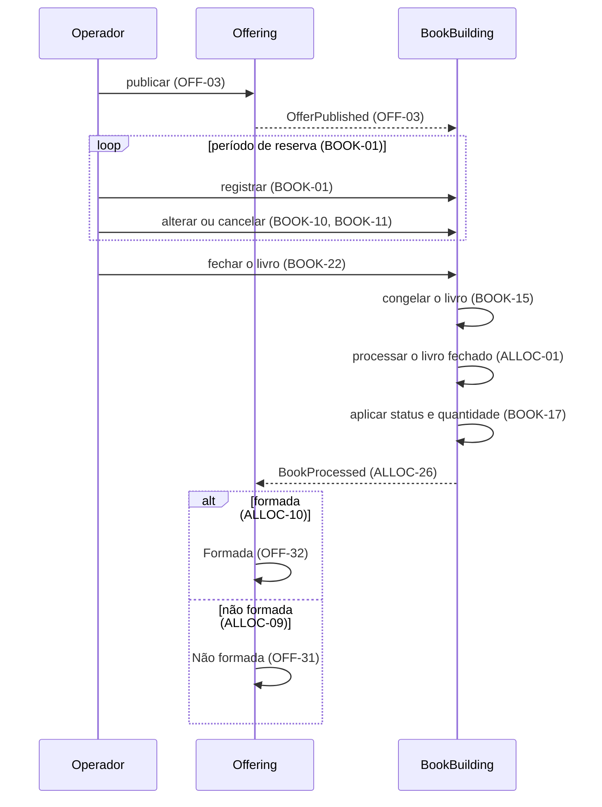
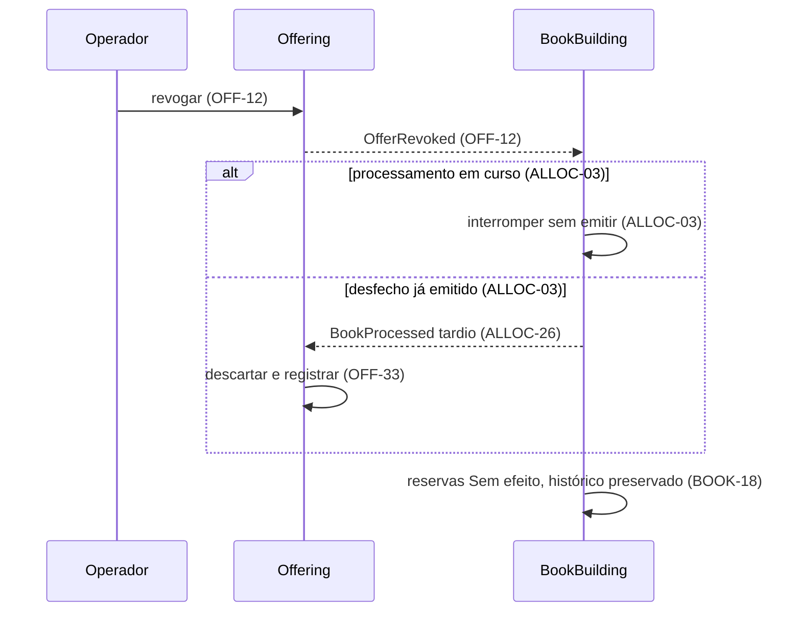

<!-- prd: overview -->
# Visão Geral da Plataforma

| | |
|---|---|
| **Scope** | Propósito, mapa de contextos, catálogo de eventos e fluxos entre contextos; regras de negócio pertencem aos PRDs donos e são referenciadas por ID. |

## Purpose

A plataforma demonstra um recorte executável da distribuição de cotas de classe fechada por uma corretora a investidores finais, com base nas Resoluções CVM 160 e CVM 175. O operador atua em nome do investidor; liquidação financeira e integrações externas ficam fora do modelo. O projeto não tem uso em produção: suas métricas medem correção por cenários e invariantes verificáveis. O recorte e as decisões de produto são do autor e estão registrados nos PRDs de domínio, junto com as fontes normativas.

## Contexts

| Contexto | Responsabilidade | PRD | Prefixo de ID | Posição |
|---|---|---|---|---|
| Offering | Definição imutável da oferta e sua máquina de estados | [0001](0001-offering-offer-lifecycle.md) | `OFF` | Upstream: o BookBuilding consome a definição e o estado e não os altera; o Offering assume o desfecho como estado final. |
| BookBuilding | Reservas contra oferta Aberta, fechamento do livro pelo operador, livro congelado no fechamento, processamento único do livro fechado (vedação a vinculadas, formação, condicionamento e rateio) e status por reserva | [0002](0002-book-building-bid-lifecycle.md) ciclo de vida da reserva; [0003](0003-book-building-book-processing.md) processamento do livro | `BOOK`, `ALLOC` | Contexto core: consome o Offering, fecha e processa o livro e devolve o desfecho. |

Cada contexto mantém sua persistência; as relações usam eventos. O Offering permanece upstream para mudanças incompatíveis de contrato. O BookBuilding tem um PRD por capability, cada um com seu prefixo; o desfecho do livro, formada ou não formada, é apurado por ele (ALLOC-09, ALLOC-10), e o Offering o assume como estado final (OFF-31 a OFF-33). O fechamento do livro é ação do operador no BookBuilding (BOOK-22) e não passa pelo Offering.

Os requisitos são citados pelo prefixo e número; sua definição ocorre somente no PRD dono. Identificadores de domínio seguem os glossários desses documentos.

## Event Catalog

| Evento | Produtor | Consumidores | Gatilho | IDs |
|---|---|---|---|---|
| `OfferPublished` | Offering | BookBuilding | Publicação; inclui a definição completa | OFF-03, BOOK-01 |
| `OfferRevoked` | Offering | BookBuilding | Revogação pelo operador em Aberta ou Formada | OFF-12, BOOK-18, ALLOC-03 |
| `BookProcessed` | BookBuilding | Offering | Conclusão do processamento; carrega o desfecho, o ramo aplicado e o resultado por reserva | ALLOC-26, OFF-31 a OFF-33 |

Todo evento identifica a oferta, o estado resultante da operação e seu instante. Em `BookProcessed`, o estado comunicado é o desfecho do processamento, que o Offering assume como estado (OFF-31, OFF-32) quando aceito (OFF-33). A definição completa acompanha `OfferPublished`; a informação do processamento segue ALLOC-26. Formada e Não formada não têm evento próprio na v1 porque não há consumidor. Fechamento do livro, congelamento, processamento e aplicação do resultado são internos ao BookBuilding e não geram evento entre contextos (BOOK-22, BOOK-15, ALLOC-01, BOOK-17).

São candidatos futuros, condicionados à existência de consumidores: `OfferBecameUnconditional`, `OfferLapsed`, `BookClosed`, `BidPlaced`, `BidChanged` e `BidWithdrawn`.

## Flows Between Contexts

Os diagramas mostram a ordem lógica das operações; transporte e sincronização precisam atender ao NFR relacionado na decisão delegada a ADR.

A revogação é permitida em Aberta e Formada (OFF-12); os dois contextos convergem ao mesmo estado final independentemente da ordem de entrega. No BookBuilding, a revogação interrompe o processamento em curso (ALLOC-03) e torna as reservas sem efeito, antes ou depois do resultado (BOOK-18); um desfecho já emitido não muda (ALLOC-03) e, chegando ao Offering depois da revogação, é descartado (OFF-33).

## Decisions Delegated to ADR

| Decisão | Exigência que a ADR precisa satisfazer |
|---|---|
| Transporte dos eventos entre contextos | OFF-NFR-03 |
