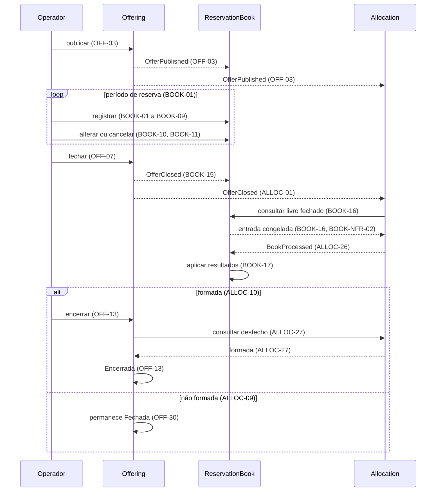
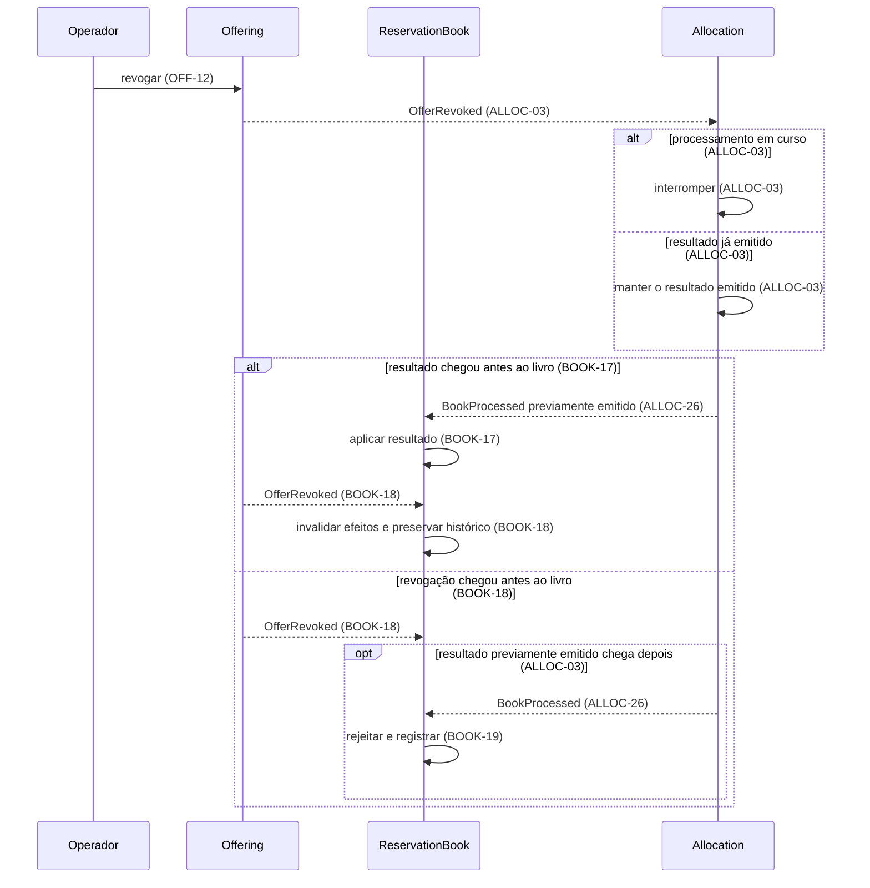

<!-- prd: overview -->
# Visão Geral da Plataforma

| | |
|---|---|
| **Escopo** | Propósito, mapa de contextos, catálogo de eventos e fluxos entre contextos; regras de negócio pertencem aos PRDs donos e são referenciadas por ID. |

## Propósito

A plataforma demonstra um recorte executável da distribuição de cotas de classe fechada por uma corretora a investidores finais, com base nas Resoluções CVM 160 e CVM 175. O operador atua em nome do investidor; liquidação financeira e integrações externas ficam fora do modelo. O projeto não tem uso em produção: suas métricas medem correção por cenários e invariantes verificáveis. O recorte e as decisões de produto vêm dos quatro briefings de `prd-briefings.md`, fora do repositório; as fontes normativas estão nos PRDs de domínio.

## Contextos

| Contexto | Responsabilidade | PRD | Prefixo de ID | Posição |
|---|---|---|---|---|
| Offering | Definição imutável da oferta e sua máquina de estados (OFF-01 a OFF-29) | [0001](0001-offering-offer-lifecycle.md) | `OFF` | Upstream: os demais consomem a definição e não a alteram; não consome evento. |
| ReservationBook | Reservas contra oferta Aberta, livro congelado no fechamento e status por reserva (BOOK-01 a BOOK-21) | [0002](0002-reservation-book-reservation-lifecycle.md) | `BOOK` | Consome Offering e fornece a entrada para Allocation. |
| Allocation | Processamento único do livro fechado: vedação a vinculadas, formação, condicionamento e rateio (ALLOC-01 a ALLOC-27) | [0003](0003-allocation-book-processing.md) | `ALLOC` | Contexto core; consome os outros dois, devolve o resultado ao ReservationBook e expõe o desfecho por consulta. |

Cada contexto mantém sua persistência; as relações usam eventos ou consulta ao dono. Offering permanece upstream para mudanças incompatíveis de contrato. O desfecho do livro, formada ou não formada, pertence ao Allocation e não altera o estado da oferta (OFF-30); o Offering o consulta para encerrar (OFF-13, ALLOC-27).

Os requisitos são citados pelo prefixo e número; sua definição ocorre somente no PRD dono. Identificadores de domínio seguem os glossários desses documentos.

## Catálogo de eventos

| Evento | Produtor | Consumidores | Gatilho | IDs |
|---|---|---|---|---|
| `OfferPublished` | Offering | ReservationBook, Allocation | Publicação; inclui a definição completa | OFF-03, BOOK-01, ALLOC-01 |
| `OfferClosed` | Offering | ReservationBook, Allocation | Fechamento pelo operador | OFF-07, BOOK-15, ALLOC-01 |
| `OfferRevoked` | Offering | ReservationBook, Allocation | Revogação pelo operador em Aberta ou Fechada | OFF-12, BOOK-18, ALLOC-03 |
| `BookProcessed` | Allocation | ReservationBook | Conclusão do processamento; carrega desfecho, `D`, `Dn`, `D'`, `E`, ramo e resultado por reserva | ALLOC-26, BOOK-17 |

Todo evento identifica a oferta, o estado resultante da operação e seu instante. Em `BookProcessed`, o estado comunicado é o desfecho do processamento, que não altera o estado da oferta (OFF-30). A definição completa acompanha `OfferPublished`; a informação do processamento segue ALLOC-26. Encerrada não tem evento próprio na v1 porque não há consumidor; a formação viaja em `BookProcessed` e é consultável no Allocation (ALLOC-27).

São candidatos futuros, condicionados à existência de consumidores: `OfferBecameUnconditional`, `OfferLapsed`, `OfferCompleted`, `ReservationPlaced`, `ReservationChanged` e `ReservationWithdrawn`. O livro fechado é obtido por consulta (BOOK-16), e não por um evento adicional.

## Fluxos entre contextos

Os diagramas mostram a ordem lógica das operações; transporte e sincronização precisam atender aos NFRs relacionados nas decisões delegadas a ADR.

A revogação é permitida em Aberta e Fechada (OFF-12); os três contextos convergem ao mesmo estado final independentemente da ordem de entrega. A ordem de chegada do resultado e da revogação ao livro é coberta por BOOK-18 e BOOK-19; a preservação do resultado emitido no Allocation segue ALLOC-03.

## Termos por contexto

| Conceito | Allocation | ReservationBook | Regra de correspondência |
|---|---|---|---|
| Atendimento pelo proporcional condicionado ou pelo rateio | `PartiallyFilledByCondition` ou `ScaledBack` | `PartiallyFilled` | ALLOC-25, BOOK-17 |
| Não formação da oferta | `OfferLapsed` | `Void` | ALLOC-25, BOOK-17 |

## Decisões delegadas a ADR

| Decisão | Exigência que a ADR precisa satisfazer |
|---|---|
| Transporte dos eventos entre contextos | OFF-NFR-03 |
| Leitura do livro fechado pelo Allocation | BOOK-NFR-02 |
