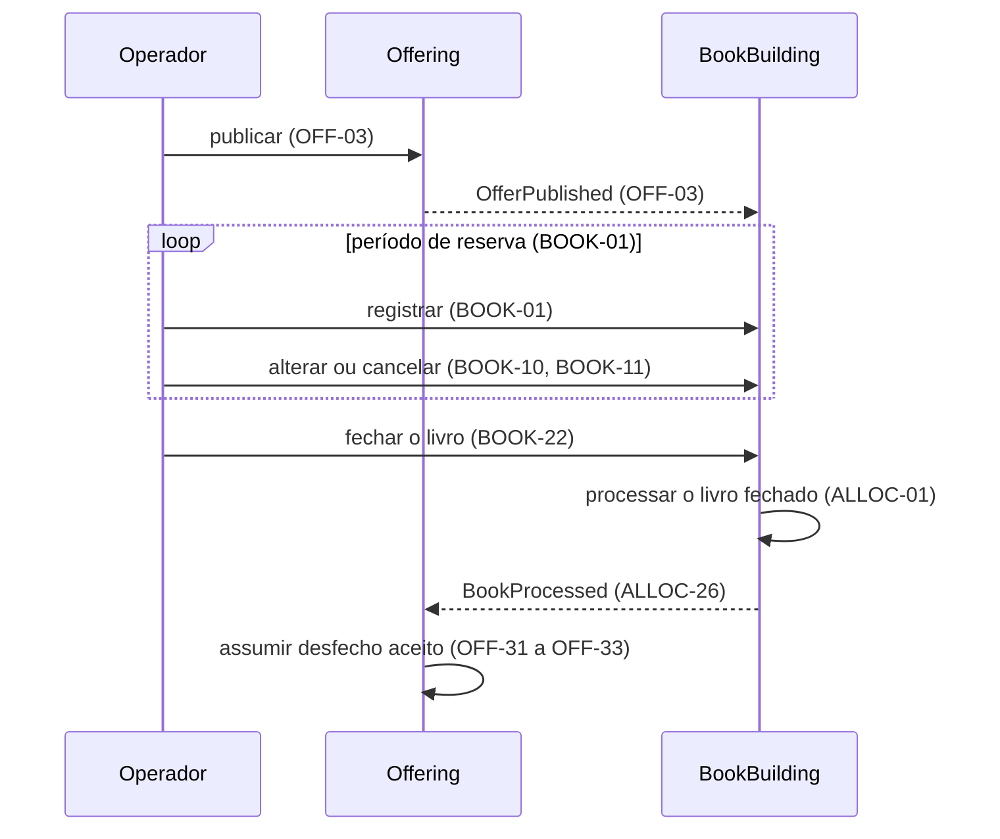
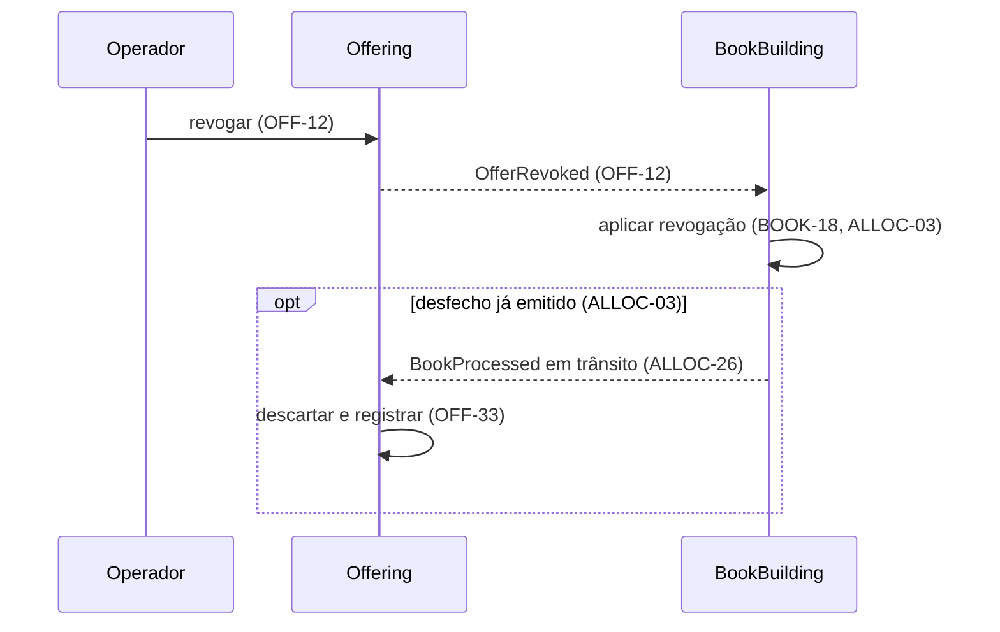

<!-- prd: overview -->
# Visão Geral da Plataforma

| | |
|---|---|
| **Scope** | Propósito, mapa de contextos, catálogo de eventos e fluxos entre contextos; regras de negócio pertencem aos PRDs donos e são referenciadas por ID. |

## Purpose

A plataforma modela a distribuição de cotas de classe fechada por uma corretora a investidores finais. O operador registra as decisões do investidor.

A plataforma tem finalidade demonstrativa e não se destina à operação em produção. Liquidação financeira e integrações externas ficam fora do escopo.

## Contexts

| Contexto | Responsabilidade | PRD | Prefixo de ID | Posição |
|---|---|---|---|---|
| Offering | Definição e ciclo de vida da oferta | [0001](0001-offering-offer-lifecycle.md) | `OFF` | Upstream |
| BookBuilding | Reservas, fechamento e processamento do livro | [0002](0002-book-building-bid-lifecycle.md) ciclo de vida da reserva; [0003](0003-book-building-book-processing.md) processamento do livro | `BOOK`, `ALLOC` | Core |

### Relações entre contextos

Cada contexto mantém sua persistência e se comunica com o outro por eventos. O BookBuilding consome a definição e o estado da oferta sem alterá-los; o Offering permanece upstream para mudanças incompatíveis de contrato.

O fechamento do livro é ação do operador no BookBuilding (BOOK-22) e não passa pelo Offering. O BookBuilding apura o desfecho do livro, formada ou não formada (ALLOC-09, ALLOC-10), e o Offering o assume como estado final (OFF-31 a OFF-33).

## Event Catalog

| Evento | Produtor | Consumidor | Gatilho | Contrato de origem | Recepção |
|---|---|---|---|---|---|
| `OfferPublished` | Offering | BookBuilding | Publicação | [PRD 0001](0001-offering-offer-lifecycle.md#domain-events), OFF-03 | BOOK-01 |
| `OfferRevoked` | Offering | BookBuilding | Revogação | [PRD 0001](0001-offering-offer-lifecycle.md#domain-events), OFF-12 | BOOK-18, ALLOC-03 |
| `BookProcessed` | BookBuilding | Offering | Conclusão do processamento | [PRD 0003](0003-book-building-book-processing.md#domain-events), ALLOC-26 | OFF-31 a OFF-33 |

## Flows Between Contexts

Os diagramas mostram a ordem lógica das interações. As condições de cada operação e seus efeitos internos estão nos requisitos citados.

### Publicação, reservas e processamento

### Revogação

A revogação parte do Offering (OFF-12) e se propaga ao BookBuilding (BOOK-18, ALLOC-03). Os dois contextos convergem ao mesmo estado final independentemente da ordem de entrega: um desfecho já emitido que chegue ao Offering após a revogação é descartado (OFF-33).

## Decisions Delegated to ADR

O transporte e a sincronização das interações acima dependem da decisão técnica abaixo, sujeita ao requisito do Offering.

| Decisão | Exigência que a ADR precisa satisfazer |
|---|---|
| Transporte dos eventos entre contextos | OFF-NFR-03 |
