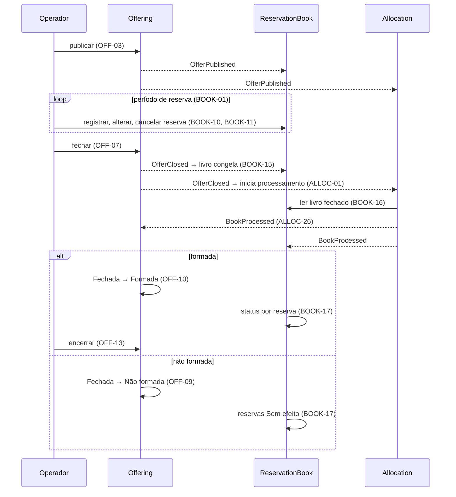
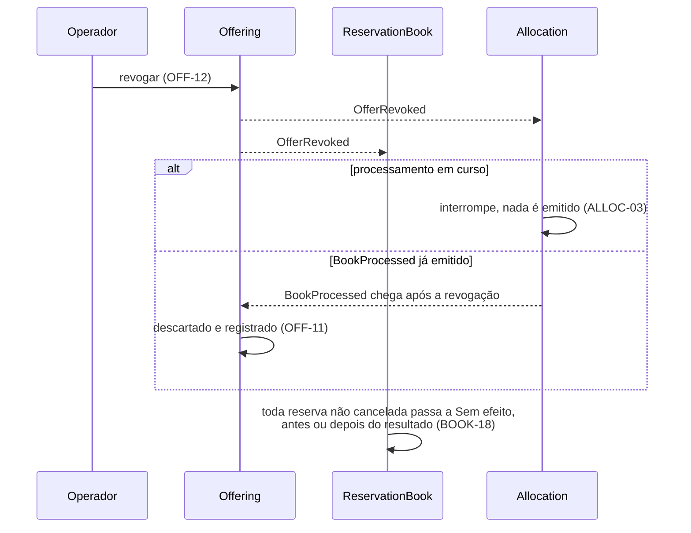

# Visão Geral da Plataforma

| | |
|---|---|
| **Status** | Rascunho |
| **Autor** | Guilherme Salvi |
| **Data** | 2026-09-05 |
| **Escopo** | Propósito, mapa de contextos, catálogo de eventos e fluxos entre contextos. Não contém regra de negócio: toda regra vive no PRD do contexto dono e é citada pelo ID |

## Propósito

[FATO] O projeto é um modelo executável do comportamento regulado pela Resolução CVM 160 (ofertas públicas) e pela Resolução CVM 175 (fundos), reduzido ao mínimo viável, para o caso de uso de corretora distribuindo cotas de fundo fechado a investidor final. Não há liquidação financeira nem integração externa. O investidor não acessa a plataforma; o operador da corretora age em seu nome.

## Contextos

| Contexto | Responsabilidade | PRD | Prefixo de ID | Posição |
|---|---|---|---|---|
| Offering | Definição imutável da oferta e sua máquina de estados | [0001](0001-offering-offer-lifecycle.md) | `OFF` | Upstream: os outros dois leem a oferta e não a alteram |
| ReservationBook | Reservas contra oferta Aberta; livro congelado no fechamento; status por reserva | [0002](0002-reservation-book-reservation-lifecycle.md) | `BOOK` | Consome Offering; fornece o livro fechado ao Allocation |
| Allocation | Processamento único do livro fechado: vedação a vinculadas, formação, condicionamento e rateio | [0003](0003-allocation-book-processing.md) | `ALLOC` | Consome Offering e ReservationBook; devolve o desfecho aos dois |

Regras de integração:

- Contextos não compartilham persistência. Integração é por evento ou por consulta ao contexto dono.
- Offering é upstream: mudança incompatível de contrato só é tolerada partindo dele.
- Requisito é citado por prefixo e número (`OFF-12`, `BOOK-18`, `ALLOC-17`); requisitos não funcionais por `OFF-NFR-03` e equivalentes. O texto do requisito existe só no PRD dono.

## Catálogo de eventos

| Evento | Produtor | Consumidores | Gatilho | Regras |
|---|---|---|---|---|
| `OfferPublished` | Offering | ReservationBook, Allocation | Publicação aprovada; oferta passa a Aberta. Carrega a definição completa | OFF-03, BOOK-01 |
| `OfferClosed` | Offering | ReservationBook, Allocation | Operador fecha o período de reserva | OFF-07, BOOK-15, ALLOC-01 |
| `OfferRevoked` | Offering | ReservationBook, Allocation | Operador revoga, em Aberta, Fechada ou Formada | OFF-12, BOOK-18, ALLOC-03 |
| `BookProcessed` | Allocation | Offering, ReservationBook | Processamento concluído; carrega desfecho, `D`, `Dn`, `D'`, `E`, ramo e resultado por reserva | ALLOC-26, OFF-09 a OFF-11, BOOK-17 |

Payload semântico mínimo de todo evento: identificação da oferta, estado resultante e instante. Formada, Não formada e Encerrada não geram evento na v1 porque nenhum contexto os consome; o desfecho não formada chega ao ReservationBook pelo resultado por reserva de `BookProcessed`. `OfferBecameUnconditional`, `OfferLapsed`, `OfferCompleted` e os eventos de reserva (`ReservationPlaced`, `ReservationChanged`, `ReservationWithdrawn`) são candidatos quando houver consumidor.

O livro fechado não é evento: o Allocation o lê do ReservationBook no início do processamento (BOOK-16).

## Fluxos entre contextos

Rótulos citam o requisito que governa cada passo.

Revogação: permitida em Aberta, Fechada e Formada (OFF-12). Os três contextos convergem para o mesmo estado final independentemente da ordem de entrega dos eventos.

## Decisões delegadas a ADR

| Decisão | Exigência que o ADR precisa satisfazer |
|---|---|
| Transporte dos eventos entre contextos | OFF-NFR-03: definição e estado corrente iguais para todos os consumidores em qualquer instante |
| Leitura do livro fechado pelo Allocation | BOOK-NFR-02: o livro lido é idêntico ao congelado |
