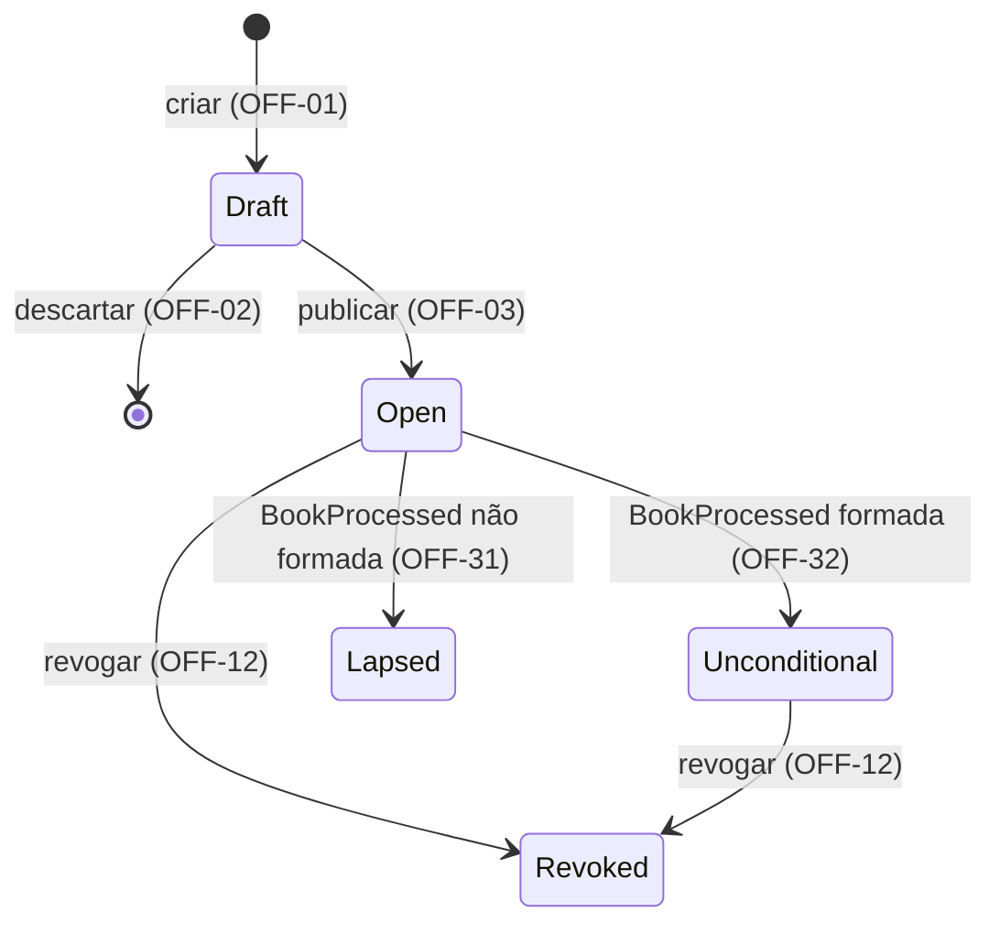

# Cadastro e Ciclo de Vida da Oferta

| | |
|---|---|
| **Originating Context** | Offering; affects BookBuilding |

Requirement prefix: `OFF`. Propósito da plataforma, mapa de contextos, catálogo de eventos e fluxos: [PRD 0000](0000-platform-overview.md).

## Executive Summary

Reservas e alocações dependem de parâmetros confiáveis e de uma indicação inequívoca da situação da oferta. O Offering permite ao operador preparar a definição, publicá-la e conduzir seu ciclo de vida, conforme OFF-01 a OFF-06, OFF-08, OFF-12, OFF-14 e OFF-31 a OFF-33. A métrica primária é a ausência de publicações inválidas, mutações da definição publicada e transições indevidas nos cenários de verificação.

## Context and Problem

Sem uma definição validada e congelada e sem um estado inequívoco, o BookBuilding não tem base: uma reserva não pode ser aceita sem saber que a oferta está aberta e com quais limites e opções, e o livro não pode ser processado sem quantidade base e montante mínimo fixos.

A oferta é a emissão de cotas de fundo fechado vendida como um único conjunto. Na Resolução CVM 175 o fundo se organiza em classes e subclasses (art. 5º, §§ 5º e 7º); como a classe fechada não admite resgate, a distribuição é o único momento de decisão de investimento que o modelo cobre. Os cortes estão em Non-goals; o propósito compartilhado está no PRD 0000.

## Target User / JTBD

- Operador de distribuição da corretora (usuário primário, por decisão do autor): cadastrar a oferta a partir dos documentos aprovados, publicar, revogar quando preciso e acompanhar o desfecho, com parâmetros consistentes e sem risco de alteração depois que reservas começarem.
- BookBuilding: obter a definição publicada e o estado corrente e confiar que a definição não muda.
- O investidor não interage com este contexto; seu ponto de contato é a reserva (PRD 0002).

## Proposed Solution

O operador prepara e publica a definição da oferta (OFF-01 a OFF-05) e pode revogá-la (OFF-12); as demais transições são as do diagrama (OFF-06). Formada e não formada são o desfecho do livro, apurado pelo BookBuilding (PRD 0003); a oferta o recebe como evento e o assume como estado final do ciclo (OFF-31 a OFF-33). O fechamento do livro é ação do operador sobre o livro (BOOK-22) e não transita a oferta. A semântica das opções pertence a OFF-26 a OFF-29. O diagrama indexa os requisitos de cada transição.

| Estado | Identifier | Significado |
|---|---|---|
| Draft | `Draft` | Minuta em elaboração (OFF-01, OFF-02, OFF-14) |
| Aberta | `Open` | Oferta publicada sem desfecho recebido; o livro é preenchido, fechado e processado pelo BookBuilding enquanto a oferta está aqui (BOOK-22); elegibilidade temporal em OFF-08 e BOOK-01 |
| Formada | `Unconditional` | Desfecho formada recebido (OFF-32); fim do ciclo de sucesso, ainda revogável (OFF-12) |
| Não formada | `Lapsed` | Terminal: desfecho não formada recebido (OFF-31) |
| Revogada | `Revoked` | Terminal por revogação (OFF-12) |

Os atributos publicados são identificados em OFF-15 a OFF-25. Persistência, exposição e experiência de edição são downstream.

## Domain Glossary

Reserva, investidor e fechamento do livro pertencem ao [PRD 0002](0002-book-building-bid-lifecycle.md); a apuração da formação, demanda efetiva e cotas efetivamente distribuídas, ao [PRD 0003](0003-book-building-book-processing.md).

| Termo | Definição |
|---|---|
| Oferta | Emissão de cotas de uma classe fechada, distribuída como um conjunto. |
| Fundo, classe, subclasse | Identificação do objeto da emissão (OFF-16). |
| Número da emissão | Identificação ordinal da emissão de cotas (OFF-16). |
| Nome da oferta | Rótulo descritivo (OFF-15). |
| Draft | Definição em elaboração (OFF-01, OFF-02, OFF-14). |
| Oferta publicada | Definição comprometida pela publicação (OFF-03, OFF-05). |
| Revogada | Oferta tornada ineficaz (OFF-12); efeitos no livro em BOOK-18. |
| Formada | Estado assumido ao receber o desfecho formada (OFF-32); identificador `Unconditional`, o mesmo do desfecho (ALLOC-26). |
| Não formada | Terminal assumido ao receber o desfecho não formada (OFF-31); identificador `Lapsed`, o mesmo do desfecho (ALLOC-26). |
| Preço por cota | Valor unitário da emissão (OFF-17). |
| Quantidade base | Número de cotas inicialmente ofertado (OFF-18). |
| Montante mínimo | Limiar de formação expresso em cotas (OFF-19). |
| Distribuição parcial | Colocação abaixo da base, sujeita ao mínimo (OFF-19, OFF-20; ALLOC-09, ALLOC-10). |
| Investimento mínimo / máximo | Limites em cotas (OFF-21, OFF-22); aplicação por reserva e por posição em BOOK-03 e BOOK-04. |
| Período de reserva | Intervalo fechado de instantes; fronteiras e término em OFF-23. |
| Condicionamento | Escolha do investidor para distribuição parcial (OFF-26 a OFF-28). |
| Opção de condicionamento | Valor do conjunto da oferta (OFF-25, OFF-29); identificadores na tabela abaixo. |

| Opção | Identifier | Semântica |
|---|---|---|
| Colocação total da base | `1` | OFF-26 |
| Mínimo com recebimento integral | `2` | OFF-27 |
| Mínimo com recebimento proporcional | `3` | OFF-28 |

## Functional Requirements

Cada requisito é uma condição verificável.

### Ciclo de vida

- **OFF-01 (Must)** Toda oferta nasce como Draft; não há criação em outro estado.
- **OFF-02 (Must)** Draft aceita qualquer combinação de atributos, inclusive ausentes ou inconsistentes, e pode ser editado e descartado sem restrição.
- **OFF-03 (Must)** Publicar é ação explícita, distinta da edição: valida todos os atributos como uma unidade e só leva a oferta a Aberta se nenhuma regra for violada.
- **OFF-04 (Must)** Rejeição de publicação informa todas as violações, com atributo e regra de cada uma.
- **OFF-05 (Must)** Nenhum atributo de oferta publicada pode ser alterado em nenhum estado posterior a Draft.
- **OFF-06 (Must)** As únicas transições são as do diagrama. Qualquer outra é rejeitada, informando estado corrente e transição tentada.
- **OFF-08 (Must)** Oferta Aberta cujo período de reserva terminou não aceita reservas, ainda que o livro não tenha sido fechado (BOOK-22). A recusa é BOOK-01; a condição é definida aqui.
- **OFF-12 (Must)** Revogar é ação explícita do operador, permitida em Aberta e Formada. Draft é descartado, não revogado; Não formada e Revogada não são revogadas. Revogar em Aberta interrompe o processamento em curso (ALLOC-03); revogar uma oferta Formada torna sem efeito a alocação já aplicada (BOOK-18), e o resultado emitido pelo processamento não é alterado (ALLOC-03).
- **OFF-14 (Must)** Somente ofertas fora de Draft são apresentadas aos demais contextos, sempre com o estado corrente.
- **OFF-31 (Must)** Oferta Aberta que recebe o desfecho não formada passa a Não formada, terminal: não há liquidação, e a restituição ocorre fora da plataforma.
- **OFF-32 (Must)** Oferta Aberta que recebe o desfecho formada passa a Formada. É o fim do ciclo de sucesso: a liquidação ocorre fora da plataforma e não é registrada, e a oferta permanece revogável (OFF-12).
- **OFF-33 (Must)** O desfecho só é aceito em Aberta, o que o torna único por oferta. Recebido em qualquer outro estado, inclusive Revogada ou após outro desfecho, é ignorado sem alterar a oferta e registrado como descartado.

### Atributos e validação na publicação

- **OFF-15 (Must)** Nome obrigatório e não vazio; é rótulo, não chave.
- **OFF-16 (Must)** Identificação das cotas obrigatória: fundo, classe e número da emissão; subclasse opcional. Texto sem espaços nas bordas e com comparação sem distinção de caixa; sem validação contra cadastro nem unicidade.
- **OFF-17 (Must)** Preço por cota estritamente positivo, decimal exato com até 8 casas.
- **OFF-18 (Must)** Quantidade base inteira, maior ou igual a 1.
- **OFF-19 (Must)** Montante mínimo presente, inteiro, maior ou igual a 1 e menor ou igual à quantidade base.
- **OFF-20 (Must)** Montante mínimo igual à quantidade base: a oferta não admite distribuição parcial e o conjunto de opções não se aplica. [GAP] Falta decidir se a publicação com conjunto informado o rejeita ou o ignora; ver Open Questions.
- **OFF-21 (Must)** Investimento mínimo por investidor inteiro, maior ou igual a 1 e menor ou igual ao máximo.
- **OFF-22 (Must)** Investimento máximo por investidor inteiro e menor ou igual à quantidade base.
- **OFF-23 (Must)** Período de reserva com início e fim definidos e fim posterior ao início; o início pode estar no passado na publicação. O intervalo é fechado: início ≤ instante ≤ fim; o período terminou quando instante > fim.
- **OFF-24 (Must)** Publicação rejeitada se o fim do período já passou no instante da publicação.
- **OFF-25 (Must)** Oferta com distribuição parcial: o conjunto de opções aceitas contém obrigatoriamente as opções 1 e 2 e, a critério do ofertante, a 3. Conjunto sem a 1 ou sem a 2 é rejeitado.

### Semântica das opções de condicionamento

Definidas aqui, aplicadas em ALLOC-11 a ALLOC-13. O ramo de insuficiência é definido em ALLOC-09.

- **OFF-26 (Must)** *Opção 1, condicionada à colocação total da quantidade base.* Em distribuição parcial, a reserva não é atendida por condicionamento e o investidor não recebe cotas; o status aplicado segue BOOK-17.
- **OFF-27 (Must)** *Opção 2, condicionada ao montante mínimo, recebendo a totalidade.* Em distribuição parcial, o investidor recebe a quantidade integral reservada. É também o efeito de não condicionar; por isso a opção é sempre declarada e não existe reserva sem opção em oferta com distribuição parcial.
- **OFF-28 (Must)** *Opção 3, condicionada ao montante mínimo, recebendo o proporcional.* Em distribuição parcial, o investidor recebe `⌊q × E / B⌋`, com `q` quantidade reservada, `E` cotas efetivamente distribuídas e `B` quantidade base. Zero é válido.
- **OFF-29 (Must)** Em oferta com distribuição parcial, uma reserva escolhe exatamente uma opção, pertencente ao conjunto aceito pela oferta. A verificação é BOOK-08; o conjunto aceito é definido aqui.

## Domain Events

Produz `OfferPublished` (OFF-03, com a definição completa) e `OfferRevoked` (OFF-12), consumidos pelo BookBuilding. Consome `BookProcessed` (OFF-31 a OFF-33), que termina o ciclo e define o estado final da oferta. Formada e Não formada não geram evento na v1. O [PRD 0000](0000-platform-overview.md) concentra conteúdo compartilhado, consumidores e sequências.

## Non-functional Requirements

- **OFF-NFR-01** Validação de publicação e cada transição de estado são atômicas.
- **OFF-NFR-02** Toda transição registra quem ou qual contexto a disparou e quando; o desfecho descartado (OFF-33) também.
- **OFF-NFR-03** Definição e estado corrente são os mesmos para todos os consumidores em qualquer instante; não há versão intermediária visível. É a exigência do ADR de transporte de eventos.
- **OFF-NFR-04** Preço e cálculo proporcional são exatos, sem arredondamento binário.

## Regulatory Considerations

Fontes: [CVM 160](https://conteudo.cvm.gov.br/export/sites/cvm/legislacao/resolucoes/anexos/100/resol160consolid.pdf) e [CVM 175](https://conteudo.cvm.gov.br/export/sites/cvm/legislacao/resolucoes/anexos/100/resol175consolid.pdf), consultadas em 2026-09-05; [ICVM 400](https://conteudo.cvm.gov.br/export/sites/cvm/legislacao/instrucoes/anexos/400/inst400.pdf), revogada, consultada em 2026-09-05.

- CVM 160, art. 73: o ato define o tratamento da parcial e o mínimo, em quantidade ou montante; § 3º, restituição integral → OFF-19, ALLOC-09.
- CVM 160, art. 74: opção do investidor entre a totalidade e o mínimo; parágrafo único inclui as condicionadas em "efetivamente distribuídos" → OFF-25, OFF-28, ALLOC-10.
- ICVM 400, art. 31, § 1º: origem da opção 3, recebimento proporcional → OFF-28. Norma revogada; referência histórica.
- CVM 160, arts. 67, III, e 68: revogação deferida pela CVM torna ineficazes oferta e aceitações → OFF-12. Deferimento não modelado.
- CVM 160, art. 76: anúncio de encerramento no que ocorrer primeiro, fim do prazo ou totalidade → BOOK-22, que o inciso II sustenta como fechamento antecipado do livro. O anúncio em si fica fora do escopo (Non-goals).
- CVM 160, art. 75: distribuição parcial não se aplica a ofertas exclusivas para profissionais → BOOK-05. Extensão futura.
- CVM 160, art. 65, § 4º: reserva irrevogável salvo modificação ou revogação → BOOK-10 a BOOK-12.
- CVM 175, art. 5º, §§ 5º e 7º: classes e subclasses → OFF-16.

## Non-goals

- Série como nível de processamento, tranches, lote adicional (art. 50), outros critérios de rateio, efeito da categoria do investidor, direito de preferência e sobras de subscrição.
- Liquidação financeira, anúncio de encerramento (art. 76) e integrações externas: a oferta não tem estado posterior ao desfecho, e o prazo real da revogação, que depende da liquidação, não é conhecido pela plataforma.
- Modificação de atributos (arts. 67, I e II, e 69), redução da quantidade base e suspensão de oferta publicada.
- Cadastro de fundo, classes, subclasses e investidores; documentos da oferta e registro na CVM (arts. 57 e 65).
- Calendário de dias úteis; o período de reserva é um intervalo de instantes.

## Declared Trade-offs

- **Identificação completa das cotas sem cadastro nem unicidade (OFF-16).** *Cost:* erro de digitação e oferta duplicada passam. *Reason:* é o nome real da oferta; unicidade sobre texto sem cadastro é garantia falsa.
- **Nome como rótulo (OFF-15).** *Cost:* ninguém localiza a oferta pelo nome com segurança. *Reason:* o mercado identifica pela emissão.
- **Série fora da v1, com caminho previsto.** *Cost:* emissão multi-série não é representável. *Reason:* com a identificação das cotas, séries entram como uma oferta por série.
- **Publicação com período já em curso (OFF-23).** *Cost:* a demanda do trecho anterior não existe no livro. *Reason:* a oferta vai a mercado pelos documentos; rejeitar não protege invariante.
- **Conjunto de opções com dois valores obrigatórios (OFF-25).** *Cost:* estrutura de conjunto para um grau de liberdade. *Reason:* preserva "opção pertence ao conjunto aceito" (OFF-29) e prepara o art. 75.
- **Revogada e Não formada como estados distintos, sem campo de motivo (OFF-12, OFF-31).** *Cost:* dois insucessos com o mesmo efeito no livro, distinguíveis só pelo estado da oferta. *Reason:* bases regulatórias diferentes, art. 68 e art. 73, § 3º, e origens diferentes: ação do operador e desfecho do processamento.
- **Desfecho assumido como estado final da oferta (OFF-31 a OFF-33).** *Cost:* a formação vive em dois lugares, apurada no BookBuilding e espelhada aqui, e o Offering, upstream, muda de estado por um evento do contexto que o consome. *Reason:* sem liquidação modelada não há operação da plataforma depois do desfecho, então ele é o fim do ciclo; o espelho é escrito uma vez, só em Aberta (OFF-33), o que contém o ciclo. Ver Weakest Point.
- **Fechamento do livro fora da oferta (BOOK-22).** *Cost:* a oferta fica Aberta entre o fechamento do livro e o desfecho, sem estado que reflita a fase do livro; quem precisa saber se o livro fechou pergunta ao BookBuilding. *Reason:* a decisão de fechar depende da demanda (BOOK-20) e o efeito é o congelamento (BOOK-15), ambos do livro; fechar aqui exigiria um evento a mais e abriria uma janela entre o fechamento e o congelamento.
- **Sem estado de encerramento nem registro de liquidação.** *Cost:* a oferta Formada permanece revogável sem prazo, porque a plataforma não sabe quando a oferta encerrou. *Reason:* a liquidação está fora do modelo; um terminal que dependesse dela seria alimentado por informação externa digitada pelo operador.
- **Montante mínimo em cotas (OFF-19).** *Cost:* os documentos usam reais. *Reason:* o art. 73 admite as duas formas; com preço fixo são equivalentes e cotas eliminam arredondamento.
- **Publicação valida tudo, Draft não valida nada (OFF-02, OFF-03).** *Cost:* sem sinal incremental durante a elaboração. *Reason:* separa elaboração de compromisso.

## Success Metrics

- Leading: toda combinação inválida de OFF-15 a OFF-25 é rejeitada com todas as violações, com um caso por regra e um combinando duas; toda transição fora do diagrama é rejeitada; todo desfecho fora de Aberta é descartado; nenhuma alteração após a publicação.
- Lagging: nenhum consumidor precisa de atributo ou estado ausente; séries entram sem reinterpretar ofertas da v1.
- Guardrails: Draft continua aceitando definição incompleta (OFF-02); o BookBuilding não reinterpreta OFF-26 a OFF-28; nenhum consumidor mantém estado próprio da oferta (OFF-NFR-03); o Offering não apura o desfecho, só o recebe (OFF-31, OFF-32).

## Acceptance Criteria

Base válida: identificação completa, nome preenchido, preço 100, base 1000, mínimo 600, investimento mínimo 10 e máximo 500, período futuro e opções {1, 2, 3}. Cada linha parte de um Draft independente, salvo indicação.

| Caso | Entrada | Intermediários | Ramo | Resultado |
|---|---|---|---|---|
| Publicação válida | Base válida; dois Drafts com mesmo nome | Limites coerentes | OFF-03, OFF-14, OFF-15 | Ambos Aberta; atributos publicados iguais aos informados |
| Violações combinadas | Sem emissão; investimento mínimo 500, máximo 10; mínimo da oferta 1001 | 500 > 10; 1001 > 1000 | OFF-04, OFF-16, OFF-19, OFF-21 | Draft preservado; três violações com atributo e regra |
| Período em curso | Início ontem; fim amanhã | Publicação dentro do intervalo | OFF-23, OFF-24 | Aberta |
| Período expirado | Fim ontem | Instante > fim | OFF-24 | Rejeitada |
| Preço exato | Preço 96,53420001 | Oito casas decimais | OFF-17, OFF-NFR-04 | Consulta devolve 96,53420001 |
| Sem parcial | Mínimo 1000; opções vazias | Mínimo = base | OFF-20 | Publicação aceita |
| Opções incompletas | Mínimo 600; opções vazias ou {1, 3} | Falta opção obrigatória | OFF-25 | Rejeitada; {1, 2} é aceita |
| Semântica das opções | Base 1000; E 700; q 15 | Proporcional exato 10,5 | OFF-26, OFF-27, OFF-28 | Opção 1: zero por condicionamento; opção 2: 15; opção 3: 10 |
| Proporcional zero | Base 1000; E 700; q 1 | Proporcional exato 0,7 | OFF-28 | Zero |

- **Given** uma oferta publicada, **when** se tenta editar um atributo, **then** a definição permanece idêntica e a alteração é rejeitada (OFF-05).
- **Given** um Draft, **when** um consumidor consulta ofertas, **then** ele não aparece (OFF-14).
- **Given** uma oferta Aberta, **when** recebe o desfecho não formada, **then** passa a Não formada (OFF-31).
- **Given** uma oferta Aberta, **when** recebe o desfecho formada, **then** passa a Formada (OFF-32).
- **Given** uma oferta Formada, **when** o operador a revoga, **then** passa a Revogada e o livro aplica BOOK-18 (OFF-12).
- **Given** uma oferta Aberta com livro fechado e processamento em curso, **when** o operador a revoga, **then** passa a Revogada e nenhum desfecho é emitido (OFF-12, ALLOC-03).
- **Given** uma oferta Revogada, Formada ou Não formada, **when** chega um desfecho, **then** ele é descartado e registrado (OFF-33).
- **Given** uma oferta terminal, **when** se solicita uma transição, **then** a rejeição informa estado e tentativa; o mesmo vale para revogar Draft ou Não formada (OFF-06).

## Dependencies and Risks

As relações compartilhadas estão no [PRD 0000](0000-platform-overview.md).

| Item | Tipo | Impacto |
|---|---|---|
| BookBuilding | Consumidor, dono do fechamento e contrato semântico | BOOK-01, BOOK-03, BOOK-04 e BOOK-08 dependem da definição publicada, e mudança de limites afeta a aceitação de reservas; aplica OFF-26 a OFF-28, e interpretação divergente muda a alocação. O fechamento do livro é BOOK-22 e não transita a oferta; o ciclo termina com o desfecho de ALLOC-26, assumido como estado por OFF-31 a OFF-33. |
| Revogação durante processamento | Consistência | A convergência depende de OFF-33, ALLOC-03 e BOOK-18. |
| Identificação sem cadastro | Dados | Não detecta erro de digitação nem oferta duplicada. |
| Transporte de eventos | ADR pendente | Precisa satisfazer OFF-NFR-03. |

## Open Questions

- [GAP] Em OFF-20, publicar uma oferta sem distribuição parcial com opções informadas deve ser rejeitado ou deve ignorar o conjunto? A decisão completa a validação da publicação e o conteúdo oferecido aos consumidores. Dono: autor; resolução: registrar a escolha em OFF-20.

## Weakest Point

A decisão de **assumir o desfecho do livro como estado final da oferta (OFF-31 a OFF-33), sem estado de encerramento**.

*Vetor de ataque:* a formação passa a existir em dois contextos, apurada no BookBuilding e espelhada no Offering, e o Offering, raiz de dependência, muda de estado por um evento do contexto que o consome; se espelho e desfecho divergirem, não há dono para arbitrar. Além disso, Formada admite revogação sem prazo, porque a plataforma não registra a liquidação que na prática encerraria a oferta. A defesa é que o espelho é escrito uma vez, só em Aberta, e nunca recalculado; a divergência só nasce de falha de entrega, coberta por OFF-NFR-03.

*Desafie antes de aprovar:* a ausência de um instante "encerrada" é aceitável para o operador, ou ele precisa marcar que a oferta liquidou para bloquear a revogação? Se precisar, volta um estado alimentado por informação externa, e é mais barato decidir agora do que depois de o BookBuilding depender do contrato atual.

## References

- [Resolução CVM 160](https://conteudo.cvm.gov.br/export/sites/cvm/legislacao/resolucoes/anexos/100/resol160consolid.pdf) — arts. 50, 57, 65, 67, 68, 73, 74, 75 e 76; lida em 2026-09-05.
- [Resolução CVM 175](https://conteudo.cvm.gov.br/export/sites/cvm/legislacao/resolucoes/anexos/100/resol175consolid.pdf) — art. 5º, §§ 5º e 7º; lida em 2026-09-05.
- [Instrução CVM 400, revogada](https://conteudo.cvm.gov.br/export/sites/cvm/legislacao/instrucoes/anexos/400/inst400.pdf) — art. 31, § 1º; lida em 2026-09-05.
- [PRD 0000](0000-platform-overview.md), [PRD 0002](0002-book-building-bid-lifecycle.md), [PRD 0003](0003-book-building-book-processing.md).
