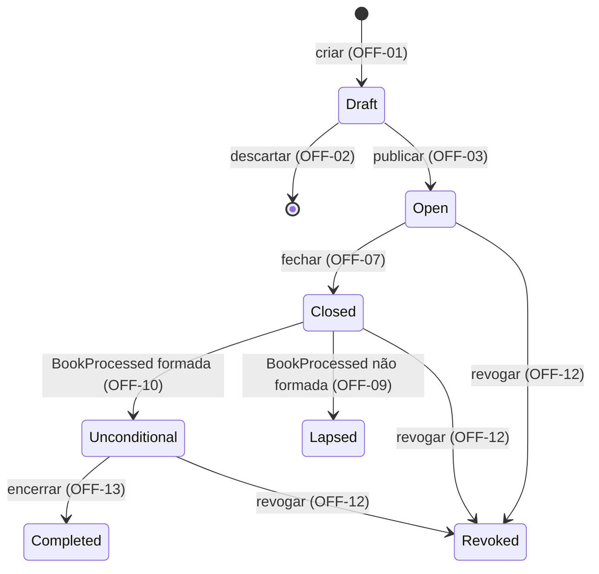

<!-- prd-tier: complexa -->
# Cadastro e Ciclo de Vida da Oferta

| | |
|---|---|
| **Status** | Rascunho |
| **Autor** | Guilherme Salvi |
| **Data** | 2026-09-04 |
| **Contexto Originário** | Offering (primário); consumido por ReservationBook e Allocation; Allocation devolve o desfecho do livro |

Prefixo dos requisitos: `OFF`. Propósito da plataforma, mapa de contextos, catálogo de eventos e fluxos: [PRD 0000](0000-platform-overview.md).

## Resumo Executivo

A plataforma cobre a janela entre a publicação de uma oferta de cotas de fundo fechado e o resultado da alocação. Tudo nessa janela depende de uma definição de oferta estável e de um estado inequívoco: preço por cota, quantidade base, montante mínimo, limites por investidor, período de reserva e opções de condicionamento não mudam depois da publicação; o estado avança por transições explícitas, de Draft a Aberta, Fechada, Formada e Encerrada, ou aos terminais Revogada e Não formada. Métrica primária: nenhuma oferta publicada com atributo inválido, nenhuma alteração de atributo após a publicação, nenhuma transição fora das permitidas.

## Alinhamento Estratégico

Offering é a raiz de dependência: os outros dois contextos leem a definição da oferta e não a alteram; o estado, por outro lado, avança com o desfecho que o Allocation produz. Erro de definição ou de estado aqui se propaga para todos; por isso o rigor deste PRD está na validação da publicação, no contrato de imutabilidade e na máquina de estados.

## Contexto e Problema

Sem definição validada e congelada e sem estado inequívoco, os demais contextos não têm base: uma reserva não pode ser aceita sem saber que a oferta está aberta e com quais limites e opções; o livro não pode ser processado sem quantidade base e montante mínimo fixos e sem saber que as reservas fecharam.

[FATO] Uma oferta é a emissão de cotas de um fundo fechado, vendida como um único conjunto. Na CVM 175 o fundo se organiza em classes e subclasses (art. 5º, §§ 5º e 7º); classe fechada não admite resgate, então a distribuição é o único momento de decisão de investimento coberto pela plataforma.

[FATO] Por decisão de escopo, nenhum atributo da oferta muda depois de publicada; só o estado muda, por transições explícitas. Os gatilhos que exigiriam alterar atributos (modificação de oferta, CVM 160, arts. 67, I e II, e 69; lote adicional, art. 50; redução da quantidade base) estão fora do escopo. Se modificação entrar, o contrato de imutabilidade cai e todo consumidor que congela a definição precisa ser revisto; essa é a fronteira do modelo, não uma incerteza dele.

[FATO] Séries como nível de processamento, tranches, lote adicional e demais extensões estão fora do escopo por decisão do autor. A oferta carrega a identificação completa das cotas (fundo, classe, subclasse, emissão) desde a v1 para que essas extensões entrem sem renomear o que existe.

## Usuário-alvo / JTBD

- Operador de distribuição da corretora (usuário primário, por decisão do autor): cadastrar a oferta a partir dos documentos aprovados, publicar, fechar, revogar quando preciso e encerrar, com parâmetros consistentes e sem risco de alteração depois que reservas começarem.
- ReservationBook e Allocation: obter a definição publicada e o estado corrente, confiar que a definição não muda; o Allocation precisa ver o desfecho do livro refletido no estado.
- O investidor não interage com este contexto; seu ponto de contato é a reserva (PRD 0002).

## Solução Proposta

A oferta é um agregado com definição imutável após a publicação e uma máquina de estados explícita. Rótulos citam o requisito que governa a transição.

| Estado | Identificador | Termo de mercado e base regulatória |
|---|---|---|
| Draft | `Draft` | Minuta em elaboração; não é oferta para os demais contextos |
| Aberta | `Open` | Oferta a mercado, em período de reserva |
| Fechada | `Closed` | Período de reserva encerrado; livro fechado, aguardando processamento |
| Formada | `Unconditional` | Montante mínimo atingido, alocação concluída, em liquidação |
| Não formada | `Lapsed` | Mínimo não atingido (art. 73, § 3º); terminal |
| Revogada | `Revoked` | Revogação da oferta (arts. 67, III, e 68); terminal |
| Encerrada | `Completed` | Anúncio de encerramento (art. 76), registrado pelo operador após a liquidação; terminal |

A oferta publicada carrega a identificação das cotas e as definições de que os demais contextos dependem: preço por cota, quantidade base, montante mínimo, investimento mínimo e máximo por investidor, período de reserva e o conjunto de opções de condicionamento aceitas. A semântica das opções é definida aqui (OFF-26 a OFF-28) e aplicada no Allocation. Persistência, exposição e experiência de edição são downstream.

## Glossário de Domínio

Termos de outros contextos usados aqui (reserva, investidor, demanda efetiva, cotas efetivamente distribuídas) têm definição canônica nos PRDs 0002 e 0003.

| Termo | Definição |
|---|---|
| Oferta | Emissão de cotas de um fundo fechado, com identificação das cotas, preço por cota, quantidade base, montante mínimo, investimento mínimo e máximo por investidor, período de reserva e opções de condicionamento aceitas. |
| Fundo, classe, subclasse | Identificação das cotas segundo a CVM 175. Texto normalizado (sem espaços nas bordas, comparação sem distinção de caixa), sem cadastro nem unicidade na v1. |
| Número da emissão | Ordinal da emissão de cotas da classe. |
| Nome da oferta | Rótulo descritivo; não é chave. |
| Draft | Oferta em elaboração; editável, descartável, não aceita reservas. |
| Oferta publicada | Oferta que saiu de Draft; atributos imutáveis, estado avança pela máquina de estados. |
| Formada | Livro processado com o mínimo atingido e alocação concluída. `Unconditional`: a condição da oferta (o mínimo) foi satisfeita. Não confundir com as opções de condicionamento da reserva, que são condições do investidor. |
| Não formada | Livro processado com demanda efetiva abaixo do mínimo; nada é alocado, valores restituídos. `Lapsed`: a oferta caduca por condição não cumprida. |
| Revogada | Encerrada por decisão do operador antes de Encerrada; reservas perdem efeito e, se o livro já foi processado, a alocação aplicada também (BOOK-18). |
| Encerrada | Oferta formada cuja liquidação terminou; terminal de sucesso. |
| Preço por cota | Valor unitário fixo; decimal exato com até 8 casas. |
| Quantidade base | Quantidade de cotas inicialmente ofertada. |
| Montante mínimo | Quantidade de cotas abaixo da qual a oferta não se forma; sempre presente e menor ou igual à quantidade base. |
| Distribuição parcial | Colocação entre o montante mínimo e a quantidade base. |
| Investimento mínimo / máximo por investidor | Limites em cotas. O mínimo vale por reserva; o máximo, pela soma das reservas ativas do investidor. Aplicação: BOOK-03, BOOK-04. |
| Período de reserva | Intervalo fechado de instantes, de início a fim. Um instante está dentro do período quando é maior ou igual ao início e menor ou igual ao fim; o período terminou quando o instante corrente é posterior ao fim. Os demais contextos usam esta definição. |
| Condicionamento | Condição declarada pelo investidor para manter a reserva caso a oferta feche em distribuição parcial. |
| Opção de condicionamento | Uma das três formas de condicionamento (OFF-26 a OFF-28); a oferta define se aceita a terceira, a reserva escolhe uma das aceitas. |

## Functional Requirements

Cada requisito é uma condição verificável.

### Ciclo de vida

- **OFF-01 (Must)** Toda oferta nasce como Draft; não há criação em outro estado.
- **OFF-02 (Must)** Draft aceita qualquer combinação de atributos, inclusive ausentes ou inconsistentes, e pode ser editado e descartado sem restrição.
- **OFF-03 (Must)** Publicar é ação explícita, distinta da edição: valida todos os atributos como uma unidade e só leva a oferta a Aberta se nenhuma regra for violada.
- **OFF-04 (Must)** Rejeição de publicação informa todas as violações, com atributo e regra de cada uma.
- **OFF-05 (Must)** Nenhum atributo de oferta publicada pode ser alterado em nenhum estado posterior a Draft.
- **OFF-06 (Must)** As únicas transições são as do diagrama. Qualquer outra é rejeitada, informando estado corrente e transição tentada.
- **OFF-07 (Must)** Fechar é ação explícita do operador sobre oferta Aberta, permitida a qualquer instante maior ou igual ao início do período de reserva, o que admite encerramento antecipado.
- **OFF-08 (Must)** Oferta Aberta cujo período de reserva terminou não aceita reservas, mesmo antes de o operador fechá-la. A recusa é BOOK-01; a condição é definida aqui.
- **OFF-09 (Must)** Oferta Fechada passa a Não formada quando o desfecho do livro informa demanda efetiva abaixo do montante mínimo.
- **OFF-10 (Must)** Oferta Fechada passa a Formada quando o desfecho informa oferta formada e alocação concluída.
- **OFF-11 (Must)** O desfecho do livro só é aceito em Fechada. Recebido em qualquer outro estado, inclusive Revogada, é ignorado sem alterar a oferta e registrado como descartado.
- **OFF-12 (Must)** Revogar é ação explícita do operador, permitida em Aberta, Fechada e Formada. Draft é descartado, não revogado; terminais não são revogados. Revogar uma oferta Formada torna sem efeito a alocação já aplicada (BOOK-18); o resultado emitido pelo Allocation não é alterado.
- **OFF-13 (Must)** Encerrar é ação explícita do operador sobre oferta Formada, registrando o fim da liquidação, que ocorre fora da plataforma; o registro do operador é o único gatilho.
- **OFF-14 (Must)** Somente ofertas fora de Draft são apresentadas aos demais contextos, sempre com o estado corrente.

### Atributos e validação na publicação

- **OFF-15 (Must)** Nome obrigatório e não vazio; é rótulo, não chave.
- **OFF-16 (Must)** Identificação das cotas obrigatória: fundo, classe e número da emissão; subclasse opcional. Texto normalizado, sem validação contra cadastro nem unicidade.
- **OFF-17 (Must)** Preço por cota estritamente positivo, decimal exato com até 8 casas.
- **OFF-18 (Must)** Quantidade base inteira, maior ou igual a 1.
- **OFF-19 (Must)** Montante mínimo presente, inteiro, maior ou igual a 1 e menor ou igual à quantidade base.
- **OFF-20 (Must)** Montante mínimo igual à quantidade base: a oferta não admite distribuição parcial e o conjunto de opções não se aplica.
- **OFF-21 (Must)** Investimento mínimo por investidor inteiro, maior ou igual a 1 e menor ou igual ao máximo.
- **OFF-22 (Must)** Investimento máximo por investidor inteiro e menor ou igual à quantidade base.
- **OFF-23 (Must)** Período de reserva com início e fim definidos e fim posterior ao início; o início pode estar no passado na publicação.
- **OFF-24 (Must)** Publicação rejeitada se o fim do período já passou no instante da publicação.
- **OFF-25 (Must)** Oferta com distribuição parcial: o conjunto de opções aceitas contém obrigatoriamente as opções 1 e 2 e, a critério do ofertante, a 3. Conjunto sem a 1 ou sem a 2 é rejeitado.

### Semântica das opções de condicionamento

Definidas aqui, aplicadas em ALLOC-11 a ALLOC-13. Abaixo do montante mínimo a oferta não se forma e nenhuma opção se aplica.

- **OFF-26 (Must)** *Opção 1, condicionada à colocação total da quantidade base.* Em distribuição parcial, a reserva é cancelada e o investidor não recebe cotas.
- **OFF-27 (Must)** *Opção 2, condicionada ao montante mínimo, recebendo a totalidade.* Em distribuição parcial, o investidor recebe a quantidade integral reservada. É também o efeito de não condicionar; por isso a opção é sempre declarada e não existe reserva sem opção em oferta com distribuição parcial.
- **OFF-28 (Must)** *Opção 3, condicionada ao montante mínimo, recebendo o proporcional.* Em distribuição parcial, o investidor recebe `⌊q × E / B⌋`, com `q` quantidade reservada, `E` cotas efetivamente distribuídas e `B` quantidade base. Zero é válido.
- **OFF-29 (Must)** Uma reserva escolhe exatamente uma opção, pertencente ao conjunto aceito pela oferta. A verificação é BOOK-08; o conjunto aceito é definido aqui.

## Domain Events

Produz `OfferPublished` (OFF-03, carrega a definição completa), `OfferClosed` (OFF-07) e `OfferRevoked` (OFF-12). Consome `BookProcessed`, único evento de entrada e único gatilho de Formada e Não formada, aceito só em Fechada (OFF-11); o Allocation interrompe o processamento ao receber `OfferRevoked` (ALLOC-03), e OFF-11 cobre o desfecho já emitido. Formada, Não formada e Encerrada não geram evento na v1. Catálogo, sequências e transporte: PRD 0000.

## Non-functional Requirements

- **OFF-NFR-01** Validação de publicação e cada transição de estado são atômicas.
- **OFF-NFR-02** Toda transição registra quem ou qual contexto a disparou e quando; desfechos descartados por OFF-11 também.
- **OFF-NFR-03** Definição e estado corrente são os mesmos para todos os consumidores em qualquer instante; não há versão intermediária visível. É a exigência do ADR de transporte de eventos.
- **OFF-NFR-04** Preço e cálculo proporcional são exatos, sem arredondamento binário.

## Considerações Regulatórias

Texto consolidado das Resoluções CVM 160 e CVM 30 lido em 2026-09-05; artigos conferidos contra o texto.

- [FATO] Art. 73: o ato que delibera a oferta define o tratamento da distribuição parcial e o mínimo, em quantidade ou em montante financeiro; § 3º manda restituir integralmente quando o mínimo não é atingido. O modelo adota quantidade de cotas e mapeia o § 3º em Não formada (OFF-09).
- [FATO] Art. 74: havendo distribuição parcial, "deve ser dada a opção ao investidor" de condicionar à totalidade (I) ou a quantidade maior ou igual ao mínimo (II). As opções 1 e 2 são obrigatórias; a variante proporcional (opção 3) não está na CVM 160 e é herança do art. 31, § 1º, da ICVM 400, mantida pela prática. OFF-25.
- [FATO] Art. 74, parágrafo único: "efetivamente distribuídos" inclui as reservas condicionadas. `E` (numerador de OFF-28) e a formação seguem essa definição, sem recálculo após o condicionamento. Detalhe: ALLOC-10.
- [FATO] Arts. 67, III, e 68: revogação pedida pelo ofertante e deferida pela CVM torna ineficazes oferta e aceitações, com restituição integral. Revogada modela o efeito; o deferimento não é modelado.
- [FATO] Art. 70: suspensão e cancelamento são atos da CVM por irregularidade. Por isso o estado de mínimo não atingido se chama Não formada, não Cancelada. Suspensão não é modelada.
- [FATO] Art. 76: o resultado é divulgado no anúncio de encerramento, no que ocorrer primeiro entre o fim do prazo (I) e a distribuição da totalidade (II). O inciso II sustenta o fechamento antecipado (OFF-07); Encerrada corresponde ao marco, o anúncio não é modelado.
- [FATO] Art. 75: distribuição parcial não se aplica a ofertas exclusivas para profissionais. A categoria é declarada na reserva; seu efeito é extensão futura.
- [FATO] Art. 65, § 4º: a reserva é irrevogável, ressalvadas modificação e revogação da oferta. Sem modificação no escopo, a decisão sobre alterar reserva antes do fechamento é BOOK-10 a BOOK-12.
- [FATO] Art. 50: lote adicional de até 25%. Fora do escopo; quando entrar, a quantidade base continua sendo o denominador do proporcional e a referência do lote.
- [FATO] Registro na CVM, prospecto, lâmina e aviso ao mercado (arts. 57 e 65) não são modelados. Nenhum atributo espelha documento formal; se precisar, o glossário muda antes do código.

## Não-objetivos

- Série como nível de processamento, tranches, lote adicional, outros critérios de rateio, efeito da categoria do investidor, direito de preferência e sobras de subscrição.
- Liquidação financeira e integrações externas; Encerrada só registra que a liquidação terminou.
- Modificação de atributos, redução da quantidade base e suspensão de oferta publicada.
- Cadastro de fundo, classes, subclasses e investidores; documentos da oferta e registro na CVM.
- Calendário de dias úteis; o período de reserva é um intervalo de instantes.

## Trade-offs Declarados

- **Identificação completa das cotas sem cadastro de fundo e sem unicidade.** *Custo:* erro de digitação passa; duas ofertas para a mesma emissão não são detectadas. *Razão:* é assim que a oferta se chama na vida real; unicidade sobre texto sem cadastro é garantia falsa; cadastro é entidade própria, fora do mínimo viável.
- **Nome como rótulo, não chave.** *Custo:* ninguém localiza a oferta pelo nome com segurança. *Razão:* não é como o mercado identifica uma emissão; consumidores usam o identificador.
- **Série fora, com caminho previsto.** *Custo:* emissão com várias séries não é representável. *Razão:* com a identificação das cotas na oferta, séries entram como "uma oferta por série, agrupadas pela emissão".
- **Publicação permitida com o período já em curso.** *Custo:* a demanda do trecho que correu sem a plataforma não existe no livro. *Razão:* a oferta vai a mercado pelos documentos; rejeitar a publicação atrasada não protege invariante nenhum.
- **Conjunto de opções com dois valores obrigatórios.** *Custo:* estrutura de conjunto para um único grau de liberdade. *Razão:* preserva o contrato "a opção pertence ao conjunto aceito" e prepara a extensão do art. 75.
- **Revogada e Não formada como estados distintos, sem campo de motivo.** *Custo:* dois terminais com o mesmo efeito downstream; todo consumidor trata os dois. *Razão:* origem e base regulatória diferem (art. 68 versus art. 73, § 3º); um estado genérico esconderia a distinção.
- **`Unconditional` e `Lapsed` como identificadores.** *Custo:* `Unconditional` convive com as opções de condicionamento e pode ser lido como "sem condicionamento". *Razão:* é o par que a comunidade anglófona usa: a oferta "becomes unconditional" quando suas condições são satisfeitas e "lapses" quando não (UK Takeover Code, Rule 31.2; prospectos de IPO da HKEX, "Structure of the Global Offering"). `Formed`/`NotFormed` seriam tradução literal sem significado.
- **Estado final decidido pelo desfecho do Allocation.** *Custo:* ciclo de eventos entre os dois contextos. *Razão:* "formou-se" e "não se formou" são fatos sobre a oferta; um único ponto de leitura vale mais que aciclicidade estrita. Contido por OFF-11. Ver Ponto de Maior Fragilidade.
- **Fechamento explícito, não derivado do fim do período.** *Custo:* oferta com período terminado fica Aberta até o operador agir, exigindo OFF-08. *Razão:* encerramento antecipado (art. 76, II) exige ação explícita.
- **Encerrada por ação do operador, sem liquidação modelada.** *Custo:* o estado depende de informação externa não verificada. *Razão:* liquidação está fora do projeto; o estado existe para o ciclo ter terminal de sucesso.
- **Montante mínimo em cotas, não em moeda.** *Custo:* diverge dos documentos, que costumam usar reais. *Razão:* o art. 73 admite as duas formas; com preço fixo são equivalentes, e cotas eliminam arredondamento.
- **Publicação valida tudo de uma vez; Draft não valida nada.** *Custo:* sem sinal incremental ao preencher. *Razão:* separa "em elaboração" de "compromisso"; validação incremental é refinamento downstream.

## Métricas de Sucesso

Projeto sem uso em produção; métricas de correção, verificáveis por teste.

- Leading: toda combinação inválida de OFF-15 a OFF-25 rejeitada com todas as violações (um caso por regra e um combinando duas); toda transição fora do diagrama rejeitada e todo desfecho fora de Fechada descartado; nenhuma alteração de atributo aceita após a publicação.
- Lagging: nenhum consumidor precisa de atributo ou estado que não esteja aqui; séries entram sem reinterpretar ofertas da v1.
- Guardrails: Draft continua aceitando estado incompleto; o Allocation não reinterpreta OFF-26 a OFF-28; nenhum consumidor mantém estado de oferta próprio.

## Critérios de Aceitação

- **Dado** um Draft com fundo, classe e emissão, preço 100, quantidade base 1000, montante mínimo 600, investimento mínimo 10 e máximo 500, período futuro e opções {1, 2, 3}, **quando** o operador publica, **então** passa a Aberta e fica disponível aos demais contextos com exatamente esses atributos; um segundo Draft com o mesmo nome também é publicado.
- **Dado** um Draft sem número da emissão, investimento mínimo 500 e máximo 10, e montante mínimo maior que a quantidade base, **quando** publica, **então** rejeitado, permanece Draft, e a resposta lista as três violações com atributo e regra.
- **Dado** um Draft válido cujo período começou ontem e termina amanhã, **quando** publica, **então** Aberta; se o período terminou ontem, rejeitado por OFF-24.
- **Dado** um Draft com preço 96,53420001, **quando** publica, **então** o preço é consultado em seguida com exatamente esse valor.
- **Dado** uma oferta fora de Draft, **quando** qualquer atributo é alterado, **então** rejeitado e a definição consultada é idêntica à publicada.
- **Dado** um Draft válido, **quando** outro contexto consulta ofertas, **então** o Draft não aparece.
- **Dado** uma oferta Fechada, **quando** chega o desfecho com demanda efetiva 500 e mínimo 600, **então** Não formada; com demanda efetiva 700 e alocação concluída, Formada.
- **Dado** uma oferta Revogada, **quando** chega um desfecho, **então** permanece Revogada e o desfecho é registrado como descartado.
- **Dado** uma oferta Formada, **quando** o operador revoga, **então** Revogada; **quando** encerra, Encerrada.
- **Dado** uma oferta Não formada, Revogada ou Encerrada, **quando** qualquer transição é tentada, **então** rejeitada informando o estado corrente; **dado** um Draft, revogar ou fechar também é rejeitado.
- **Dado** montante mínimo igual à quantidade base e conjunto de opções vazio, **quando** publica, **então** aceita e apresentada como sem distribuição parcial.
- **Dado** montante mínimo menor que a quantidade base, **quando** publica com conjunto vazio ou {1, 3}, **então** rejeitado por OFF-25; com {1, 2}, aceito.
- **Dado** quantidade base 1000, `E = 700` e reserva de 15 cotas, **quando** o Allocation aplica a semântica daqui, **então** opção 3 recebe 10 (⌊15 × 700 / 1000⌋ = ⌊10,5⌋), opção 1 é cancelada, opção 2 recebe 15; opção 3 com reserva de 1 cota recebe 0.

## Dependências e Riscos

Acoplamentos entre contextos: PRD 0000.

| Item | Tipo | Impacto |
|---|---|---|
| Allocation aplica OFF-26 a OFF-28 | Contrato semântico | Divergência de interpretação produz alocação errada; a semântica é deste PRD |
| Revogação durante o processamento | Risco de consistência | Contido por OFF-11, ALLOC-03 e BOOK-18 |
| Identificação das cotas sem cadastro | Risco de dados | Erro de digitação e oferta duplicada para a mesma emissão passam |
| Transporte dos eventos | ADR pendente | Precisa satisfazer OFF-NFR-03; até lá o contrato é semântico |

## Perguntas em Aberto

Nenhuma. Decisões de 2026-09-05 estão em Trade-offs; as sem custo próprio: fechamento antecipado permitido (OFF-07, art. 76, II); Encerrada por ação do operador é Must (OFF-13); precisão do preço em 8 casas (OFF-17).

## Ponto de Maior Fragilidade

A decisão de **o Offering ser dono dos desfechos Formada e Não formada, consumindo `BookProcessed` do Allocation**, em vez de terminar seu ciclo em Fechada e deixar o desfecho como leitura do Allocation.

*Vetor de ataque:* o Offering é declarado raiz de dependência e, ainda assim, reage a um evento do contexto que o consome. Mesmo contido por OFF-11, o ciclo cria dois lugares onde o desfecho existe (resultado no Allocation, estado no Offering), e "descartar fora de Fechada" pode esconder um processamento que rodou sobre oferta já revogada; as alocações desse processamento só não sobrevivem porque BOOK-18 torna sem efeito toda reserva da oferta revogada. A alternativa acíclica é mais simples de raciocinar: Offering termina em Fechada ou Revogada, Allocation expõe o desfecho, e quem precisa do quadro completo compõe as duas leituras.

*Desafie antes de aprovar:* um único ponto de leitura para "em que pé está a oferta" compensa manter o desfecho em dois contextos? A decisão está defendida (fatos sobre a oferta pertencem à oferta; um único evento de entrada em um único estado; o Allocation interrompe ao receber `OfferRevoked`), mas é a que mais custa se errada, porque muda o contrato do Allocation e a máquina de estados ao mesmo tempo.

## Referências

- [Resolução CVM 160 (texto consolidado)](https://conteudo.cvm.gov.br/export/sites/cvm/legislacao/resolucoes/anexos/100/resol160consolid.pdf) — arts. 50, 57, 65, 67, 68, 70, 73, 74, 75 e 76. Lido em 2026-09-05.
- [Resolução CVM 175 (texto consolidado)](https://conteudo.cvm.gov.br/export/sites/cvm/legislacao/resolucoes/anexos/100/resol175consolid.pdf) — art. 5º, §§ 5º e 7º.
- [Instrução CVM 400 (revogada)](https://conteudo.cvm.gov.br/export/sites/cvm/legislacao/instrucoes/anexos/400/inst400.pdf) — art. 31, § 1º.
- [PRD 0000](0000-platform-overview.md), [PRD 0002](0002-reservation-book-reservation-lifecycle.md) (reservas, limites, status), [PRD 0003](0003-allocation-book-processing.md) (contrato de `BookProcessed`).
