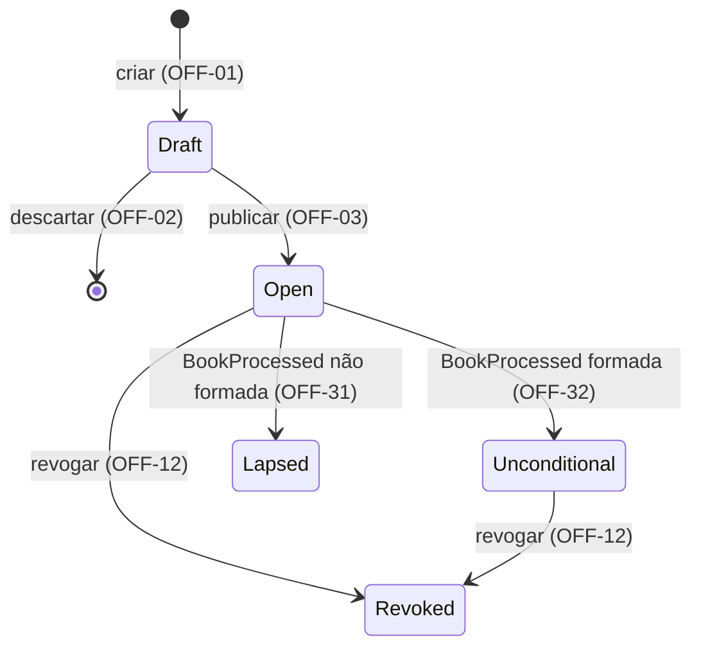

# Cadastro e Ciclo de Vida da Oferta

| | |
|---|---|
| **Originating Context** | Offering; affects BookBuilding |

Requirement prefix: `OFF`. Propósito da plataforma, mapa de contextos, catálogo de eventos e fluxos: [PRD 0000](0000-platform-overview.md).

## Executive Summary

O Offering impede publicações inválidas, alterações da definição publicada e transições fora do ciclo da oferta. A publicação valida e congela os parâmetros usados pelo BookBuilding.

O operador prepara, publica e revoga a oferta. O Offering recebe do BookBuilding o desfecho do livro e o assume como estado da oferta, nas condições definidas neste PRD.

## Context and Problem

O BookBuilding precisa conhecer o estado da oferta, seus limites e suas opções para aceitar uma reserva. Para processar o livro, também precisa de quantidade base e montante mínimo fixos. Alterações nesses parâmetros depois da publicação tornariam os pedidos e o resultado inconsistentes.

A oferta é a emissão de cotas de classe fechada vendida como um único conjunto. Na Resolução CVM 175 o fundo se organiza em classes e subclasses (art. 5º, §§ 5º e 7º); como a classe fechada não admite resgate, a distribuição é o único momento de decisão de investimento que o modelo cobre.

## Target User / JTBD

- Operador de distribuição da corretora: cadastrar a oferta a partir dos documentos aprovados, publicá-la, revogá-la quando necessário e acompanhar o desfecho. É o usuário primário do modelo.
- BookBuilding: obter a definição publicada e o estado corrente e confiar que a definição não muda.
- O investidor não interage com este contexto; seu ponto de contato é a reserva (PRD 0002).

## Proposed Solution

### Ciclo da oferta

O operador prepara a oferta em Draft e a publica após validar a definição (OFF-01 a OFF-05). A definição publicada é imutável.

O fechamento do livro não muda o estado da oferta. Ao receber o desfecho do BookBuilding, o Offering passa de Aberta para Formada ou Não formada (OFF-31 a OFF-33).

A revogação é permitida em Aberta e Formada (OFF-12). O diagrama apresenta todas as transições permitidas no ciclo da oferta (OFF-06).

| Estado | Identifier | Significado |
|---|---|---|
| Draft | `Draft` | Minuta em elaboração (OFF-01, OFF-02, OFF-14) |
| Aberta | `Open` | Oferta publicada sem desfecho recebido; período de reserva em OFF-23 |
| Formada | `Unconditional` | Desfecho formada recebido (OFF-32); fim do ciclo de sucesso, ainda revogável (OFF-12) |
| Não formada | `Lapsed` | Terminal: desfecho não formada recebido (OFF-31) |
| Revogada | `Revoked` | Terminal por revogação (OFF-12) |

### Opções de condicionamento

Este PRD define as opções de condicionamento aceitas pela oferta (OFF-25). O efeito de cada opção na alocação pertence ao processamento do livro, no BookBuilding.

## Domain Glossary

Reserva, investidor e fechamento do livro estão definidos no [PRD 0002](0002-book-building-bid-lifecycle.md). A apuração da formação, a demanda efetiva e as cotas efetivamente distribuídas estão definidas no [PRD 0003](0003-book-building-book-processing.md).

| Termo | Definição |
|---|---|
| Oferta | Emissão de cotas de uma classe fechada, distribuída como um conjunto. |
| Fundo, classe, subclasse | Identificação do objeto da emissão (OFF-16). |
| Número da emissão | Identificação ordinal da emissão de cotas (OFF-16). |
| Nome da oferta | Rótulo descritivo (OFF-15). |
| Draft | Definição em elaboração (OFF-01, OFF-02, OFF-14). |
| Oferta publicada | Definição comprometida pela publicação (OFF-03, OFF-05). |
| Revogada | Oferta tornada ineficaz (OFF-12). |
| Formada | Estado assumido ao receber o desfecho formada (OFF-32); identificador `Unconditional`, o mesmo do desfecho (ALLOC-26). |
| Não formada | Terminal assumido ao receber o desfecho não formada (OFF-31); identificador `Lapsed`, o mesmo do desfecho (ALLOC-26). |
| Preço por cota | Valor unitário da emissão (OFF-17). |
| Quantidade base | Número de cotas inicialmente ofertado (OFF-18). |
| Montante mínimo | Limiar de formação expresso em cotas (OFF-19). |
| Distribuição parcial | Colocação abaixo da base, sujeita ao mínimo (OFF-19, OFF-20). |
| Investimento mínimo / máximo | Limites em cotas por investidor (OFF-21, OFF-22). |
| Período de reserva | Intervalo fechado de instantes; fronteiras e término em OFF-23. |
| Condicionamento | Escolha do investidor para distribuição parcial; conjunto aceito em OFF-25. |
| Opção de condicionamento | Valor do conjunto da oferta (OFF-25), escolhido na reserva; identificadores na tabela abaixo. |

| Opção | Identifier | Semântica |
|---|---|---|
| Colocação total da base | `1` | Condicionada à colocação de toda a quantidade base |
| Mínimo com recebimento integral | `2` | Condicionada ao montante mínimo, recebendo a totalidade reservada |
| Mínimo com recebimento proporcional | `3` | Condicionada ao montante mínimo, recebendo o proporcional |

## Functional Requirements

### Draft

- **OFF-01 (Must)** Toda oferta nasce como Draft; não há criação em outro estado.
- **OFF-02 (Must)** Draft aceita qualquer combinação de atributos, inclusive ausentes ou inconsistentes, e pode ser editado e descartado sem restrição.

### Definição e atributos

- **OFF-15 (Must)** Nome obrigatório e não vazio; é rótulo, não chave.
- **OFF-16 (Must)** Identificação das cotas obrigatória: fundo, classe e número da emissão; subclasse opcional. Texto sem espaços nas bordas e com comparação sem distinção de caixa; sem validação contra cadastro nem unicidade. [GAP] Falta decidir se espaços nas bordas são removidos ou rejeitam a publicação e qual operação usa a comparação sem distinção de caixa; ver Open Questions.
- **OFF-17 (Must)** Preço por cota estritamente positivo, decimal exato com até 8 casas.
- **OFF-18 (Must)** Quantidade base inteira, maior ou igual a 1.
- **OFF-21 (Must)** Investimento mínimo por investidor inteiro, maior ou igual a 1 e menor ou igual ao máximo.
- **OFF-22 (Must)** Investimento máximo por investidor inteiro e menor ou igual à quantidade base.
- **OFF-23 (Must)** Período de reserva com início e fim definidos e fim posterior ao início; o início pode estar no passado na publicação. O intervalo é fechado: início ≤ instante ≤ fim; o período terminou quando instante > fim.

### Distribuição parcial e configuração

- **OFF-19 (Must)** Montante mínimo presente, inteiro, maior ou igual a 1 e menor ou igual à quantidade base.
- **OFF-20 (Must)** Montante mínimo igual à quantidade base: a oferta não admite distribuição parcial e o conjunto de opções não se aplica. [GAP] Falta decidir se a publicação com conjunto informado o rejeita ou o ignora; ver Open Questions.
- **OFF-25 (Must)** Oferta com distribuição parcial: o conjunto de opções aceitas contém obrigatoriamente as opções 1 e 2 e, a critério do ofertante, a 3. Conjunto sem a 1 ou sem a 2 é rejeitado.

### Publicação e imutabilidade

- **OFF-03 (Must)** Publicar é ação explícita, distinta da edição: valida todos os atributos como uma unidade e só leva a oferta a Aberta se nenhuma regra for violada.
- **OFF-04 (Must)** Rejeição de publicação informa todas as violações, com atributo e regra de cada uma.
- **OFF-24 (Must)** Publicação rejeitada se o fim do período já passou no instante da publicação.
- **OFF-05 (Must)** Nenhum atributo de oferta publicada pode ser alterado em nenhum estado posterior a Draft.
- **OFF-14 (Must)** Somente ofertas fora de Draft são apresentadas aos demais contextos, sempre com o estado corrente.

### Estados

- **OFF-06 (Must)** As únicas transições são as do diagrama. Qualquer outra é rejeitada, informando estado corrente e transição tentada.

### Revogação

- **OFF-12 (Must)** Revogar é ação explícita do operador, permitida em Aberta e Formada. Draft é descartado, não revogado; Não formada e Revogada não são revogadas.

### Desfecho

- **OFF-31 (Must)** Oferta Aberta que recebe o desfecho não formada passa a Não formada, terminal: não há liquidação, e a restituição ocorre fora da plataforma.
- **OFF-32 (Must)** Oferta Aberta que recebe o desfecho formada passa a Formada. É o fim do ciclo de sucesso: a liquidação ocorre fora da plataforma e não é registrada, e a oferta permanece revogável (OFF-12).
- **OFF-33 (Must)** O desfecho só é aceito em Aberta, o que o torna único por oferta. Recebido em qualquer outro estado, inclusive Revogada ou após outro desfecho, é ignorado sem alterar a oferta e registrado como descartado.

## Domain Events

Produz `OfferPublished` (OFF-03) e `OfferRevoked` (OFF-12), consumidos pelo BookBuilding. Ambos identificam a oferta, o estado resultante da operação e seu instante. `OfferPublished` inclui também a definição completa da oferta.

Consome `BookProcessed` (OFF-31 a OFF-33), que termina o ciclo e define o estado final da oferta quando aceito.

Formada e Não formada não geram evento na v1 porque não há consumidor. `OfferBecameUnconditional` e `OfferLapsed` são candidatos futuros, condicionados à existência de consumidores.

## Non-functional Requirements

- **OFF-NFR-01** Validação de publicação e cada transição de estado são atômicas.
- **OFF-NFR-02** Toda transição registra quem ou qual contexto a disparou e quando; o desfecho descartado (OFF-33) também.
- **OFF-NFR-03** Definição e estado corrente são os mesmos para todos os consumidores em qualquer instante; não há versão intermediária visível. É a exigência do ADR de transporte de eventos.
- **OFF-NFR-04** Preço e cálculo proporcional são exatos, sem arredondamento binário.

## Regulatory Considerations

Fontes: [CVM 160](https://conteudo.cvm.gov.br/export/sites/cvm/legislacao/resolucoes/anexos/100/resol160consolid.pdf) e [CVM 175](https://conteudo.cvm.gov.br/export/sites/cvm/legislacao/resolucoes/anexos/100/resol175consolid.pdf), consultadas em 2026-09-05.

- CVM 160, art. 73: o ato define o tratamento da parcial e o mínimo, em quantidade ou montante; § 3º, restituição integral → OFF-19, OFF-31.
- CVM 160, art. 74: opção do investidor entre a totalidade e o mínimo → OFF-25.
- CVM 160, arts. 67, III, e 68: revogação deferida pela CVM torna ineficazes oferta e aceitações → OFF-12. Deferimento não modelado.
- CVM 175, art. 5º, §§ 5º e 7º: classes e subclasses → OFF-16.

## Non-goals

- Série como nível de processamento, tranches, lote adicional (art. 50), outros critérios de rateio, efeito da categoria do investidor, direito de preferência e sobras de subscrição.
- Liquidação financeira, anúncio de encerramento (art. 76) e integrações externas: a oferta não tem estado posterior ao desfecho, e o prazo real da revogação, que depende da liquidação, não é conhecido pela plataforma.
- Modificação de atributos (arts. 67, I e II, e 69), redução da quantidade base e suspensão de oferta publicada.
- Cadastro de fundo, classes, subclasses e investidores; documentos da oferta e registro na CVM (arts. 57 e 65).
- Calendário de dias úteis; o período de reserva é um intervalo de instantes.

## Declared Trade-offs

### Identificação completa das cotas sem cadastro nem unicidade (OFF-16)

*Cost:* erro de digitação e oferta duplicada passam.

*Reason:* é o nome real da oferta; unicidade sobre texto sem cadastro é garantia falsa.

### Nome como rótulo (OFF-15)

*Cost:* ninguém localiza a oferta pelo nome com segurança.

*Reason:* o mercado identifica pela emissão.

### Série fora da v1, com caminho previsto

*Cost:* emissão multi-série não é representável.

*Reason:* com a identificação das cotas, séries entram como uma oferta por série.

### Publicação com período já em curso (OFF-23)

*Cost:* a demanda do trecho anterior não existe no livro.

*Reason:* a oferta vai a mercado pelos documentos; rejeitar não protege invariante.

### Publicação valida tudo, Draft não valida nada (OFF-02, OFF-03)

*Cost:* sem sinal incremental durante a elaboração.

*Reason:* separa elaboração de compromisso.

### Montante mínimo em cotas (OFF-19)

*Cost:* os documentos usam reais.

*Reason:* o art. 73 admite as duas formas; com preço fixo são equivalentes e cotas eliminam arredondamento.

### Conjunto de opções com dois valores obrigatórios (OFF-25)

*Cost:* estrutura de conjunto para um grau de liberdade.

*Reason:* preserva a regra de que a opção da reserva pertence ao conjunto aceito e prepara o art. 75.

### Revogada e Não formada como estados distintos, sem campo de motivo (OFF-12, OFF-31)

*Cost:* dois insucessos com o mesmo efeito no livro, distinguíveis só pelo estado da oferta.

*Reason:* bases regulatórias diferentes, art. 68 e art. 73, § 3º, e origens diferentes: ação do operador e desfecho do processamento.

### Desfecho assumido como estado final da oferta (OFF-31 a OFF-33)

*Cost:* a formação vive em dois lugares, apurada no BookBuilding e espelhada aqui; o Offering, upstream, muda de estado por um evento do contexto que o consome; e a oferta fica Aberta entre o fechamento do livro no BookBuilding e o desfecho, sem estado que reflita a fase do livro.

*Reason:* sem liquidação modelada não há operação da plataforma depois do desfecho, então ele é o fim do ciclo; o espelho é escrito uma vez, só em Aberta (OFF-33), o que contém o ciclo. Ver Weakest Point.

### Sem estado de encerramento nem registro de liquidação

*Cost:* a oferta Formada permanece revogável sem prazo, porque a plataforma não sabe quando a oferta encerrou.

*Reason:* a liquidação está fora do modelo; um terminal que dependesse dela seria alimentado por informação externa digitada pelo operador.

## Success Metrics

### Leading

- Toda combinação inválida de OFF-15 a OFF-25 é rejeitada com todas as violações, com um caso por regra e um combinando duas.
- Toda transição fora do diagrama é rejeitada.
- Todo desfecho fora de Aberta é descartado.
- Nenhuma alteração após a publicação.

### Lagging

- Nenhum consumidor precisa de atributo ou estado ausente.
- Séries entram sem reinterpretar ofertas da v1.

### Guardrails

- Draft continua aceitando definição incompleta (OFF-02).
- Nenhum consumidor mantém estado próprio da oferta (OFF-NFR-03).
- O Offering não apura o desfecho, só o recebe (OFF-31, OFF-32).

## Acceptance Criteria

Base válida: identificação completa, nome preenchido, preço 100, base 1000, mínimo 600, investimento mínimo 10 e máximo 500, período futuro e opções {1, 2, 3}.

Cada linha parte de um Draft independente, salvo indicação.

| Caso | Entrada | Intermediários | Ramo | Resultado |
|---|---|---|---|---|
| Publicação válida | Base válida; dois Drafts com mesmo nome | Limites coerentes | OFF-03, OFF-14, OFF-15 | Ambos Aberta; atributos publicados iguais aos informados |
| Violações combinadas | Sem emissão; investimento mínimo 500, máximo 10; mínimo da oferta 1001 | 500 > 10; 1001 > 1000 | OFF-04, OFF-16, OFF-19, OFF-21 | Draft preservado; três violações com atributo e regra |
| Período em curso | Início ontem; fim amanhã | Publicação dentro do intervalo | OFF-23, OFF-24 | Aberta |
| Período expirado | Fim ontem | Instante > fim | OFF-24 | Rejeitada |
| Preço exato | Preço 96,53420001 | Oito casas decimais | OFF-17, OFF-NFR-04 | Consulta devolve 96,53420001 |
| Sem parcial | Mínimo 1000; opções vazias | Mínimo = base | OFF-20 | Publicação aceita |
| Opções incompletas | Mínimo 600; opções vazias ou {1, 3} | Falta opção obrigatória | OFF-25 | Rejeitada; {1, 2} é aceita |

- **Dada** uma oferta publicada, **quando** se tenta editar um atributo, **então** a definição permanece idêntica e a alteração é rejeitada (OFF-05).
- **Dado** um Draft, **quando** um consumidor consulta ofertas, **então** ele não aparece (OFF-14).
- **Dada** uma oferta Aberta, **quando** recebe o desfecho não formada, **então** passa a Não formada (OFF-31).
- **Dada** uma oferta Aberta, **quando** recebe o desfecho formada, **então** passa a Formada (OFF-32).
- **Dada** uma oferta Aberta ou Formada, **quando** o operador a revoga, **então** passa a Revogada (OFF-12).
- **Dada** uma oferta Revogada, Formada ou Não formada, **quando** chega um desfecho, **então** ele é descartado e registrado (OFF-33).
- **Dada** uma oferta terminal, **quando** se solicita uma transição, **então** a rejeição informa estado e tentativa; o mesmo vale para revogar Draft ou Não formada (OFF-06).

## Dependencies and Risks

| Item | Tipo | Impacto |
|---|---|---|
| BookBuilding | Consumidor da definição e produtor do desfecho | Mudança nos limites ou nas opções da oferta afeta a aceitação de reservas e a alocação. O ciclo termina com o desfecho de `BookProcessed` (ALLOC-26), assumido como estado por OFF-31 a OFF-33. |
| Revogação durante processamento | Consistência | OFF-33 descarta o desfecho que chegar depois da revogação. |
| Identificação sem cadastro | Dados | Não detecta erro de digitação nem oferta duplicada. |
| Transporte de eventos | ADR pendente | Precisa satisfazer OFF-NFR-03. |

## Open Questions

### [GAP] Normalização da identificação das cotas (OFF-16)

**Decisão pendente:** definir se espaços nas bordas de fundo, classe, subclasse e número da emissão são removidos ou rejeitam a publicação, e qual operação usa a comparação sem distinção de caixa, já que OFF-16 não exige unicidade nem validação contra cadastro.

**Impacto:** a escolha altera a validação da publicação (OFF-03, OFF-04) e a identificação entregue aos consumidores (OFF-14).

**Responsável:** autor.

**Resolução necessária:** registrar as escolhas em OFF-16 e acrescentar os casos correspondentes em Acceptance Criteria.

### [GAP] Opções informadas em oferta sem distribuição parcial (OFF-20)

**Decisão pendente:** escolher entre rejeitar a publicação e ignorar o conjunto informado. O caso com opções vazias já está definido.

**Impacto:** a escolha afeta a validação da publicação e a definição entregue aos consumidores.

**Responsável:** autor.

**Resolução necessária:** registrar a escolha em OFF-20 e acrescentar o caso correspondente em Acceptance Criteria.

## Weakest Point

**Decisão:** assumir o desfecho do livro como estado final da oferta, sem estado de encerramento (OFF-31 a OFF-33).

**Risco:** a formação é calculada no BookBuilding e espelhada no Offering. Uma falha de entrega pode deixar os contextos divergentes. Além disso, Formada permanece revogável sem prazo, pois a plataforma não registra liquidação.

**Mitigação definida:** o Offering aceita o desfecho uma única vez, somente em Aberta, e não o recalcula (OFF-33). A solução de integração ainda precisa demonstrar o atendimento a OFF-NFR-03.

**Critério de reavaliação:** se o operador precisar bloquear a revogação após a liquidação, será necessário registrar esse fato externo e revisar o ciclo de vida. Essa mudança exige decisão de produto e amplia o escopo atual.

## References

- [Resolução CVM 160](https://conteudo.cvm.gov.br/export/sites/cvm/legislacao/resolucoes/anexos/100/resol160consolid.pdf) — arts. 50, 57, 65, 67, 68, 73, 74, 75 e 76; lida em 2026-09-05.
- [Resolução CVM 175](https://conteudo.cvm.gov.br/export/sites/cvm/legislacao/resolucoes/anexos/100/resol175consolid.pdf) — art. 5º, §§ 5º e 7º; lida em 2026-09-05.
