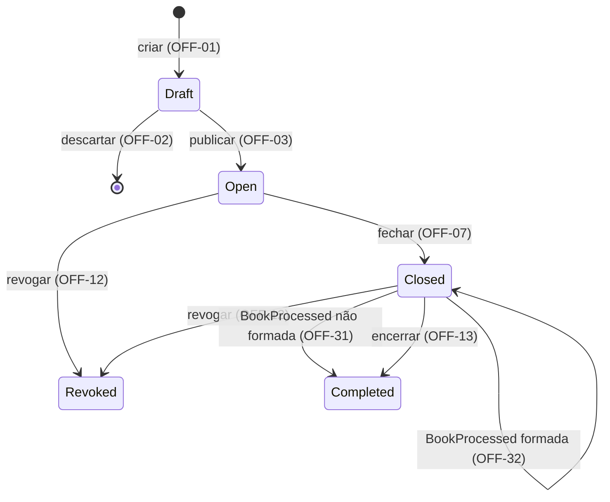

# Cadastro e Ciclo de Vida da Oferta

| | |
|---|---|
| **Contexto Originário** | Offering; afeta ReservationBook e Allocation |

Prefixo dos requisitos: `OFF`. Propósito da plataforma, mapa de contextos, catálogo de eventos e fluxos: [PRD 0000](0000-platform-overview.md).

## Resumo Executivo

Reservas e alocações dependem de parâmetros confiáveis e de uma indicação inequívoca da situação da oferta. O Offering permite ao operador preparar a definição, publicá-la e conduzir seu ciclo de vida, conforme OFF-01 a OFF-14. A métrica primária é a ausência de publicações inválidas, mutações da definição publicada e transições indevidas nos cenários de verificação.

## Contexto e Problema

Sem uma definição validada e congelada e sem um estado inequívoco, os outros contextos não têm base: uma reserva não pode ser aceita sem saber que a oferta está aberta e com quais limites e opções, e o livro não pode ser processado sem quantidade base e montante mínimo fixos e sem saber que as reservas fecharam.

A oferta é a emissão de cotas de fundo fechado vendida como um único conjunto. Na Resolução CVM 175 o fundo se organiza em classes e subclasses (art. 5º, §§ 5º e 7º); como a classe fechada não admite resgate, a distribuição é o único momento de decisão de investimento que o modelo cobre. Os cortes estão em Não-objetivos; o propósito compartilhado está no PRD 0000.

## Usuário-alvo / JTBD

- Operador de distribuição da corretora (usuário primário, por decisão do autor): cadastrar a oferta a partir dos documentos aprovados, publicar, fechar, revogar quando preciso e encerrar, com parâmetros consistentes e sem risco de alteração depois que reservas começarem.
- ReservationBook e Allocation: obter a definição publicada e o estado corrente e confiar que a definição não muda.
- O investidor não interage com este contexto; seu ponto de contato é a reserva (PRD 0002).

## Solução Proposta

O operador prepara e publica a definição da oferta (OFF-01 a OFF-05), depois acompanha e conduz as transições de OFF-06 a OFF-14. Formada e não formada são desfecho do livro, de posse do Allocation; a oferta os consome como evento para terminar o ciclo, sem os manter como estado (OFF-30 a OFF-33). A semântica das opções pertence a OFF-26 a OFF-29. O diagrama indexa os requisitos de cada transição.

| Estado | Identificador | Significado |
|---|---|---|
| Draft | `Draft` | Minuta em elaboração (OFF-01, OFF-02, OFF-14) |
| Aberta | `Open` | Oferta publicada ainda não fechada; elegibilidade temporal em OFF-08 e BOOK-01 |
| Fechada | `Closed` | Livro fechado (OFF-07); com desfecho formada, aguarda o encerramento pelo operador (OFF-32) |
| Revogada | `Revoked` | Terminal por revogação (OFF-12) |
| Encerrada | `Completed` | Terminal: fim da liquidação registrado pelo operador (OFF-13) ou oferta não formada (OFF-31) |

Os atributos publicados são identificados em OFF-15 a OFF-25. Persistência, exposição e experiência de edição são downstream.

## Glossário de Domínio

Reserva e investidor pertencem ao [PRD 0002](0002-reservation-book-reservation-lifecycle.md); formação da oferta, demanda efetiva e cotas efetivamente distribuídas, ao [PRD 0003](0003-allocation-book-processing.md).

| Termo | Definição |
|---|---|
| Oferta | Emissão de cotas de uma classe fechada, distribuída como um conjunto. |
| Fundo, classe, subclasse | Identificação do objeto da emissão (OFF-16). |
| Número da emissão | Identificação ordinal da emissão de cotas (OFF-16). |
| Nome da oferta | Rótulo descritivo (OFF-15). |
| Draft | Definição em elaboração (OFF-01, OFF-02, OFF-14). |
| Oferta publicada | Definição comprometida pela publicação (OFF-03, OFF-05). |
| Revogada | Oferta tornada ineficaz (OFF-12); efeitos no livro em BOOK-18. |
| Encerrada | Terminal alcançado pelo fim da liquidação (OFF-13) ou pela não formação (OFF-31). |
| Preço por cota | Valor unitário da emissão (OFF-17). |
| Quantidade base | Número de cotas inicialmente ofertado (OFF-18). |
| Montante mínimo | Limiar de formação expresso em cotas (OFF-19). |
| Distribuição parcial | Colocação abaixo da base, sujeita ao mínimo (OFF-19, OFF-20; ALLOC-09, ALLOC-10). |
| Investimento mínimo / máximo | Limites em cotas (OFF-21, OFF-22); aplicação por reserva e por posição em BOOK-03 e BOOK-04. |
| Período de reserva | Intervalo fechado de instantes; fronteiras e término em OFF-23. |
| Condicionamento | Escolha do investidor para distribuição parcial (OFF-26 a OFF-28). |
| Opção de condicionamento | Valor do conjunto da oferta (OFF-25, OFF-29); identificadores na tabela abaixo. |

| Opção | Identificador | Semântica |
|---|---|---|
| Colocação total da base | `1` | OFF-26 |
| Mínimo com recebimento integral | `2` | OFF-27 |
| Mínimo com recebimento proporcional | `3` | OFF-28 |

## Requisitos Funcionais

Cada requisito é uma condição verificável.

### Ciclo de vida

- **OFF-01 (Must)** Toda oferta nasce como Draft; não há criação em outro estado.
- **OFF-02 (Must)** Draft aceita qualquer combinação de atributos, inclusive ausentes ou inconsistentes, e pode ser editado e descartado sem restrição.
- **OFF-03 (Must)** Publicar é ação explícita, distinta da edição: valida todos os atributos como uma unidade e só leva a oferta a Aberta se nenhuma regra for violada.
- **OFF-04 (Must)** Rejeição de publicação informa todas as violações, com atributo e regra de cada uma.
- **OFF-05 (Must)** Nenhum atributo de oferta publicada pode ser alterado em nenhum estado posterior a Draft.
- **OFF-06 (Must)** As únicas transições são as do diagrama. Qualquer outra é rejeitada, informando estado corrente e transição tentada.
- **OFF-07 (Must)** Fechar é ação explícita do operador sobre oferta Aberta, permitida a qualquer instante maior ou igual ao início do período de reserva, o que admite encerramento antecipado.
- **OFF-08 (Must)** Oferta Aberta cujo período de reserva terminou não aceita reservas, mesmo antes de o operador fechá-la. A recusa é BOOK-01; a condição é definida aqui.
- **OFF-12 (Must)** Revogar é ação explícita do operador, permitida em Aberta e Fechada. Draft é descartado, não revogado; terminais não são revogados. Revogar uma oferta Fechada com desfecho já emitido torna sem efeito a alocação já aplicada (BOOK-18); o resultado emitido pelo Allocation não é alterado.
- **OFF-13 (Must)** Encerrar é ação explícita do operador sobre oferta Fechada que já recebeu desfecho formada (OFF-32), registrando o fim da liquidação, que ocorre fora da plataforma; o registro do operador é o único gatilho. Antes do desfecho, encerrar é rejeitado informando o motivo.
- **OFF-14 (Must)** Somente ofertas fora de Draft são apresentadas aos demais contextos, sempre com o estado corrente.
- **OFF-30 (Must)** A oferta não mantém formada ou não formada como estado; o desfecho é do Allocation (ALLOC-09, ALLOC-10) e determina apenas se a oferta aguarda liquidação (OFF-32) ou encerra (OFF-31).
- **OFF-31 (Must)** Oferta Fechada que recebe o desfecho não formada passa a Encerrada: não há liquidação, e a restituição ocorre fora da plataforma.
- **OFF-32 (Must)** Oferta Fechada que recebe o desfecho formada permanece Fechada, com o recebimento registrado, e passa a admitir o encerramento pelo operador (OFF-13).
- **OFF-33 (Must)** O desfecho só é aceito em Fechada e uma vez por oferta. Recebido em qualquer outro estado, inclusive Revogada, ou repetido, é ignorado sem alterar a oferta e registrado como descartado.

### Atributos e validação na publicação

- **OFF-15 (Must)** Nome obrigatório e não vazio; é rótulo, não chave.
- **OFF-16 (Must)** Identificação das cotas obrigatória: fundo, classe e número da emissão; subclasse opcional. Texto sem espaços nas bordas e com comparação sem distinção de caixa; sem validação contra cadastro nem unicidade.
- **OFF-17 (Must)** Preço por cota estritamente positivo, decimal exato com até 8 casas.
- **OFF-18 (Must)** Quantidade base inteira, maior ou igual a 1.
- **OFF-19 (Must)** Montante mínimo presente, inteiro, maior ou igual a 1 e menor ou igual à quantidade base.
- **OFF-20 (Must)** Montante mínimo igual à quantidade base: a oferta não admite distribuição parcial e o conjunto de opções não se aplica. [LACUNA] Falta decidir se a publicação com conjunto informado o rejeita ou o ignora; ver Perguntas em Aberto.
- **OFF-21 (Must)** Investimento mínimo por investidor inteiro, maior ou igual a 1 e menor ou igual ao máximo.
- **OFF-22 (Must)** Investimento máximo por investidor inteiro e menor ou igual à quantidade base.
- **OFF-23 (Must)** Período de reserva com início e fim definidos e fim posterior ao início; o início pode estar no passado na publicação. O intervalo é fechado: início ≤ instante ≤ fim; o período terminou quando instante > fim.
- **OFF-24 (Must)** Publicação rejeitada se o fim do período já passou no instante da publicação.
- **OFF-25 (Must)** Oferta com distribuição parcial: o conjunto de opções aceitas contém obrigatoriamente as opções 1 e 2 e, a critério do ofertante, a 3. Conjunto sem a 1 ou sem a 2 é rejeitado.

### Semântica das opções de condicionamento

Definidas aqui, aplicadas em ALLOC-11 a ALLOC-13. O ramo de insuficiência é definido em ALLOC-09.

- **OFF-26 (Must)** *Opção 1, condicionada à colocação total da quantidade base.* Em distribuição parcial, a reserva não é atendida por condicionamento e o investidor não recebe cotas; o status aplicado segue BOOK-17.
- **OFF-27 (Must)** *Opção 2, condicionada ao montante mínimo, recebendo a totalidade.* Em distribuição parcial, o investidor recebe a quantidade integral reservada. É também o efeito de não condicionar; por isso a opção é sempre declarada e não existe reserva sem opção em oferta com distribuição parcial.
- **OFF-28 (Must)** *Opção 3, condicionada ao montante mínimo, recebendo o proporcional.* Em distribuição parcial, o investidor recebe `⌊q × E / B⌋`, com `q` quantidade reservada, `E` cotas efetivamente distribuídas e `B` quantidade base. Zero é válido.
- **OFF-29 (Must)** Em oferta com distribuição parcial, uma reserva escolhe exatamente uma opção, pertencente ao conjunto aceito pela oferta. A verificação é BOOK-08; o conjunto aceito é definido aqui.

## Domain Events

Produz `OfferPublished` (OFF-03, com a definição completa), `OfferClosed` (OFF-07) e `OfferRevoked` (OFF-12). Consome `BookProcessed` (OFF-31 a OFF-33) para terminar o ciclo sem manter o desfecho como estado (OFF-30). Encerrada não gera evento na v1. O [PRD 0000](0000-platform-overview.md) concentra conteúdo compartilhado, consumidores e sequências.

## Requisitos Não Funcionais

- **OFF-NFR-01** Validação de publicação e cada transição de estado são atômicas.
- **OFF-NFR-02** Toda transição registra quem ou qual contexto a disparou e quando; o desfecho recebido (OFF-32) e o descartado (OFF-33) também.
- **OFF-NFR-03** Definição e estado corrente são os mesmos para todos os consumidores em qualquer instante; não há versão intermediária visível. É a exigência do ADR de transporte de eventos.
- **OFF-NFR-04** Preço e cálculo proporcional são exatos, sem arredondamento binário.

## Considerações Regulatórias

Fontes: [CVM 160](https://conteudo.cvm.gov.br/export/sites/cvm/legislacao/resolucoes/anexos/100/resol160consolid.pdf) e [CVM 175](https://conteudo.cvm.gov.br/export/sites/cvm/legislacao/resolucoes/anexos/100/resol175consolid.pdf), consultadas em 2026-09-05; [ICVM 400](https://conteudo.cvm.gov.br/export/sites/cvm/legislacao/instrucoes/anexos/400/inst400.pdf), revogada, consultada em 2026-09-05.

- CVM 160, art. 73: o ato define o tratamento da parcial e o mínimo, em quantidade ou montante; § 3º, restituição integral → OFF-19, ALLOC-09.
- CVM 160, art. 74: opção do investidor entre a totalidade e o mínimo; parágrafo único inclui as condicionadas em "efetivamente distribuídos" → OFF-25, OFF-28, ALLOC-10.
- ICVM 400, art. 31, § 1º: origem da opção 3, recebimento proporcional → OFF-28. Norma revogada; referência histórica.
- CVM 160, arts. 67, III, e 68: revogação deferida pela CVM torna ineficazes oferta e aceitações → OFF-12. Deferimento não modelado.
- CVM 160, art. 76: anúncio de encerramento no que ocorrer primeiro, fim do prazo ou totalidade → OFF-07, OFF-13. O inciso II sustenta o fechamento antecipado.
- CVM 160, art. 75: distribuição parcial não se aplica a ofertas exclusivas para profissionais → BOOK-05. Extensão futura.
- CVM 160, art. 65, § 4º: reserva irrevogável salvo modificação ou revogação → BOOK-10 a BOOK-12.
- CVM 175, art. 5º, §§ 5º e 7º: classes e subclasses → OFF-16.

## Não-objetivos

- Série como nível de processamento, tranches, lote adicional (art. 50), outros critérios de rateio, efeito da categoria do investidor, direito de preferência e sobras de subscrição.
- Liquidação financeira e integrações externas; Encerrada só registra que a liquidação terminou.
- Modificação de atributos (arts. 67, I e II, e 69), redução da quantidade base e suspensão de oferta publicada.
- Cadastro de fundo, classes, subclasses e investidores; documentos da oferta e registro na CVM (arts. 57 e 65).
- Calendário de dias úteis; o período de reserva é um intervalo de instantes.

## Trade-offs Declarados

- **Identificação completa das cotas sem cadastro nem unicidade (OFF-16).** *Custo:* erro de digitação e oferta duplicada passam. *Razão:* é o nome real da oferta; unicidade sobre texto sem cadastro é garantia falsa.
- **Nome como rótulo (OFF-15).** *Custo:* ninguém localiza a oferta pelo nome com segurança. *Razão:* o mercado identifica pela emissão.
- **Série fora da v1, com caminho previsto.** *Custo:* emissão multi-série não é representável. *Razão:* com a identificação das cotas, séries entram como uma oferta por série.
- **Publicação com período já em curso (OFF-23).** *Custo:* a demanda do trecho anterior não existe no livro. *Razão:* a oferta vai a mercado pelos documentos; rejeitar não protege invariante.
- **Conjunto de opções com dois valores obrigatórios (OFF-25).** *Custo:* estrutura de conjunto para um grau de liberdade. *Razão:* preserva "opção pertence ao conjunto aceito" (OFF-29) e prepara o art. 75.
- **Revogada como estado da oferta e não formada como desfecho do Allocation, sem campo de motivo.** *Custo:* dois insucessos com o mesmo efeito downstream, em contextos diferentes. *Razão:* bases regulatórias diferentes, art. 68 e art. 73, § 3º, e donos diferentes.
- **Desfecho consumido como evento, sem virar estado (OFF-30 a OFF-33).** *Custo:* ciclo de eventos com o Allocation, contido por OFF-33, e um fato recebido que a oferta precisa lembrar para encerrar. *Razão:* a formação tem um único dono, mas sem o evento a oferta não formada ficaria Fechada para sempre. Ver Ponto de Maior Fragilidade.
- **Fechamento explícito, não derivado do fim do período (OFF-07).** *Custo:* a oferta fica Aberta até o operador agir, o que exige OFF-08. *Razão:* o fechamento antecipado (art. 76, II) exige ação explícita.
- **Encerrada por ação do operador, sem liquidação modelada (OFF-13).** *Custo:* depende de informação externa. *Razão:* a liquidação fica fora; o ciclo precisa de terminal de sucesso.
- **Montante mínimo em cotas (OFF-19).** *Custo:* os documentos usam reais. *Razão:* o art. 73 admite as duas formas; com preço fixo são equivalentes e cotas eliminam arredondamento.
- **Publicação valida tudo, Draft não valida nada (OFF-02, OFF-03).** *Custo:* sem sinal incremental durante a elaboração. *Razão:* separa elaboração de compromisso.

## Métricas de Sucesso

- Leading: toda combinação inválida de OFF-15 a OFF-25 é rejeitada com todas as violações, com um caso por regra e um combinando duas; toda transição fora do diagrama é rejeitada; todo desfecho fora de Fechada ou repetido é descartado; nenhuma alteração após a publicação.
- Lagging: nenhum consumidor precisa de atributo ou estado ausente; séries entram sem reinterpretar ofertas da v1.
- Guardrails: Draft continua aceitando definição incompleta (OFF-02); o Allocation não reinterpreta OFF-26 a OFF-28; nenhum consumidor mantém estado próprio da oferta (OFF-NFR-03).

## Critérios de Aceitação

Base válida: identificação completa, nome preenchido, preço 100, base 1000, mínimo 600, investimento mínimo 10 e máximo 500, período futuro e opções {1, 2, 3}. Cada linha parte de um Draft independente, salvo indicação.

| Caso | Entrada | Intermediários | Ramo | Resultado |
|---|---|---|---|---|
| Publicação válida | Base válida; dois Drafts com mesmo nome | Limites coerentes | OFF-03, OFF-14, OFF-15 | Ambos Aberta; atributos publicados iguais aos informados |
| Violações combinadas | Sem emissão; investimento mínimo 500, máximo 10; mínimo da oferta 1001 | 500 > 10; 1001 > 1000 | OFF-04, OFF-16, OFF-19, OFF-21 | Draft preservado; três violações com atributo e regra |
| Período em curso | Início ontem; fim amanhã | Publicação dentro do intervalo | OFF-23, OFF-24 | Aberta |
| Período expirado | Fim ontem | Instante > fim | OFF-24 | Rejeitada |
| Preço exato | Preço 96,53420001 | Oito casas decimais | OFF-17, OFF-NFR-04 | Consulta devolve 96,53420001 |
| Sem parcial | Mínimo 1000; opções vazias | Mínimo = base | OFF-20 | Publicação aceita |
| Opções incompletas | Mínimo 600; opções vazias ou {1, 3} | Falta opção obrigatória | OFF-25 | Rejeitada; {1, 2} é aceita |
| Semântica das opções | Base 1000; E 700; q 15 | Proporcional exato 10,5 | OFF-26, OFF-27, OFF-28 | Opção 1: zero por condicionamento; opção 2: 15; opção 3: 10 |
| Proporcional zero | Base 1000; E 700; q 1 | Proporcional exato 0,7 | OFF-28 | Zero |

- **Dada** uma oferta publicada, **quando** se tenta editar um atributo, **então** a definição permanece idêntica e a alteração é rejeitada (OFF-05).
- **Dado** um Draft, **quando** um consumidor consulta ofertas, **então** ele não aparece (OFF-14).
- **Dada** uma oferta Fechada, **quando** recebe o desfecho não formada, **então** passa a Encerrada (OFF-31).
- **Dada** uma oferta Fechada, **quando** recebe o desfecho formada, **então** permanece Fechada com o recebimento registrado (OFF-32).
- **Dadas** duas ofertas Fechadas com desfecho formada recebido, **quando** o operador revoga a primeira e encerra a segunda, **então** terminam respectivamente Revogada e Encerrada (OFF-12, OFF-13).
- **Dada** uma oferta Fechada sem desfecho recebido, **quando** o operador tenta encerrar, **então** a tentativa é rejeitada com o motivo (OFF-13).
- **Dada** uma oferta Revogada ou já com desfecho recebido, **quando** chega um desfecho, **então** ele é descartado e registrado (OFF-33).
- **Dada** uma oferta terminal, **quando** se solicita uma transição, **então** a rejeição informa estado e tentativa; o mesmo vale para fechar ou revogar Draft (OFF-06).

## Dependências e Riscos

As relações compartilhadas estão no [PRD 0000](0000-platform-overview.md).

| Item | Tipo | Impacto |
|---|---|---|
| ReservationBook | Consumidor | BOOK-01, BOOK-03, BOOK-04 e BOOK-08 dependem da definição publicada; mudança de limites afeta a aceitação de reservas. |
| Allocation | Contrato semântico | Aplica OFF-26 a OFF-28; interpretação divergente muda a alocação. O ciclo termina com o desfecho de ALLOC-26, consumido por OFF-31 a OFF-33. |
| Revogação durante processamento | Consistência | A convergência depende de OFF-33, ALLOC-03 e BOOK-18. |
| Identificação sem cadastro | Dados | Não detecta erro de digitação nem oferta duplicada. |
| Transporte de eventos | ADR pendente | Precisa satisfazer OFF-NFR-03. |

## Perguntas em Aberto

- [LACUNA] Em OFF-20, publicar uma oferta sem distribuição parcial com opções informadas deve ser rejeitado ou deve ignorar o conjunto? A decisão completa a validação da publicação e o conteúdo oferecido aos consumidores. Dono: autor; resolução: registrar a escolha em OFF-20.

## Ponto de Maior Fragilidade

A decisão de **encerrar a oferta não formada automaticamente pelo evento (OFF-31), enquanto a formada espera o operador (OFF-13)**, com um único terminal de sucesso, Encerrada, para os dois casos.

*Vetor de ataque:* Encerrada agrega dois fatos distintos, oferta liquidada e oferta que nunca se formou, sem os distinguir no estado; quem precisa saber se houve liquidação compõe o estado da oferta com o desfecho do Allocation. O Offering, raiz de dependência, reage a um evento do contexto que o consome, e o ciclo só é contido porque OFF-33 descarta desfecho fora de Fechada ou repetido. A alternativa rejeitada, estados Formada e Não formada na oferta, dava ponto de leitura único ao custo de manter a formação em dois donos.

*Desafie antes de aprovar:* Encerrada única basta para o operador, ou a oferta não formada precisa de terminal próprio? Um terminal próprio reintroduz a formação como estado da oferta, que é o que esta decisão evita; se for necessário, é mais barato decidir agora do que depois de o ReservationBook e o Allocation dependerem do contrato atual.

## Referências

- Briefing `prd-briefings.md`, Briefing 1, fora do repositório: decisões, requisitos e cenários; consultado em 2026-09-12.
- [Resolução CVM 160](https://conteudo.cvm.gov.br/export/sites/cvm/legislacao/resolucoes/anexos/100/resol160consolid.pdf) — arts. 50, 57, 65, 67, 68, 73, 74, 75 e 76; lida em 2026-09-05.
- [Resolução CVM 175](https://conteudo.cvm.gov.br/export/sites/cvm/legislacao/resolucoes/anexos/100/resol175consolid.pdf) — art. 5º, §§ 5º e 7º; lida em 2026-09-05.
- [Instrução CVM 400, revogada](https://conteudo.cvm.gov.br/export/sites/cvm/legislacao/instrucoes/anexos/400/inst400.pdf) — art. 31, § 1º; lida em 2026-09-05.
- [PRD 0000](0000-platform-overview.md), [PRD 0002](0002-reservation-book-reservation-lifecycle.md), [PRD 0003](0003-allocation-book-processing.md).
