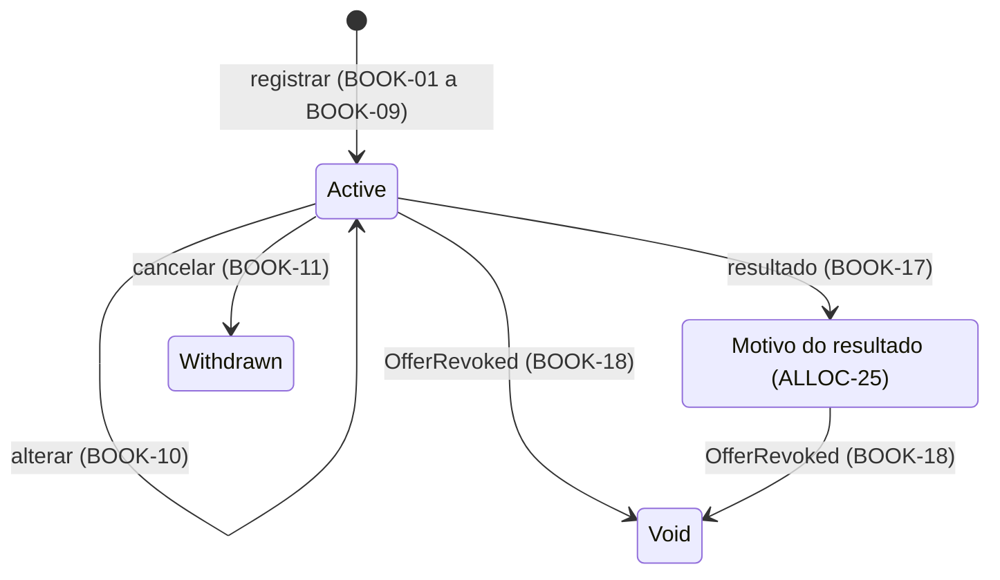

# Livro de Reservas

| | |
|---|---|
| **Originating Context** | BookBuilding; affects Offering |

Requirement prefix: `BOOK`. Propósito da plataforma, mapa de contextos, catálogo de eventos e fluxos: [PRD 0000](0000-platform-overview.md).

## Executive Summary

O BookBuilding impede reservas inválidas e alterações dos pedidos após o fechamento. O livro congelado fornece os pedidos usados pelo processamento do [PRD 0003](0003-book-building-book-processing.md).

O operador registra reservas em nome do investidor, altera ou cancela os pedidos nas condições definidas, fecha o livro e consulta o resultado por reserva.

## Context and Problem

O processamento precisa de pedidos compatíveis com os limites e as opções da oferta. Quantidades inválidas ou alterações após o fechamento comprometem o cálculo.

O operador precisa consultar o resultado de cada reserva para explicar ao investidor quanto foi atendido e por quê.

Categoria e vínculo entram como declarações no pedido, sem cadastro verificado. A opção de condicionamento e a declaração de vínculo constam do pedido de reserva (CVM 160, art. 65, § 6º, II e V), e a categoria é atestada por escrito pelo investidor (CVM 30, arts. 11 e 12).

Política interna de compliance que exija dado cadastral está em Non-goals.

## Target User / JTBD

- Investidor (comitente): garantir participação com a quantidade e a condição que escolheu, e saber o que aconteceu com a reserva.
- Operador da corretora: livro consistente com a oferta e demanda acumulada para decidir e executar o fechamento, inclusive antecipado.

Por decisão do autor, na v1 o operador registra em nome do investidor; não há acesso direto nem identidade de investidor.

## Proposed Solution

Cada reserva é um pedido individual. Um investidor pode manter várias reservas ativas na mesma oferta; o limite se aplica à soma, e as declarações de categoria e vínculo devem coincidir (BOOK-04, BOOK-07).

O operador registra, altera e cancela reservas enquanto a oferta está Aberta, dentro do período e antes do fechamento do livro (BOOK-01, BOOK-10 a BOOK-12). A permissão de alterar e cancelar depende da premissa registrada em Open Questions.

O fechamento é uma ação explícita que congela o livro na mesma operação (BOOK-22, BOOK-15). O processamento atribui status e quantidade alocada a cada reserva, preservando o pedido original (BOOK-17).

O operador consulta a demanda acumulada e os resultados (BOOK-20, BOOK-21). Os estados da reserva e suas transições estão no diagrama e na tabela a seguir.

| Status | Identifier | Significado |
|---|---|---|
| Ativa | `Active` | Pedido aceito, aguardando fechamento ou resultado (BOOK-01, BOOK-22, BOOK-15) |
| Cancelada pelo investidor | `Withdrawn` | Pedido retirado pelo investidor (BOOK-11); não entra no livro fechado |
| Resultado do processamento | Identificador do motivo (ALLOC-25) | Status aplicado pelo resultado (BOOK-17): o motivo do resultado da reserva |
| Sem efeito | `Void` | Oferta revogada (BOOK-18); é também o motivo do resultado quando a oferta não se forma |

## Domain Glossary

A definição da oferta, seus estados, período e conjunto de opções aceitas estão no [PRD 0001](0001-offering-offer-lifecycle.md). O processamento do livro e os motivos do resultado estão no [PRD 0003](0003-book-building-book-processing.md).

| Termo | Definição |
|---|---|
| Investidor | Comitente identificado por id e nome, previamente carregado por seed na v1 (BOOK-02). |
| Categoria do investidor | Classificação declarada na reserva (BOOK-05, BOOK-07); valores na tabela abaixo. |
| Pessoa vinculada | Condição declarada de vínculo com os participantes da oferta (BOOK-06, BOOK-07); declaração `IsRelatedParty`. |
| Reserva | Pedido individual de cotas de uma oferta; pode coexistir com outros pedidos do investidor (BOOK-04, BOOK-08). Identificador `Bid`, justificado em Declared Trade-offs. |
| Livro de reservas / livro fechado | Conjunto de pedidos de uma oferta; fechado pelo operador (BOOK-22), com o recorte congelado definido em BOOK-15 e descrito em BOOK-16. Identificador `Book`. |
| Fechamento do livro | Ação do operador que congela o livro no mesmo instante (BOOK-22, BOOK-15); admite antecipação em relação ao fim do período. |
| Posição do investidor | Soma de suas quantidades ativas na oferta, para aplicação de BOOK-04. |
| Instante do registro | Momento de aceitação da reserva (BOOK-14). |
| Ordem de registro | Posição total e imutável de aceitação no livro (BOOK-14). |
| Opção de condicionamento | Escolha entre as opções aceitas pela oferta (OFF-25), validada por BOOK-08. |
| Quantidade reservada | Cotas pedidas pelo investidor (BOOK-03, BOOK-15). |
| Quantidade alocada | Resultado quantitativo do processamento (ALLOC-25), aplicado por BOOK-17; efeito da revogação em BOOK-18. |
| Demanda acumulada | Soma das quantidades ativas da oferta no instante da consulta (BOOK-20). |

| Categoria (BOOK-05) | Identifier |
|---|---|
| Varejo | `Retail` |
| Qualificado | `Qualified` |
| Profissional | `Professional` |

Os identificadores espelham os termos da CVM 30, arts. 11 e 12; não há termo consagrado equivalente na comunidade anglófona, e a lacuna fica registrada aqui.

## Functional Requirements

Nos requisitos, "investidor" como ator significa o operador agindo em seu nome.

### Registro

- **BOOK-01 (Must)** Reserva só é aceita contra oferta Aberta, com livro ainda não fechado (BOOK-22) e com instante do registro dentro do período de reserva, intervalo fechado definido em OFF-23. Terminado o período, a oferta Aberta não aceita mais reservas, ainda que o livro não tenha sido fechado.
- **BOOK-02 (Must)** O investidor deve existir; este contexto não cria investidor.
- **BOOK-03 (Must)** Quantidade reservada inteira e maior ou igual ao investimento mínimo por investidor.
- **BOOK-04 (Must)** Posição do investidor, incluindo a reserva sendo registrada ou alterada, menor ou igual ao investimento máximo por investidor.
- **BOOK-05 (Must)** Categoria obrigatória: varejo, qualificado ou profissional. Na v1 não altera regra alguma.
- **BOOK-06 (Must)** Declaração de vínculo obrigatória: vinculado ou não vinculado.
- **BOOK-07 (Must)** Categoria e vínculo únicos por investidor em cada oferta: nova reserva de investidor com reserva ativa repete as declarações vigentes; declaração diferente é rejeitada.
- **BOOK-08 (Must)** Oferta com distribuição parcial: o pedido declara exatamente uma opção, pertencente ao conjunto aceito pela oferta (OFF-25). A opção é sempre declarada porque a opção 2 é também o efeito de não condicionar, e não existe reserva sem opção nessas ofertas. Sem distribuição parcial: o pedido deve omitir a opção; se a informar, o registro é rejeitado. Reservas do mesmo investidor podem ter opções distintas.
- **BOOK-09 (Must)** Rejeição informa todas as violações, com atributo e regra de cada uma.

### Alteração e cancelamento

- **BOOK-10 (Must)** Quantidade, declarações e opção de reserva ativa podem ser alteradas enquanto a oferta está Aberta, o livro não foi fechado (BOOK-22) e dentro do período, validadas pelas regras do registro. Alteração de categoria ou vínculo se aplica a todas as reservas ativas do investidor na oferta, cada uma registrando a mudança no histórico. A permissão depende da premissa explicitada em Open Questions.
- **BOOK-11 (Must)** Reserva ativa pode ser cancelada enquanto a oferta está Aberta, o livro não foi fechado (BOOK-22) e o instante está dentro do período, sob a mesma premissa de BOOK-10: passa a Cancelada pelo investidor e não entra no livro fechado; as demais reservas do investidor não são afetadas.
- **BOOK-12 (Must)** Com o livro fechado (BOOK-22), fora de oferta Aberta ou fora do período, alteração e cancelamento são rejeitados; a reserva é irrevogável a partir daí.
- **BOOK-13 (Must)** Toda alteração e cancelamento preserva o histórico: quem, quando e o que mudou.
- **BOOK-14 (Must)** Instante e ordem do registro são imutáveis. A ordem é total no livro: duas reservas nunca compartilham a posição, ainda que aceitas no mesmo instante.

### Fechamento e congelamento

- **BOOK-22 (Must)** Fechar o livro é ação explícita do operador sobre livro de oferta Aberta, permitida a qualquer instante maior ou igual ao início do período de reserva, o que admite fechamento antecipado; o fim do período não fecha o livro por si. Livro já fechado não é fechado de novo, e a ação não transita a oferta.
- **BOOK-15 (Must)** No fechamento (BOOK-22) o livro congela no mesmo instante: as reservas ativas naquele instante formam o livro fechado; nenhuma entra, muda ou sai depois.
- **BOOK-16 (Must)** O livro fechado é a entrada exclusiva do processamento: todas as reservas que o compõem segundo BOOK-15, cada uma identificável, com investidor, quantidade, declarações, opção, instante e ordem do registro.

### Resultado

- **BOOK-17 (Must)** Cada reserva do livro fechado recebe do processamento o status resultante e a quantidade alocada: o status é o motivo do resultado (ALLOC-25). Quantidade reservada, declarações e opção não mudam.

### Revogação

- **BOOK-18 (Must)** Quando a oferta é revogada, toda reserva que não esteja Cancelada pelo investidor passa a Sem efeito, qualquer que seja o status, inclusive um resultado já aplicado; reserva já Sem efeito permanece. A quantidade alocada vigente passa a zero e o resultado anterior fica no histórico (BOOK-13, BOOK-NFR-03). Oferta não formada chega pelo resultado (BOOK-17), não por evento próprio.

### Consulta

- **BOOK-20 (Must)** O livro é consultável pelo operador a qualquer momento, com demanda acumulada e lista de reservas com status. É a base do fechamento antecipado (BOOK-22).
- **BOOK-21 (Should)** As reservas de um investidor são consultáveis pelo operador, com status e, após o processamento, quantidade alocada.

## Domain Events

Consome `OfferPublished` (BOOK-01) e `OfferRevoked` (BOOK-18).

Fechamento do livro (BOOK-22), congelamento, processamento e aplicação do resultado são internos ao contexto. O evento `BookProcessed` é declarado no [PRD 0003](0003-book-building-book-processing.md).

`BookClosed`, `BidPlaced`, `BidChanged` e `BidWithdrawn` são candidatos futuros, condicionados à existência de consumidores.

## Non-functional Requirements

- **BOOK-NFR-01** Registro, alteração e cancelamento são atômicos e validados contra a definição vigente da oferta; BOOK-04 e BOOK-07 leem as demais reservas ativas do investidor na mesma operação.
- **BOOK-NFR-02** Congelamento consistente: fechamento (BOOK-22) e congelamento (BOOK-15) são uma única operação atômica, não existe reserva aceita com instante posterior ao fechamento, e o processamento lê o livro idêntico ao congelado (BOOK-16).
- **BOOK-NFR-03** Toda mudança de reserva e todo status aplicado registram origem e instante.
- **BOOK-NFR-04** Dados do investidor não aparecem em rastros de execução; identificadores de reserva e oferta bastam.

## Regulatory Considerations

Fontes: [CVM 160](https://conteudo.cvm.gov.br/export/sites/cvm/legislacao/resolucoes/anexos/100/resol160consolid.pdf) e [CVM 30](https://conteudo.cvm.gov.br/export/sites/cvm/legislacao/resolucoes/anexos/001/resol030consolid.pdf), consultadas em 2026-09-05.

- CVM 160, art. 65, § 4º: reserva irrevogável salvo modificação ou revogação → BOOK-10, BOOK-11, BOOK-12. Alteração até o fechamento é decisão do autor; ver Open Questions.
- CVM 160, art. 65, § 6º, II e V: o pedido contém as condições da parcial e identifica o vinculado → BOOK-06, BOOK-08.
- CVM 160, art. 66: reservas não se aplicam a profissionais → BOOK-05. Sem efeito na v1.
- CVM 160, art. 2º, XVI, e art. 56: pessoa vinculada, declarada na reserva para a aplicação da vedação em excesso → BOOK-06.
- CVM 160, art. 2º, X e XI, e CVM 30, arts. 11 e 12: profissional e qualificado atestam a condição por escrito → BOOK-05.
- CVM 160, art. 75: parcial não se aplica a ofertas exclusivas para profissionais → BOOK-05. Sem distinção por categoria na v1.
- CVM 160, arts. 69, § 1º, e 65, § 5º: desistência após o fechamento nasce de modificação ou divergência de prospectos → BOOK-12. Fora do escopo; modificação exigiria cancelamento com prazo mínimo de cinco dias úteis.
- CVM 160, art. 76, II: encerramento quando a totalidade for colocada, antes do fim do prazo → BOOK-22. Sustenta o fechamento antecipado do livro; o anúncio de encerramento fica fora do escopo.

## Non-goals

- Cadastro, identidade e autorização de investidor; verificação de suitability (art. 64) e das declarações, inclusive por política interna.
- Depósito do montante reservado (art. 65, §§ 1º e 2º) e movimentação financeira.
- Vedação a vinculadas, condicionamento e rateio (PRD 0003); efeito da categoria do investidor.
- Reservas por mais de um intermediário; direito de desistência após o fechamento; coleta de intenções de investimento sem período de reserva.

## Declared Trade-offs

### Fechamento do livro como ação explícita do operador no BookBuilding, não derivado do fim do período (BOOK-22)

*Cost:* no Offering, a oferta fica Aberta entre o fechamento do livro e o desfecho, sem estado que reflita a fase do livro, e quem precisa saber se o livro fechou pergunta ao BookBuilding; no BookBuilding, o livro fica aberto até o operador agir, e a recusa após o fim do período depende de BOOK-01.

*Reason:* o fechamento antecipado (art. 76, II) exige ação explícita, e a ação mora onde estão a demanda que a motiva (BOOK-20) e o congelamento que ela produz (BOOK-15); fechar no Offering exigiria um evento a mais e abriria uma janela entre o fechamento e o congelamento.

### Alteração e cancelamento antes do fechamento, dentro do período e em oferta Aberta (BOOK-10 a BOOK-12)

*Cost:* a demanda acumulada pode diminuir antes do fechamento antecipado, e a permissão depende de uma premissa operacional ainda não verificada.

*Reason:* o modelo representa o livro interno da corretora e considera o consolidado como a aceitação enviada ao coordenador. A relação dessa premissa com o art. 65, § 4º, está registrada em Open Questions.

### Categoria e vínculo como declarações na reserva, únicas por investidor em cada oferta (BOOK-05 a BOOK-07)

*Cost:* categorias diferentes em ofertas diferentes; declaração falsa passa; alterar cascateia.

*Reason:* é como a norma trata; evita cadastro; impede investidor metade vinculado.

### Várias reservas ativas por investidor, limite sobre a soma (BOOK-04)

*Cost:* o registro lê as demais reservas; fracionar aumenta as chances no resto do rateio.

*Reason:* permite lotes com opções distintas; o limite sobre a posição preserva o teto do Offering.

### Status resultante do processamento é o motivo do resultado (BOOK-17)

*Cost:* um status por motivo do resultado, e Sem efeito agrega não formação e revogação, distinguíveis só pelo desfecho da oferta.

*Reason:* um conceito, um nome no mesmo contexto; "o que aconteceu com a minha reserva" tem resposta direta, e a quantidade reservada nunca muda.

### Instante e ordem imutáveis mesmo com alteração (BOOK-14)

*Cost:* reservar cedo e aumentar no fim mantém a prioridade no desempate, com ganho máximo de uma cota.

*Reason:* campo imutável é auditável e reiniciar puniria correções; a ordem, não o instante, é o desempate porque o processamento exige determinismo.

### Sem eventos por reserva na v1

*Cost:* nenhum contrato para reagir às reservas em tempo real.

*Reason:* evento sem consumidor é acoplamento implícito; o único evento do contexto é o desfecho, `BookProcessed`.

### `BookBuilding` como nome do contexto

*Cost:* no mercado o termo inclui a descoberta de preço, que o modelo não tem: o preço é fixo (OFF-17) e a coleta de intenções está em Non-goals.

*Reason:* é o nome que os comunicados de placement dão ao processo de abrir o livro, receber pedidos, fechar e alocar com scale-back, inclusive a preço único; `ReservationBook` seria espelho do português e `Booking` significa registrar uma transação.

### `Bid` como identificador da reserva

*Cost:* em inglês geral sugere leilão ou preço, ausentes aqui.

*Reason:* é o termo desses comunicados para o pedido que entra no livro e sofre scale-back; `Order` colide com a ordem de registro (BOOK-14) e `Application` com o vocabulário de software.

## Success Metrics

### Leading

- Toda combinação inválida de BOOK-01 a BOOK-08 é rejeitada no registro e na alteração com todas as violações.
- Nada é aceito, alterado ou cancelado após o fechamento.
- Toda reserva do livro fechado de oferta processada tem status resultante do processamento e quantidade alocada.

### Lagging

- O processamento não precisa de dado além do conteúdo de BOOK-16.

### Guardrails

- Pedido, declarações, opção, instante e ordem nunca são alterados por resultado nem por revogação.
- Reserva Cancelada pelo investidor nunca recebe resultado.
- A posição nunca excede o máximo.
- Nenhuma regra depende da categoria na v1.

## Acceptance Criteria

Oferta Aberta dentro do período, investimento mínimo 10 e máximo 500, opções {1, 2, 3}; investidor existente, varejo e não vinculado, salvo indicação.

Cada caso é independente. Nos casos de aplicação de resultado, a entrada é um livro já fechado e válido para os limites da respectiva oferta.

| Caso | Entrada | Intermediários | Ramo | Resultado |
|---|---|---|---|---|
| Primeira reserva | 50 cotas, opção 3 | Posição 50 | BOOK-01 a BOOK-08 | Ativa |
| Reservas adicionais | 50 ativas; nova de 400, opção 1; depois tentativa de 60 | Posições 450 e 510 | BOOK-04, BOOK-08 | Segunda aceita; terceira rejeitada |
| Declaração conflitante | Reserva ativa não vinculada; nova declara vínculo | Divergência na oferta | BOOK-07 | Nova reserva rejeitada |
| Rejeição múltipla | 5 cotas, opção 4, vínculo ausente | Três violações | BOOK-03, BOOK-06, BOOK-08, BOOK-09 | Rejeição lista as três |
| Opção fora da condição | Oferta sem parcial; reserva informa opção 1 | Opção inaplicável | BOOK-08 | Rejeitada |
| Alteração preserva ordem | 50 cotas às 10h, ordem 7; alterar para 80 às 11h | Posição 80 | BOOK-10, BOOK-13, BOOK-14 | 80 cotas; histórico; instante 10h e ordem 7 |
| Resultado por rateio | Pedido 50; resultado 40 por rateio | 40/50 | BOOK-17 | Atendida parcialmente por rateio; pedido preservado |
| Proporcional zero | Pedido 1 em oferta com mínimo individual 1; resultado proporcional zero | 0/1 | BOOK-17 | Atendida parcialmente por proporcional com zero |
| Exclusão | Resultado por vinculação, zero | Motivo excluída por vinculação | BOOK-17 | Excluída por vinculação |
| Não formação | Desfecho não formada | Cada resultado zero, desfecho `Lapsed` | BOOK-17 | Reservas do livro fechado Sem efeito |
| Revogação após resultado | Atendida integralmente 50/50; rateio 40/50; uma Withdrawn | Dois resultados vigentes | BOOK-18 | Duas Sem efeito com zero e histórico; Withdrawn preservada |
| Consulta da demanda | Reservas ativas 50, 400 e 30 de investidores distintos | Soma 480 | BOOK-20 | Demanda 480 e três Ativas |
| Fechamento antecipado | Período até amanhã; três ativas e uma Withdrawn; operador fecha hoje | Instante ≥ início do período | BOOK-22, BOOK-15 | Livro fechado com as três ativas; nova reserva rejeitada |

- **Dadas** duas reservas ativas do investidor, **quando** o operador muda categoria ou vínculo em uma, **então** ambas recebem a declaração e cada histórico registra a alteração (BOOK-07, BOOK-10).
- **Dada** oferta em Draft ou Revogada, livro já fechado, ou oferta Aberta após o período, **quando** se tenta reservar, **então** o pedido é rejeitado (BOOK-01, BOOK-22).
- **Dado** livro fechado, **quando** se tenta cancelar reserva, **então** a tentativa é rejeitada (BOOK-12).
- **Dado** um livro com reservas ativas e uma Withdrawn, **quando** o operador fecha o livro, **então** somente as ativas no fechamento compõem a entrada do processamento; reservas aceitas no mesmo instante têm ordens distintas (BOOK-14 a BOOK-16, BOOK-22).
- **Dado** livro já fechado, **quando** o operador tenta fechá-lo de novo, **então** a tentativa é rejeitada (BOOK-22).
- **Dada** oferta Aberta com reservas ativas, **quando** é revogada, **então** elas ficam Sem efeito (BOOK-18).

## Dependencies and Risks

| Item | Tipo | Impacto |
|---|---|---|
| Offering | Fornecedor da definição | BOOK-01, BOOK-03, BOOK-04 e BOOK-08 dependem da definição publicada e do estado corrente (OFF-NFR-03); o fechamento do livro não depende dele (BOOK-22). |
| Investidores carregados por seed | Dados | A ausência de investidores impede registrar reservas por BOOK-02. |
| Declarações não verificadas | Dados | Erro de vínculo altera a aplicação da vedação; a categoria não produz efeito na v1. |
| Alteração antes do fechamento | Comportamento | A hipótese operacional de BOOK-10 a BOOK-12 depende de validação do autor. |

## Open Questions

### [ASSUMPTION] Ajuste do pedido antes da aceitação formal

**Premissa:** o pedido no livro interno da corretora pode ser ajustado nas condições de BOOK-10 a BOOK-12, e a aceitação formal enviada ao coordenador é o consolidado. A premissa permanece não verificada.

**Impacto se falsa:** será necessário distinguir registro e confirmação e revisar BOOK-10 a BOOK-12.

**Responsável:** autor.

**Evidência necessária:** regulamento da corretora ou contrato de distribuição que permita essa operação e defina o instante da aceitação irrevogável.

## Weakest Point

**Decisão:** permitir alteração e cancelamento antes do fechamento, dentro do período e em oferta Aberta (BOOK-10 a BOOK-12).

**Risco:** a demanda usada para decidir o fechamento antecipado pode diminuir. A permissão também depende de distinguir o pedido interno da aceitação formal; essa distinção ainda não foi comprovada pela fonte operacional indicada em Open Questions.

**Mitigação definida:** o livro congelado é imutável (BOOK-15), e alterações anteriores preservam histórico (BOOK-13). Essas regras protegem o cálculo e a rastreabilidade, mas não comprovam a premissa operacional.

**Critério de reavaliação:** se a aceitação irrevogável ocorrer antes do fechamento, o modelo precisará de um instante de confirmação e de novas condições para BOOK-10 a BOOK-12. A decisão cabe ao autor, com a evidência indicada em Open Questions.

## References

- [Resolução CVM 160](https://conteudo.cvm.gov.br/export/sites/cvm/legislacao/resolucoes/anexos/100/resol160consolid.pdf) — arts. 2º, X, XI e XVI, 56, 64, 65, 66, 69, 75 e 76; lida em 2026-09-05.
- [Resolução CVM 30](https://conteudo.cvm.gov.br/export/sites/cvm/legislacao/resolucoes/anexos/001/resol030consolid.pdf) — arts. 11 e 12; lida em 2026-09-05.
- Referências terminológicas em inglês, sem valor normativo, que sustentam `BookBuilding` e `Bid`: [Lloyds TSB Group](https://www.sec.gov/Archives/edgar/data/0001160106/000119163808001657/lloy200809196k2.htm), [Argo Blockchain](https://www.sec.gov/Archives/edgar/data/1841675/000165495423009326/a4294g.htm) e [Renalytix](https://www.sec.gov/Archives/edgar/data/1811115/000119312524230319/d896405dex992.htm) — comunicados de placement com "the Bookbuild will establish a single price", "to bid in the Bookbuild" e "bids may be scaled down"; lidos em 2026-09-13.
