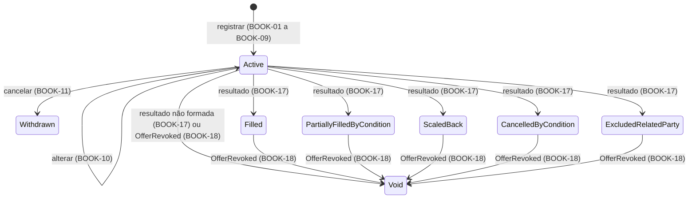

# Livro de Reservas

| | |
|---|---|
| **Originating Context** | BookBuilding; affects Offering |

Requirement prefix: `BOOK`. Propósito da plataforma, mapa de contextos, catálogo de eventos e fluxos: [PRD 0000](0000-platform-overview.md).

## Executive Summary

Pedidos incompatíveis com a oferta e mudanças tardias no livro comprometem a alocação. O BookBuilding permite registrar a intenção do investidor, acompanhar sua evolução e consultar o resultado por reserva, conforme BOOK-01 a BOOK-18, BOOK-20 e BOOK-21; o processamento do livro fechado é o [PRD 0003](0003-book-building-book-processing.md). A métrica primária é a ausência de reservas inválidas e de mudanças no pedido após o fechamento nos cenários de verificação.

## Context and Problem

O processamento do livro precisa receber uma demanda consistente com os limites da oferta. Quantidades indevidas, opções não admitidas e alterações posteriores ao fechamento tornam essa entrada pouco confiável; a ausência de um resultado consultável por reserva também impede o operador de explicar o atendimento ao investidor.

Categoria e vínculo entram como declarações no pedido, sem cadastro verificado: a opção de condicionamento e a declaração de vínculo moram no pedido de reserva (CVM 160, art. 65, § 6º, II e V) e a categoria é atestada por escrito pelo investidor (CVM 30, arts. 11 e 12). Política interna de compliance que exija dado cadastral está em Non-goals.

## Target User / JTBD

- Investidor (comitente): garantir participação com a quantidade e a condição que escolheu, e saber o que aconteceu com a reserva. Por decisão do autor, no MVP o operador registra em nome dele; não há acesso direto nem identidade de investidor.
- Operador da corretora: livro consistente com a oferta e demanda acumulada para decidir o fechamento antecipado.

## Proposed Solution

Cada reserva é um pedido individual, e o livro da oferta é o conjunto das suas reservas; um investidor pode ter várias reservas ativas na mesma oferta, com limite sobre a soma e declarações iguais em todas (BOOK-04, BOOK-07). Após o processamento do livro fechado (PRD 0003), cada reserva recebe um status terminal e a quantidade alocada, sem alterar o pedido (BOOK-17). Registro e declarações são governados por BOOK-01 a BOOK-09; alterações e cancelamento, por BOOK-10 a BOOK-14, sujeitos à premissa em Open Questions. O fechamento e o resultado seguem BOOK-15 a BOOK-18. O operador acompanha a demanda e os resultados por BOOK-20 e BOOK-21.

| Status | Identifier | Significado |
|---|---|---|
| Ativa | `Active` | Pedido aceito, aguardando fechamento ou resultado (BOOK-01, BOOK-15) |
| Cancelada pelo investidor | `Withdrawn` | Pedido retirado pelo investidor (BOOK-11); não entra no livro fechado |
| Atendida | `Filled` | Atendimento integral (BOOK-17; ALLOC-12, ALLOC-15, ALLOC-21) |
| Atendida parcialmente por proporcional | `PartiallyFilledByCondition` | Opção 3 em distribuição parcial (BOOK-17; ALLOC-13), inclusive com zero cotas (ALLOC-24) |
| Atendida parcialmente por rateio | `ScaledBack` | Excesso de demanda (BOOK-17; ALLOC-16), inclusive quando o resto leva a quantidade a `q` |
| Não atendida por condicionamento | `CancelledByCondition` | Opção 1 em distribuição parcial (BOOK-17; ALLOC-11) |
| Excluída por vinculação | `ExcludedRelatedParty` | Vedação a vinculadas (BOOK-17; ALLOC-06) |
| Sem efeito | `Void` | Oferta não formada (BOOK-17; ALLOC-09) ou revogada (BOOK-18) |

Persistência, exposição e experiência de registro são downstream.

## Domain Glossary

Definição da oferta, estados, período e opções pertencem ao [PRD 0001](0001-offering-offer-lifecycle.md); o processamento do livro e os motivos do resultado, ao [PRD 0003](0003-book-building-book-processing.md).

| Termo | Definição |
|---|---|
| Investidor | Comitente identificado por id e nome, previamente carregado por seed no MVP (BOOK-02). |
| Categoria do investidor | Classificação declarada na reserva (BOOK-05, BOOK-07); valores na tabela abaixo. |
| Pessoa vinculada | Condição declarada de vínculo com os participantes da oferta (BOOK-06, BOOK-07); declaração `IsRelatedParty`. |
| Reserva | Pedido individual de cotas de uma oferta; pode coexistir com outros pedidos do investidor (BOOK-04, BOOK-08). Identificador `Bid`; decisão em Declared Trade-offs. |
| Livro de reservas / livro fechado | Conjunto de pedidos de uma oferta; recorte congelado definido em BOOK-15 e descrito em BOOK-16. Identificador `Book`. |
| Posição do investidor | Soma de suas quantidades ativas na oferta, para aplicação de BOOK-04. |
| Instante do registro | Momento de aceitação da reserva (BOOK-14). |
| Ordem de registro | Posição total e imutável de aceitação no livro (BOOK-14); usada por ALLOC-17. |
| Opção de condicionamento | Escolha entre as opções do Offering (OFF-26 a OFF-29), validada por BOOK-08. |
| Quantidade reservada | Cotas pedidas pelo investidor (BOOK-03, BOOK-15). |
| Quantidade alocada | Resultado quantitativo do processamento (ALLOC-25), aplicado por BOOK-17; efeito da revogação em BOOK-18. |
| Demanda acumulada | Soma das quantidades ativas da oferta no instante da consulta (BOOK-20). |

| Categoria (BOOK-05) | Identifier |
|---|---|
| Varejo | `Retail` |
| Qualificado | `Qualified` |
| Profissional | `Professional` |

Os identificadores espelham os termos da CVM 30, arts. 11 e 12; não há termo consagrado equivalente na comunidade anglófona, e a lacuna fica registrada aqui.

## Functional Requirements

Cada requisito é uma condição verificável. "Investidor" como ator significa o operador agindo em seu nome.

### Registro

- **BOOK-01 (Must)** Reserva só é aceita contra oferta Aberta e com instante do registro dentro do período de reserva (OFF-08; intervalo fechado em OFF-23).
- **BOOK-02 (Must)** O investidor deve existir; este contexto não cria investidor.
- **BOOK-03 (Must)** Quantidade reservada inteira e maior ou igual ao investimento mínimo por investidor.
- **BOOK-04 (Must)** Posição do investidor, incluindo a reserva sendo registrada ou alterada, menor ou igual ao investimento máximo por investidor.
- **BOOK-05 (Must)** Categoria obrigatória: varejo, qualificado ou profissional. Na v1 não altera regra alguma.
- **BOOK-06 (Must)** Declaração de vínculo obrigatória: vinculado ou não vinculado.
- **BOOK-07 (Must)** Categoria e vínculo únicos por investidor em cada oferta: nova reserva de investidor com reserva ativa repete as declarações vigentes; declaração diferente é rejeitada.
- **BOOK-08 (Must)** Oferta com distribuição parcial: opção obrigatória e pertencente ao conjunto aceito (OFF-29). Sem distribuição parcial: o pedido deve omitir a opção; se a informar, o registro é rejeitado. Reservas do mesmo investidor podem ter opções distintas.
- **BOOK-09 (Must)** Rejeição informa todas as violações, com atributo e regra de cada uma.

### Alteração e cancelamento

- **BOOK-10 (Must)** Quantidade, declarações e opção de reserva ativa podem ser alteradas enquanto a oferta está Aberta e dentro do período, validadas pelas regras do registro. Alteração de categoria ou vínculo se aplica a todas as reservas ativas do investidor na oferta, cada uma registrando a mudança no histórico. A permissão depende da premissa explicitada em Open Questions.
- **BOOK-11 (Must)** Reserva ativa pode ser cancelada nas condições e sob a premissa de BOOK-10: passa a Cancelada pelo investidor e não entra no livro fechado; as demais reservas do investidor não são afetadas.
- **BOOK-12 (Must)** Fora de oferta Aberta ou fora do período, alteração e cancelamento são rejeitados; a reserva é irrevogável a partir daí.
- **BOOK-13 (Must)** Toda alteração e cancelamento preserva o histórico: quem, quando e o que mudou.
- **BOOK-14 (Must)** Instante e ordem do registro são imutáveis. A ordem é total no livro: duas reservas nunca compartilham a posição, ainda que aceitas no mesmo instante.

### Fechamento e resultado

- **BOOK-15 (Must)** No fechamento da oferta o livro congela: as reservas ativas naquele instante formam o livro fechado; nenhuma entra, muda ou sai depois.
- **BOOK-16 (Must)** O livro fechado é a entrada exclusiva do processamento (ALLOC-01): todas as reservas que o compõem segundo BOOK-15, cada uma identificável, com investidor, quantidade, declarações, opção, instante e ordem do registro.
- **BOOK-17 (Must)** O resultado do processamento define o status terminal e a quantidade alocada de cada reserva do livro fechado: o status é o motivo do resultado (ALLOC-25), e Sem efeito quando a oferta não se forma (ALLOC-09). Quantidade reservada, declarações e opção não mudam.
- **BOOK-18 (Must)** Quando a oferta é revogada, toda reserva que não esteja Cancelada pelo investidor passa a Sem efeito, qualquer que seja o status, inclusive um resultado já aplicado; reserva já Sem efeito permanece. A quantidade alocada vigente passa a zero e o resultado anterior fica no histórico (BOOK-13, BOOK-NFR-03). Oferta não formada chega pelo resultado (BOOK-17), não por evento próprio.

### Consulta

- **BOOK-20 (Must)** O livro é consultável pelo operador a qualquer momento, com demanda acumulada e lista de reservas com status. É a base do fechamento antecipado (OFF-07).
- **BOOK-21 (Should)** As reservas de um investidor são consultáveis pelo operador, com status e, após o processamento, quantidade alocada.

## Domain Events

Consome `OfferPublished` (BOOK-01), `OfferClosed` (BOOK-15) e `OfferRevoked` (BOOK-18). Congelamento do livro, processamento e aplicação do resultado são internos ao contexto; o evento `BookProcessed`, que fecha o ciclo com o Offering, é declarado no [PRD 0003](0003-book-building-book-processing.md). Catálogo e fluxos estão no [PRD 0000](0000-platform-overview.md).

## Non-functional Requirements

- **BOOK-NFR-01** Registro, alteração e cancelamento são atômicos e validados contra a definição vigente da oferta; BOOK-04 e BOOK-07 leem as demais reservas ativas do investidor na mesma operação.
- **BOOK-NFR-02** Congelamento consistente: não existe reserva aceita com instante posterior ao fechamento, e o processamento lê o livro idêntico ao congelado (BOOK-16).
- **BOOK-NFR-03** Toda mudança de reserva e todo status aplicado registram origem e instante.
- **BOOK-NFR-04** Dados do investidor não aparecem em rastros de execução; identificadores de reserva e oferta bastam.

## Regulatory Considerations

Fontes: [CVM 160](https://conteudo.cvm.gov.br/export/sites/cvm/legislacao/resolucoes/anexos/100/resol160consolid.pdf) e [CVM 30](https://conteudo.cvm.gov.br/export/sites/cvm/legislacao/resolucoes/anexos/001/resol030consolid.pdf), consultadas em 2026-09-05.

- CVM 160, art. 65, § 4º: reserva irrevogável salvo modificação ou revogação → BOOK-10, BOOK-11, BOOK-12. Alteração até o fechamento é decisão do autor; ver Open Questions.
- CVM 160, art. 65, § 6º, II e V: o pedido contém as condições da parcial e identifica o vinculado → BOOK-06, BOOK-08.
- CVM 160, art. 66: reservas não se aplicam a profissionais → BOOK-05. Sem efeito na v1.
- CVM 160, art. 2º, XVI, e art. 56: pessoa vinculada e vedação em excesso → BOOK-06, ALLOC-06, ALLOC-07, ALLOC-08, ALLOC-21. A vedação vive no PRD 0003.
- CVM 160, art. 2º, X e XI, e CVM 30, arts. 11 e 12: profissional e qualificado atestam a condição por escrito → BOOK-05.
- CVM 160, art. 75: parcial não se aplica a ofertas exclusivas para profissionais → BOOK-05. Sem distinção por categoria na v1.
- CVM 160, arts. 69, § 1º, e 65, § 5º: desistência após o fechamento nasce de modificação ou divergência de prospectos → BOOK-12. Fora do escopo; modificação exigiria cancelamento com prazo mínimo de cinco dias úteis.

## Non-goals

- Cadastro, identidade e autorização de investidor; verificação de suitability (art. 64) e das declarações, inclusive por política interna.
- Depósito do montante reservado (art. 65, §§ 1º e 2º) e movimentação financeira.
- Vedação a vinculadas, condicionamento e rateio (PRD 0003); efeito da categoria do investidor.
- Reservas por mais de um intermediário; direito de desistência após o fechamento; coleta de intenções de investimento sem período de reserva.

## Declared Trade-offs

- **Alteração e cancelamento livres até o fechamento (BOOK-10 a BOOK-12).** *Cost:* a demanda acumulada não é compromisso, o livro pode encolher antes do fechamento antecipado e a regra diverge da letra do art. 65, § 4º. *Reason:* a plataforma modela o livro da corretora, não o do coordenador; a irrevogabilidade que o processamento exige é a do livro fechado. Vinculada à premissa em Open Questions.
- **Categoria e vínculo como declarações na reserva, únicas por investidor em cada oferta (BOOK-05 a BOOK-07).** *Cost:* categorias diferentes em ofertas diferentes; declaração falsa passa; alterar cascateia. *Reason:* é como a norma trata; evita cadastro; impede investidor metade vinculado.
- **Várias reservas ativas por investidor, limite sobre a soma (BOOK-04).** *Cost:* o registro lê as demais reservas; fracionar aumenta as chances no resto do rateio. *Reason:* permite lotes com opções distintas; o limite sobre a posição preserva o teto do Offering.
- **Status terminal é o motivo do resultado (BOOK-17).** *Cost:* oito valores de status, e Sem efeito agrega não formação e revogação, distinguíveis só pelo desfecho da oferta. *Reason:* um conceito, um nome no mesmo contexto; "o que aconteceu com a minha reserva" tem resposta direta, e a quantidade reservada nunca muda.
- **Instante e ordem imutáveis mesmo com alteração (BOOK-14).** *Cost:* reservar cedo e aumentar no fim mantém a prioridade no desempate, com ganho máximo de uma cota. *Reason:* campo imutável é auditável e reiniciar puniria correções; a ordem, não o instante, é o desempate porque o processamento exige determinismo (ALLOC-04).
- **Sem eventos por reserva na v1.** *Cost:* nenhum contrato para reagir às reservas em tempo real. *Reason:* evento sem consumidor é acoplamento implícito; o único evento do contexto é o desfecho (ALLOC-26).
- **`BookBuilding` como nome do contexto.** *Cost:* no mercado o termo inclui a descoberta de preço, que o modelo não tem: o preço é fixo (OFF-17) e a coleta de intenções está em Non-goals. *Reason:* é o nome que os comunicados de placement dão ao processo de abrir o livro, receber pedidos, fechar e alocar com scale-back, inclusive a preço único; `ReservationBook` seria espelho do português e `Booking` significa registrar uma transação.
- **`Bid` como identificador da reserva.** *Cost:* em inglês geral sugere leilão ou preço, ausentes aqui. *Reason:* é o termo desses comunicados para o pedido que entra no livro e sofre scale-back; `Order` colide com a ordem de registro (BOOK-14) e `Application` com o vocabulário de software.

## Success Metrics

- Leading: toda combinação inválida de BOOK-01 a BOOK-08 é rejeitada no registro e na alteração com todas as violações; nada é aceito, alterado ou cancelado após o fechamento; toda reserva do livro fechado de oferta processada tem status terminal e quantidade alocada.
- Lagging: o processamento não precisa de dado além do conteúdo de BOOK-16.
- Guardrails: pedido, declarações, opção, instante e ordem nunca são alterados por resultado nem por revogação; reserva Cancelada pelo investidor nunca recebe resultado; a posição nunca excede o máximo; nenhuma regra depende da categoria na v1.

## Acceptance Criteria

Oferta Aberta dentro do período, investimento mínimo 10 e máximo 500, opções {1, 2, 3}; investidor existente, varejo e não vinculado, salvo indicação. Cada caso é independente. Nos casos de aplicação de resultado, a entrada é um livro já fechado e válido para os limites da respectiva oferta.

| Caso | Entrada | Intermediários | Ramo | Resultado |
|---|---|---|---|---|
| Primeira reserva | 50 cotas, opção 3 | Posição 50 | BOOK-01 a BOOK-08 | Ativa |
| Reservas adicionais | 50 ativas; nova de 400, opção 1; depois tentativa de 60 | Posições 450 e 510 | BOOK-04, BOOK-08 | Segunda aceita; terceira rejeitada |
| Declaração conflitante | Reserva ativa não vinculada; nova declara vínculo | Divergência na oferta | BOOK-07 | Nova reserva rejeitada |
| Rejeição múltipla | 5 cotas, opção 4, vínculo ausente | Três violações | BOOK-03, BOOK-06, BOOK-08, BOOK-09 | Rejeição lista as três |
| Opção fora da condição | Oferta sem parcial; reserva informa opção 1 | Opção inaplicável | BOOK-08 | Rejeitada |
| Alteração preserva ordem | 50 cotas às 10h, ordem 7; alterar para 80 às 11h | Posição 80 | BOOK-10, BOOK-13, BOOK-14 | 80 cotas; histórico; instante 10h e ordem 7 |
| Resultado por rateio | Pedido 50; resultado 40 por rateio | 40/50 | BOOK-17 | Atendida parcialmente por rateio; pedido preservado |
| Proporcional zero | Pedido 1 em oferta com mínimo individual 1; resultado proporcional zero | 0/1 | BOOK-17 | Atendida parcialmente por proporcional com zero |
| Exclusão | Resultado por vinculação, zero | Motivo excluída por vinculação | BOOK-17 | Excluída por vinculação |
| Não formação | Desfecho não formada | Cada resultado zero, desfecho `Lapsed` | BOOK-17 | Reservas do livro fechado Sem efeito |
| Revogação após resultado | Atendida 50/50; rateio 40/50; uma Withdrawn | Dois resultados vigentes | BOOK-18 | Duas Sem efeito com zero e histórico; Withdrawn preservada |
| Consulta da demanda | Reservas ativas 50, 400 e 30 de investidores distintos | Soma 480 | BOOK-20 | Demanda 480 e três Ativas |

- **Given** duas reservas ativas do investidor, **when** o operador muda categoria ou vínculo em uma, **then** ambas recebem a declaração e cada histórico registra a alteração (BOOK-07, BOOK-10).
- **Given** oferta em Draft, Fechada ou Revogada, ou Aberta após o período, **when** se tenta reservar, **then** o pedido é rejeitado (BOOK-01).
- **Given** oferta Fechada, **when** se tenta cancelar reserva, **then** a tentativa é rejeitada (BOOK-12).
- **Given** um livro com reservas ativas e uma Withdrawn, **when** a oferta é fechada, **then** somente as ativas no fechamento compõem a entrada do processamento; reservas aceitas no mesmo instante têm ordens distintas (BOOK-14 a BOOK-16).
- **Given** oferta Aberta com reservas ativas, **when** é revogada, **then** elas ficam Sem efeito (BOOK-18).

## Dependencies and Risks

O [PRD 0000](0000-platform-overview.md) apresenta as relações entre contextos.

| Item | Tipo | Impacto |
|---|---|---|
| Offering | Fornecedor da definição e consumidor do desfecho | BOOK-01, BOOK-03, BOOK-04 e BOOK-08 dependem da definição publicada e do estado corrente (OFF-NFR-03); o desfecho do processamento (ALLOC-26) é consumido por OFF-31 a OFF-33. |
| Investidores carregados por seed | Dados | A ausência de investidores impede registrar reservas por BOOK-02. |
| Declarações não verificadas | Dados | Erro de vínculo altera a aplicação da vedação; a categoria não produz efeito na v1. |
| Alteração antes do fechamento | Comportamento | A hipótese operacional de BOOK-10 a BOOK-12 depende de validação do autor. |

## Open Questions

- **[ASSUMPTION] O pedido do cliente no livro interno da corretora pode ser ajustado até o fechamento, e a aceitação formal enviada ao coordenador é o consolidado; if false, BOOK-10 a BOOK-12 deixam de representar o caso de uso e será necessário distinguir registro de confirmação.** Dono: autor; validar em regulamento da corretora ou contrato de distribuição que permita essa operação e delimite quando ocorre a aceitação irrevogável.

## Weakest Point

A decisão de **permitir alteração e cancelamento até o fechamento, tratando a irrevogabilidade do art. 65, § 4º, como propriedade do livro fechado** (BOOK-10 a BOOK-12).

*Vetor de ataque:* lido literalmente, o § 4º faz da reserva uma aceitação irrevogável. Com a alteração livre, a demanda acumulada deixa de ser compromisso e o fechamento antecipado (OFF-07) se apoia em um número que pode cair. A defesa é que o modelo representa o livro da corretora e o pedido formal ao coordenador é o consolidado; é a única premissa não verificada do PRD.

*Desafie antes de aprovar:* o caso de uso permite mexer na reserva até o fechamento, ou é uma janela curta de arrependimento seguida de irrevogabilidade? Se for a segunda, entra um instante de confirmação separado do registro e BOOK-10 a BOOK-12 mudam.

## References

- [Resolução CVM 160](https://conteudo.cvm.gov.br/export/sites/cvm/legislacao/resolucoes/anexos/100/resol160consolid.pdf) — arts. 2º, X, XI e XVI, 56, 64, 65, 66, 69 e 75; lida em 2026-09-05.
- [Resolução CVM 30](https://conteudo.cvm.gov.br/export/sites/cvm/legislacao/resolucoes/anexos/001/resol030consolid.pdf) — arts. 11 e 12; lida em 2026-09-05.
- [Lloyds TSB Group, placing announcement (Form 6-K, 2008)](https://www.sec.gov/Archives/edgar/data/0001160106/000119163808001657/lloy200809196k2.htm) — "the Bookbuild will establish a single price"; "bids may be scaled down"; lido em 2026-09-13.
- [Argo Blockchain, placing announcement (Form 6-K, 2023)](https://www.sec.gov/Archives/edgar/data/1841675/000165495423009326/a4294g.htm) — "to bid in the Bookbuild"; "bids may be scaled down by the Agent"; lido em 2026-09-13.
- [Renalytix, placing announcement (Form 8-K, 2024)](https://www.sec.gov/Archives/edgar/data/1811115/000119312524230319/d896405dex992.htm) — "close of the Bookbuild"; "may scale down any bids"; lido em 2026-09-13.
- [PRD 0000](0000-platform-overview.md), [PRD 0001](0001-offering-offer-lifecycle.md), [PRD 0003](0003-book-building-book-processing.md).
