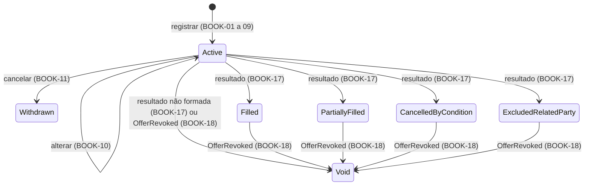

<!-- prd-tier: complexa -->
# Livro de Reservas

| | |
|---|---|
| **Status** | Rascunho |
| **Autor** | Guilherme Salvi |
| **Data** | 2026-09-04 |
| **Contexto Originário** | ReservationBook (primário); consome Offering; o livro fechado é lido pelo Allocation, que devolve o resultado por reserva |

Prefixo dos requisitos: `BOOK`. Propósito da plataforma, mapa de contextos, catálogo de eventos e fluxos: [PRD 0000](0000-platform-overview.md).

## Resumo Executivo

Entre a publicação e o fechamento, a oferta recebe reservas: o operador registra, em nome do investidor, uma quantidade de cotas e as declarações de categoria, vínculo e opção de condicionamento. O livro é o registro dessa demanda. Ele aceita só o que a oferta permite, admite alteração e cancelamento enquanto a oferta está Aberta, congela no fechamento e, depois do processamento, mostra em cada reserva o que aconteceu com ela sem alterar o que foi pedido. Métrica primária: nenhuma reserva aceita fora das regras da oferta e nenhuma quantidade reservada alterada após o fechamento.

## Alinhamento Estratégico

O livro é o único ponto de contato do investidor com a plataforma e a única fonte de demanda para o fechamento. Junto com o Allocation forma o núcleo do domínio: o Offering define a oferta, mas é o livro que registra quem quer o quê, e é sobre ele que a alocação decide. Erro aqui vira alocação errada ou reserva indevida.

## Contexto e Problema

Sem um livro que valide contra a oferta e congele no fechamento, o Allocation não tem entrada confiável: quantidade fora dos limites, opção não aceita ou reserva alterada depois do fechamento produzem alocação inválida. Sem status por reserva após o processamento, investidor e operador não respondem "o que aconteceu com a minha reserva" sem consultar outro contexto.

[FATO] A opção de condicionamento e a declaração de vínculo moram no pedido de reserva (CVM 160, art. 65, § 6º, II e V); a categoria de investidor é autodeclaração atestada por escrito (CVM 30, arts. 11 e 12). Não há cadastro verificado nem validação externa. Política interna de compliance que exija dado cadastral é não-objetivo, não incerteza regulatória; se entrar, as declarações viram atributos do investidor.

[FATO] Por decisão do autor, o investidor no MVP tem apenas id e nome, carregados por seed; categoria e vínculo são declarações feitas na reserva, únicas por investidor em cada oferta.

## Usuário-alvo / JTBD

- Investidor (comitente): garantir participação com a quantidade e a condição que escolheu, e saber o que aconteceu com a reserva. [FATO] Por decisão do autor, no MVP o operador registra em nome dele; não há acesso direto nem identidade de investidor.
- Operador da corretora: livro consistente com a oferta e demanda acumulada para decidir o fechamento antecipado.
- Allocation: lê o livro fechado como entrada única e devolve o resultado por reserva.

## Solução Proposta

A reserva é um agregado próprio; o livro de uma oferta é o conjunto de suas reservas. Registro só contra oferta Aberta, dentro do período, dentro dos limites, com declarações obrigatórias e opção pertencente ao conjunto aceito. Um investidor pode ter várias reservas ativas na mesma oferta: o investimento máximo vale para a soma, e categoria e vínculo são os mesmos em todas. No fechamento o livro congela; após o processamento, cada reserva mostra status e quantidade alocada como leitura derivada do Allocation, sem alterar o que foi pedido. Rótulos citam o requisito que governa a transição.

| Status | Identificador | Significado |
|---|---|---|
| Ativa | `Active` | Válida, aguardando fechamento ou processamento |
| Cancelada pelo investidor | `Withdrawn` | Cancelada antes do fechamento; não entra no livro fechado; nenhuma transição posterior |
| Atendida | `Filled` | Motivo atendida integralmente |
| Atendida parcialmente | `PartiallyFilled` | Motivo proporcional ou rateio; em regra menos que a reservada, inclusive zero; pode igualar a reservada no limite de ALLOC-18. O status segue a regra aplicada, não a quantidade (ALLOC-24) |
| Não atendida por condicionamento | `CancelledByCondition` | Distribuição parcial e reserva condicionada à colocação total |
| Excluída por vinculação | `ExcludedRelatedParty` | Excluída pela vedação a pessoas vinculadas |
| Sem efeito | `Void` | Oferta revogada ou não formada; a reserva perde efeito, inclusive um resultado já aplicado; quantidade alocada vigente zero |

Persistência, exposição e experiência de registro são downstream.

## Glossário de Domínio

| Termo | Definição |
|---|---|
| Investidor | Pessoa que reserva cotas. No MVP, apenas id e nome, carregados por seed. |
| Categoria do investidor | Declaração feita na reserva: varejo, qualificado ou profissional. Única por investidor em cada oferta. |
| Pessoa vinculada | Investidor que declara, na reserva, vínculo com o fundo, o ofertante ou os intermediários. Declaração única por investidor em cada oferta. |
| Reserva | Pedido de compra de uma quantidade de cotas de uma oferta Aberta por um investidor, com declaração de categoria, de vínculo e opção de condicionamento. |
| Livro de reservas | Conjunto das reservas de uma oferta. Livro fechado: as reservas ativas no instante do fechamento. |
| Posição do investidor | Soma das quantidades das reservas ativas de um investidor em uma oferta; limitada pelo investimento máximo. |
| Instante do registro | Momento em que a reserva foi aceita. Imutável. |
| Ordem de registro | Posição da reserva na sequência de aceitação do livro da oferta. Total e imutável: duas reservas do mesmo livro nunca ocupam a mesma posição, ainda que aceitas no mesmo instante. Desempate do Allocation (ALLOC-17). |
| Opção de condicionamento | Uma das três formas definidas em OFF-26 a OFF-28; a reserva escolhe uma entre as aceitas pela oferta. |
| Quantidade reservada | Cotas pedidas. Imutável a partir do fechamento. |
| Quantidade alocada | Cotas recebidas no processamento. Definida pelo Allocation; lida aqui. Zero quando a reserva está Sem efeito. |
| Demanda acumulada | Soma das quantidades das reservas ativas de uma oferta em um instante. |

## Functional Requirements

Cada requisito é uma condição verificável. "Investidor" como ator significa o operador agindo em seu nome.

### Registro

- **BOOK-01 (Must)** Reserva só é aceita contra oferta Aberta e com instante do registro dentro do período de reserva (intervalo fechado, glossário do PRD 0001).
- **BOOK-02 (Must)** O investidor deve existir; este contexto não cria investidor.
- **BOOK-03 (Must)** Quantidade reservada inteira e maior ou igual ao investimento mínimo por investidor.
- **BOOK-04 (Must)** Posição do investidor, incluindo a reserva sendo registrada ou alterada, menor ou igual ao investimento máximo por investidor.
- **BOOK-05 (Must)** Categoria obrigatória: varejo, qualificado ou profissional. Na v1 não altera regra alguma.
- **BOOK-06 (Must)** Declaração de vínculo obrigatória: vinculado ou não vinculado.
- **BOOK-07 (Must)** Categoria e vínculo únicos por investidor em cada oferta: nova reserva de investidor com reserva ativa repete as declarações vigentes; declaração diferente é rejeitada.
- **BOOK-08 (Must)** Oferta com distribuição parcial: opção obrigatória e pertencente ao conjunto aceito. Sem distribuição parcial: a reserva não carrega opção. Reservas do mesmo investidor podem ter opções distintas.
- **BOOK-09 (Must)** Rejeição informa todas as violações, com atributo e regra de cada uma.

### Alteração e cancelamento

- **BOOK-10 (Must)** Quantidade, declarações e opção de reserva ativa podem ser alteradas enquanto a oferta está Aberta e dentro do período, validadas pelas regras do registro. Alteração de categoria ou vínculo se aplica a todas as reservas ativas do investidor na oferta, cada uma registrando a mudança no histórico.
- **BOOK-11 (Must)** Reserva ativa pode ser cancelada nas mesmas condições: passa a Cancelada pelo investidor e não entra no livro fechado; as demais reservas do investidor não são afetadas.
- **BOOK-12 (Must)** Fora de oferta Aberta ou fora do período, alteração e cancelamento são rejeitados; a reserva é irrevogável a partir daí.
- **BOOK-13 (Must)** Toda alteração e cancelamento preserva o histórico: quem, quando e o que mudou.
- **BOOK-14 (Must)** Instante e ordem do registro são imutáveis. A ordem é total no livro: duas reservas nunca compartilham a posição, ainda que aceitas no mesmo instante.

### Fechamento e resultado

- **BOOK-15 (Must)** No fechamento da oferta o livro congela: as reservas ativas naquele instante formam o livro fechado; nenhuma entra, muda ou sai depois.
- **BOOK-16 (Must)** O livro fechado é consultável pelo Allocation com todas as reservas ativas, cada uma com investidor, quantidade, declarações, opção, instante e ordem do registro.
- **BOOK-17 (Must)** O resultado do Allocation atualiza status e quantidade alocada de cada reserva do livro fechado. O status deriva do motivo (ALLOC-25): atendida integralmente → Atendida; parcialmente por proporcional ou por rateio → Atendida parcialmente; não atendida por condicionamento → Não atendida por condicionamento; excluída por vinculação → Excluída por vinculação; oferta não formada → Sem efeito. Quantidade reservada, declarações e opção não mudam.
- **BOOK-18 (Must)** Quando a oferta é revogada, toda reserva que não esteja Cancelada pelo investidor passa a Sem efeito, qualquer que seja o status, inclusive um resultado já aplicado; reserva já Sem efeito permanece. A quantidade alocada vigente passa a zero e o resultado anterior fica no histórico (BOOK-13, BOOK-NFR-03). Oferta não formada chega por BOOK-17, não por evento próprio.
- **BOOK-19 (Must)** Resultado só é aplicado a reservas do livro fechado da oferta correspondente. Resultado para reserva inexistente, Cancelada pelo investidor ou já em status terminal é rejeitado e registrado.

### Consulta

- **BOOK-20 (Must)** O livro é consultável pelo operador a qualquer momento, com demanda acumulada e lista de reservas com status. É a base do fechamento antecipado (OFF-07).
- **BOOK-21 (Should)** As reservas de um investidor são consultáveis pelo operador, com status e, após o processamento, quantidade alocada.

## Domain Events

Não produz eventos na v1: o único consumidor do livro é o Allocation, que o lê no fechamento (BOOK-16). Consome `OfferPublished` (passa a aceitar reservas com limites, período e opções), `OfferClosed` (BOOK-15), `OfferRevoked` (BOOK-18, antes ou depois do resultado) e `BookProcessed` (BOOK-17, inclusive Sem efeito em oferta não formada). Catálogo e sequências: PRD 0000.

## Non-functional Requirements

- **BOOK-NFR-01** Registro, alteração e cancelamento são atômicos e validados contra a definição vigente da oferta; BOOK-04 e BOOK-07 leem as demais reservas ativas do investidor na mesma operação.
- **BOOK-NFR-02** Congelamento consistente: não existe reserva aceita com instante posterior ao fechamento, e o livro que o Allocation lê é idêntico ao congelado. É a exigência do ADR de leitura do livro.
- **BOOK-NFR-03** Toda mudança de reserva e todo status aplicado registram origem e instante.
- **BOOK-NFR-04** Dados do investidor não aparecem em rastros de execução; identificadores de reserva e oferta bastam.

## Considerações Regulatórias

Texto consolidado das Resoluções CVM 160 e CVM 30 lido em 2026-09-05; artigos conferidos contra o texto.

- [FATO] CVM 160, art. 65, § 4º: a reserva é irrevogável, ressalvadas modificação e revogação da oferta. O modelo admite alteração e cancelamento até o fechamento por decisão do autor (BOOK-10 a BOOK-12). Ver Trade-offs e Ponto de Maior Fragilidade.
- [FATO] Art. 65, § 6º, II e V: o pedido de reserva contém as condições em distribuição parcial e identifica o investidor vinculado. BOOK-06, BOOK-08.
- [FATO] Art. 65, §§ 1º e 2º: depósito do montante reservado é facultativo. Não modelado.
- [FATO] Art. 66: a seção de reservas não se aplica a profissionais. Sem efeito na v1; é o gatilho quando a categoria passar a alterar regra.
- [FATO] Art. 2º, XVI, e art. 56: pessoa vinculada e vedação em excesso. Aqui só a declaração; a vedação, inclusive a colocação limitada do § 3º, é ALLOC-06 a ALLOC-08 e ALLOC-21.
- [FATO] Art. 2º, X e XI, e CVM 30, arts. 11 e 12: profissional e qualificado atestam por escrito sua condição. Categoria declarada, não verificada.
- [FATO] Art. 64: adequação ao perfil (suitability) é dever do intermediário. Fora do escopo.
- [FATO] Art. 75: distribuição parcial não se aplica a ofertas exclusivas para profissionais. Efeito da categoria é extensão futura.
- [FATO] Art. 69, § 1º, e art. 65, § 5º: desistência nasce de modificação da oferta ou divergência entre prospectos, ambos fora do escopo. Se modificação entrar, este contexto ganha cancelamento após o fechamento com prazo mínimo de cinco dias úteis e presunção de manutenção no silêncio.

## Não-objetivos

- Cadastro, identidade e autorização de investidor; verificação de suitability e das declarações, inclusive por política interna.
- Depósito do montante reservado e movimentação financeira.
- Vedação a vinculadas, condicionamento e rateio (Allocation); efeito da categoria do investidor.
- Reservas por mais de um intermediário; direito de desistência após o fechamento; bookbuilding e intenções de investimento sem período de reserva.

## Trade-offs Declarados

- **Alteração e cancelamento livres até o fechamento.** *Custo:* a demanda acumulada não é compromisso; o livro pode encolher antes do fechamento antecipado. Diverge da letra do art. 65, § 4º. *Razão:* a plataforma modela o livro da corretora, não o do coordenador; a irrevogabilidade que o Allocation exige é a do livro fechado. [PREMISSA] Na corretora, a reserva do cliente é ajustável até o fechamento do livro interno e o pedido formal ao coordenador é o consolidado; não verificada em fonte primária, de baixo impacto porque a decisão se sustenta na fronteira do modelo.
- **Categoria e vínculo como declarações na reserva, únicas por investidor em cada oferta.** *Custo:* categorias diferentes em ofertas diferentes; declaração falsa passa; alterar em uma reserva cascateia para as outras. *Razão:* é como a norma trata; evita cadastro no MVP; impede investidor metade vinculado no mesmo livro.
- **Várias reservas ativas por investidor, limite sobre a soma.** *Custo:* registro e alteração leem as demais reservas; quem fraciona a posição aumenta suas chances no resto do arredondamento. *Razão:* representa lotes com opções distintas; o limite sobre a posição preserva o teto do Offering.
- **Status como projeção do resultado do Allocation.** *Custo:* o desfecho de cada reserva existe em dois contextos; após revogação, o resultado do Allocation permanece enquanto o livro mostra a reserva sem efeito. *Razão:* "o que aconteceu com a minha reserva" é pergunta do livro; a quantidade reservada nunca muda, então não há dois valores para o mesmo fato.
- **Instante e ordem do registro imutáveis, mesmo com alteração.** *Custo:* reservar pouco cedo e aumentar no fim mantém a prioridade no desempate; ganho máximo de uma cota, só em empate exato. *Razão:* campo imutável é simples de auditar; reiniciar puniria correções. A ordem, e não só o instante, é o desempate porque duas reservas podem ser aceitas no mesmo instante e o Allocation exige determinismo (ALLOC-04).
- **Sem eventos de saída na v1.** *Custo:* nenhum contrato para reagir a reservas em tempo real. *Razão:* publicar evento sem consumidor é acoplamento implícito.

## Métricas de Sucesso

Projeto sem uso em produção; métricas de correção, verificáveis por teste.

- Leading: toda combinação inválida de BOOK-01 a BOOK-08 rejeitada no registro e na alteração com todas as violações; nenhuma reserva aceita, alterada ou cancelada após o fechamento; toda reserva do livro fechado de oferta processada tem status terminal e quantidade alocada.
- Lagging: o Allocation não precisa de dado de reserva além de BOOK-16.
- Guardrails: quantidade reservada, declarações, opção, instante e ordem do registro nunca são alterados por resultado nem por revogação; Cancelada pelo investidor nunca recebe status de resultado; a posição nunca excede o investimento máximo; nenhuma regra de categoria na v1.

## Critérios de Aceitação

Oferta Aberta dentro do período, investimento mínimo 10 e máximo 500, opções aceitas {1, 2, 3}, salvo indicação.

- **Dado** um investidor existente, **quando** reserva 50 cotas com varejo, não vinculado e opção 3, **então** Ativa; **quando** registra uma segunda de 400 com opção 1, **então** aceita, posição 450; **quando** tenta uma terceira de 60, **então** rejeitada por BOOK-04 (posição 510); **quando** registra outra declarando vinculado, **então** rejeitada por BOOK-07.
- **Dado** um investidor com duas reservas ativas, **quando** altera o vínculo de uma para vinculado, **então** as duas passam a vinculado e cada uma registra a mudança.
- **Dado** uma reserva de 5 cotas com opção 4 sem declarar vínculo, **quando** registrada, **então** rejeitada com as três violações.
- **Dado** uma oferta sem distribuição parcial, **quando** a reserva informa opção, **então** rejeitada por BOOK-08.
- **Dado** uma oferta em Draft, Fechada ou Revogada, ou Aberta com período terminado, **quando** alguém tenta reservar, **então** rejeitado por BOOK-01.
- **Dado** uma reserva Ativa de 50 registrada às 10h, **quando** alterada para 80 às 11h, **então** aceita, histórico registra a mudança, instante e ordem do registro não mudam.
- **Dado** uma reserva Ativa, **quando** a oferta passa a Fechada e o investidor tenta cancelar, **então** rejeitado por BOOK-12.
- **Dado** uma oferta Fechada com reservas Ativas e uma Cancelada pelo investidor, **quando** o Allocation consulta o livro fechado, **então** recebe só as Ativas, com quantidade, declarações, opção, instante e ordem do registro; duas aceitas no mesmo instante recebem ordens distintas.
- **Dado** o livro fechado, **quando** chega o resultado, **então** reserva de 50 alocada em 40 passa a Atendida parcialmente com alocada 40 e reservada 50; reserva de 1 alocada em 0 por proporcional passa a Atendida parcialmente com 0; reserva excluída por vinculação passa a Excluída por vinculação com 0; em oferta não formada, todas passam a Sem efeito com 0.
- **Dado** uma oferta Aberta com reservas Ativas, **quando** revogada, **então** todas passam a Sem efeito.
- **Dado** uma oferta Formada com reservas Atendida (50 alocadas 50), Atendida parcialmente (50 alocadas 40) e uma Cancelada pelo investidor, **quando** revogada, **então** as duas primeiras passam a Sem efeito com alocada 0 e resultado anterior no histórico; a Cancelada não muda.
- **Dado** um resultado para reserva Cancelada pelo investidor, **quando** recebido, **então** rejeitado e registrado, sem alterar a reserva.
- **Dado** uma oferta Aberta com reservas ativas de 50, 400 e 30, **quando** o operador consulta o livro, **então** vê demanda acumulada 480 e as três com status Ativa.

## Dependências e Riscos

Acoplamentos entre contextos: PRD 0000.

| Item | Tipo | Impacto |
|---|---|---|
| Seed de investidores | Dependência de dados | Sem investidores carregados, nenhuma reserva é possível |
| Declarações não verificadas | Risco de dados | Categoria ou vínculo falsos passam; efeito no MVP limitado à vedação do art. 56 |
| Alteração livre até o fechamento | Risco de comportamento | Demanda acumulada pode encolher antes do fechamento antecipado |
| Leitura do livro fechado pelo Allocation | ADR pendente | Precisa satisfazer BOOK-NFR-02; até lá o contrato é semântico (BOOK-16) |

## Perguntas em Aberto

Nenhuma. Decisões de 2026-09-05 estão em Trade-offs; as sem custo próprio: operador registra em nome do investidor; demanda acumulada visível é Must (BOOK-20); revogação após o processamento e oferta não formada por resultado (BOOK-17, BOOK-18).

## Ponto de Maior Fragilidade

A decisão de **permitir alteração e cancelamento da reserva até o fechamento**, tratando a irrevogabilidade do art. 65, § 4º, como propriedade do livro fechado e não da reserva.

*Vetor de ataque:* lido ao pé da letra, o § 4º faz da reserva um ato de aceitação irrevogável, e as exceções são modificação e revogação da oferta, não a vontade do investidor. Com alteração livre, a demanda acumulada deixa de ser compromisso, e o fechamento antecipado (OFF-07) se apoia em número que pode cair no minuto seguinte. A defesa é que a plataforma modela o livro da corretora e o pedido formal é o consolidado no fechamento; essa leitura da prática é a única premissa não verificada deste PRD. Se uma revisão exigir irrevogabilidade desde o registro, BOOK-10 a BOOK-12 caem e entra um estado de reserva confirmada.

*Desafie antes de aprovar:* o caso de uso da corretora com investidor final permite ao cliente mexer na reserva até o fechamento, ou o que existe é uma janela curta de arrependimento seguida de irrevogabilidade? Se for a segunda, o modelo precisa de um instante de confirmação separado do registro.

## Referências

- [Resolução CVM 160 (texto consolidado)](https://conteudo.cvm.gov.br/export/sites/cvm/legislacao/resolucoes/anexos/100/resol160consolid.pdf) — arts. 2º (X, XI, XVI), 56, 64, 65, 66, 69 e 75. Lido em 2026-09-05.
- [Resolução CVM 30 (texto consolidado)](https://conteudo.cvm.gov.br/export/sites/cvm/legislacao/resolucoes/anexos/001/resol030consolid.pdf) — arts. 11 e 12. Lido em 2026-09-05.
- [PRD 0000](0000-platform-overview.md), [PRD 0001](0001-offering-offer-lifecycle.md) (definição da oferta, estados, limites, opções), [PRD 0003](0003-allocation-book-processing.md) (vedação, formação, condicionamento, rateio, `BookProcessed`).
