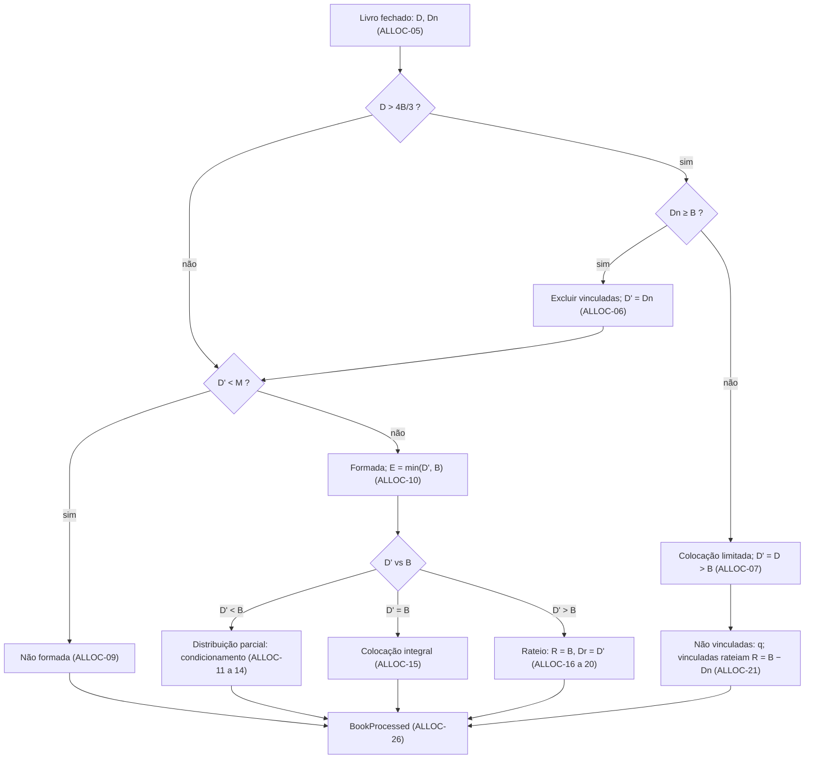

<!-- prd-tier: complexa -->
# Processamento do Livro e Alocação

| | |
|---|---|
| **Status** | Rascunho |
| **Autor** | Guilherme Salvi |
| **Data** | 2026-09-04 |
| **Contexto Originário** | Allocation (primário); consome Offering e ReservationBook; devolve `BookProcessed` aos dois |

Prefixo dos requisitos: `ALLOC`. Propósito da plataforma, mapa de contextos, catálogo de eventos e fluxos: [PRD 0000](0000-platform-overview.md).

## Resumo Executivo

Quando a oferta fecha, o livro precisa virar resultado: a oferta se formou ou não; quais reservas entram, depois da vedação a pessoas vinculadas; quantas cotas inteiras cada reserva recebe, por condicionamento em distribuição parcial ou por rateio em excesso de demanda. O Allocation faz esse processamento uma vez por oferta, a partir do livro fechado e da definição da oferta, e devolve um único desfecho. Métrica primária: resultado determinístico, soma alocada nunca acima da quantidade base e igual a ela em excesso, nenhuma reserva recebendo mais do que pediu.

## Alinhamento Estratégico

Allocation é o núcleo do domínio: é onde as regras da CVM 160 sobre distribuição parcial, condicionamento e pessoas vinculadas produzem efeito, e onde a plataforma entrega o que promete. Os outros dois contextos existem para alimentar este; o rigor deste PRD está na precisão das regras e nos exemplos numéricos.

## Contexto e Problema

Sem um processamento único e determinístico, cada leitura do livro produziria um resultado diferente, e nenhum contexto poderia confiar no desfecho. Sem regras precisas para vedação, formação, condicionamento e rateio, os casos de borda (exclusão que derruba a demanda abaixo da base, truncamento que deixa resto, condição que cancela reservas depois da formação) ficam a critério de quem implementa.

[FATO] As cotas efetivamente distribuídas são apuradas antes do condicionamento e não são recalculadas depois: formação e numerador do proporcional consideram todas as reservas do livro fechado, inclusive as que a opção de colocação total vai cancelar. É a leitura literal da CVM 160, art. 74, parágrafo único, e a única que o texto admite: o parágrafo existe para quebrar a circularidade entre "quanto foi distribuído" e "quais condições se cumprem". Consequência aceita: a oferta pode se formar com soma final abaixo do montante mínimo, e os investidores da opção 1 são restituídos (art. 73, § 4º).

[FATO] Por decisão do autor, o rateio proporcional com resto por maior fração é o único critério da v1.

## Usuário-alvo / JTBD

- Operador da corretora: fechar a oferta e ter um desfecho correto, explicável reserva a reserva e reprodutível, sem intervenção manual.
- Investidor, indireto via livro: saber quantas cotas recebeu e por quê.
- Consumidores: Offering muda de estado com o desfecho; ReservationBook aplica o resultado por reserva.

## Solução Proposta

Processar o livro fechado uma única vez por oferta, em etapas ordenadas com regras fixas, produzindo um desfecho e um resultado por reserva. Notação usada em todo o documento: `B` quantidade base, `M` montante mínimo, `D` demanda total, `Dn` demanda das não vinculadas, `D'` demanda efetiva, `E` cotas efetivamente distribuídas, `q` quantidade reservada, `R` quantidade rateada, `Dr` demanda rateada.

Mecanismo de execução, forma de leitura do livro e transporte do resultado são downstream (PRD 0000, ADRs).

## Glossário de Domínio

| Termo | Definição |
|---|---|
| Livro fechado | Reservas ativas de uma oferta no instante do fechamento. Entrada única do processamento; cada reserva é uma linha, mesmo que um investidor tenha várias. |
| Demanda total (`D`) | Soma das quantidades reservadas do livro fechado. |
| Demanda das não vinculadas (`Dn`) | Soma das quantidades das reservas sem declaração de vínculo. Decide entre exclusão e colocação limitada. |
| Demanda efetiva (`D'`) | Demanda total após a vedação a pessoas vinculadas. Base da formação, do condicionamento e do rateio; o condicionamento não a altera. Em colocação limitada, igual à demanda total. |
| Excesso superior a um terço | `D > B × 4/3`. Gatilho da vedação do art. 56. |
| Colocação limitada | Art. 56, §§ 1º, III, e 3º: não vinculadas recebem o que demandaram; vinculadas dividem o que falta para completar `B`. |
| Formação | `D' ≥ M`. Oferta formada segue para alocação; não formada não aloca nada e os valores são restituídos. |
| Cotas efetivamente distribuídas (`E`) | `min(D', B)`, apurado antes do condicionamento (art. 74, parágrafo único). Numerador do proporcional; o denominador é `B`. |
| Distribuição parcial | `M ≤ D' < B`. |
| Excesso de demanda | `D' > B`. |
| Condicionamento | Regra por reserva em distribuição parcial: colocação total (cancela), mínimo com totalidade (integral), mínimo com proporcional (truncado). Semântica definida em OFF-26 a OFF-28. |
| Rateio proporcional | Em excesso, cada reserva do conjunto rateado recebe `⌊q × R / Dr⌋`. No caso geral `R = B` e `Dr = D'`. |
| Resto do arredondamento | `R` menos a soma dos truncamentos. Distribuído uma cota por reserva, por maior parte fracionária. Em inglês, `RoundingRemainder`. Não confundir com "sobras" de subscrição (art. 65, § 2º, I), fora do escopo. |
| Quantidade alocada | Cotas inteiras atribuídas a uma reserva. Nunca maior que a reservada; zero é válido. |
| Desfecho | Resultado do processamento para a oferta: formada e alocada, ou não formada. |

## Functional Requirements

Cada requisito é uma condição verificável. Notação na Solução Proposta.

### Gatilho e entrada

- **ALLOC-01 (Must)** O processamento inicia com o fechamento da oferta e usa como entrada exclusiva a definição publicada e o livro fechado.
- **ALLOC-02 (Must)** Cada oferta produz no máximo um `BookProcessed`. Depois de emitido, novo processamento é rejeitado. Processamento que terminou sem emitir (ALLOC-NFR-02) pode ser repetido e, por ALLOC-04, produz o mesmo resultado.
- **ALLOC-03 (Must)** Se a oferta for revogada antes de o processamento concluir, ele é interrompido e nada é emitido. Revogação após a emissão não altera o resultado emitido; o efeito nas reservas é BOOK-18.
- **ALLOC-04 (Must)** O processamento é determinístico: mesma oferta e mesmo livro fechado produzem exatamente o mesmo resultado.

### Consolidação e vedação

- **ALLOC-05 (Must)** `D` é a soma de `q` de todas as reservas do livro fechado; `Dn` é a soma de `q` das reservas sem declaração de vínculo.
- **ALLOC-06 (Must)** Se `D > B × 4/3` e `Dn ≥ B`, as reservas com declaração de vínculo são excluídas: quantidade alocada zero, motivo excluída por vinculação.
- **ALLOC-07 (Must)** Se `D > B × 4/3` e `Dn < B`, nenhuma reserva é excluída e o processamento segue em colocação limitada (ALLOC-21).
- **ALLOC-08 (Must)** `D'` é a soma de `q` das reservas não excluídas. As demais exceções do art. 56, § 1º (formadores de mercado, aplicação mínima obrigatória) não são modeladas.

### Formação

- **ALLOC-09 (Must)** Se `D' < M`, a oferta não se forma: desfecho não formada; toda reserva não excluída recebe zero com motivo oferta não formada.
- **ALLOC-10 (Must)** Se `D' ≥ M`, a oferta se forma e `E = min(D', B)`. `E` é apurado uma vez e não é recalculado após o condicionamento.

### Distribuição parcial (`M ≤ D' < B`)

- **ALLOC-11 (Must)** Opção de colocação total: recebe zero, motivo não atendida por condicionamento.
- **ALLOC-12 (Must)** Opção de mínimo com totalidade: recebe `q`, motivo atendida integralmente.
- **ALLOC-13 (Must)** Opção de mínimo com proporcional: recebe `⌊q × E / B⌋`, motivo atendida parcialmente por proporcional. Zero é válido.
- **ALLOC-14 (Must)** Em oferta sem distribuição parcial (`M = B`) este ramo não ocorre: `D' < B` implica `D' < M`.

### Colocação integral (`D' = B`)

- **ALLOC-15 (Must)** Cada reserva não excluída recebe `q`, motivo atendida integralmente; a opção de condicionamento é ignorada.

### Excesso de demanda (`D' > B`)

- **ALLOC-16 (Must)** Cada reserva do conjunto rateado recebe `⌊q × R / Dr⌋`, com `Dr` a soma de `q` do conjunto rateado. No caso geral o conjunto é o das reservas não excluídas, `R = B` e `Dr = D'`. Motivo atendida parcialmente por rateio, mesmo quando ALLOC-17 leva a quantidade a `q`.
- **ALLOC-17 (Must)** O resto do arredondamento, `R` menos a soma de ALLOC-16, é distribuído uma cota por reserva do conjunto rateado, em ordem decrescente da parte fracionária de `q × R / Dr`. Empate é desfeito pela ordem de registro, mais antiga primeiro (BOOK-14).
- **ALLOC-18 (Must)** Nenhuma reserva recebe mais que `q`; se o resto alcançar esse limite em uma reserva, a cota vai para a próxima na ordem.
- **ALLOC-19 (Must)** Em excesso de demanda, a soma das quantidades alocadas é exatamente `B`.
- **ALLOC-20 (Must)** O condicionamento não se aplica em excesso de demanda; a opção declarada é ignorada.
- **ALLOC-21 (Must)** Em colocação limitada (ALLOC-07), cada reserva não vinculada recebe `q` com motivo atendida integralmente; o conjunto rateado é o das vinculadas, `R = B − Dn`, `Dr` é a soma de `q` das vinculadas, e ALLOC-16 a ALLOC-18 se aplicam a esse conjunto. ALLOC-19 vale para o total.

### Resultado

- **ALLOC-22 (Must)** Toda quantidade alocada é inteira e maior ou igual a zero.
- **ALLOC-23 (Must)** Em qualquer ramo, a soma das quantidades alocadas é menor ou igual a `B`.
- **ALLOC-24 (Must)** Investimento mínimo por reserva e máximo por posição valem no registro (BOOK-03, BOOK-04), não na alocação: rateio e proporcional podem alocar abaixo do mínimo, inclusive zero. O motivo é a regra aplicada, não a quantidade.
- **ALLOC-25 (Must)** O resultado por reserva carrega quantidade alocada e um motivo entre: atendida integralmente, atendida parcialmente por proporcional, atendida parcialmente por rateio, não atendida por condicionamento, excluída por vinculação, oferta não formada.
- **ALLOC-26 (Must)** O desfecho carrega `D`, `Dn`, `D'`, `E`, o ramo aplicado (inclusive colocação limitada) e a lista de resultados por reserva, e é emitido uma única vez como `BookProcessed`.

## Domain Events

Produz `BookProcessed` (ALLOC-26). Consome `OfferPublished` (definição), `OfferClosed` (ALLOC-01) e `OfferRevoked` (ALLOC-03). O livro fechado é lido do ReservationBook (BOOK-16); a forma da leitura é delegada a ADR e precisa satisfazer BOOK-NFR-02. Catálogo e sequências: PRD 0000.

## Non-functional Requirements

- **ALLOC-NFR-01** Aritmética exata: sem ponto flutuante; truncamento sempre para baixo.
- **ALLOC-NFR-02** Processamento atômico: ou emite `BookProcessed` completo, ou nada.
- **ALLOC-NFR-03** Resultado explicável: motivo mais `D`, `Dn`, `D'`, `E` e ramo permitem recalcular manualmente cada quantidade alocada.
- **ALLOC-NFR-04** O processamento é a única operação de domínio com span manual de tracing na plataforma.

## Considerações Regulatórias

Texto consolidado da CVM 160 lido em 2026-09-05; artigos conferidos contra o texto.

- [FATO] Art. 56, caput, § 1º, III, e § 3º: vedação a vinculadas em excesso superior a um terço; exceção quando a exclusão derruba a demanda abaixo da quantidade ofertada; nessa hipótese a colocação para vinculadas "fica limitada ao necessário para perfazer a quantidade", preservada a colocação integral das não vinculadas. ALLOC-06, ALLOC-07, ALLOC-21. O cálculo do excesso ignora lote adicional e suplementar, inexistentes na v1.
- [FATO] Art. 73, §§ 3º e 4º: restituição integral abaixo do mínimo, inclusive a quem condicionou à distribuição total. ALLOC-09; ALLOC-11 em distribuição parcial.
- [FATO] Art. 74 e parágrafo único: opções de condicionamento; "efetivamente distribuídos" inclui as reservas condicionadas. ALLOC-10 fixa `E` antes do condicionamento. Incisos I e II obrigatórios na oferta (OFF-25); este contexto só aplica a opção declarada.
- [FATO] Art. 75: distribuição parcial não se aplica a ofertas exclusivas para profissionais. Não modelado; a categoria não altera o condicionamento na v1.
- [FATO] Art. 49, III: o plano de distribuição fixa o rateio com tratamento equitativo; a norma não impõe critério. O critério da v1 é escolha do modelo.
- [FATO] ICVM 400, art. 31, § 1º (revogada): origem da distinção totalidade/proporcional, mantida pela prática de mercado.

## Não-objetivos

- Outros critérios de rateio (igualitário e sucessivo, cronológico puro, prioridade por lote mínimo, exclusão de reservas pequenas) e critérios por tranche.
- Garantia do investimento mínimo por investidor na alocação.
- Lote adicional e suplementar; sobras de subscrição e direito de preferência; alocação discricionária e tranche institucional.
- Exceções do art. 56 para formadores de mercado e aplicação mínima obrigatória.
- Efeito da categoria do investidor; reprocessamento manual, aprovação ou ajuste pelo operador; liquidação, custódia e posição do cotista.

## Trade-offs Declarados

- **Processamento automático no fechamento, sem revisão do operador.** *Custo:* livro com erro só se corrige revogando a oferta. *Razão:* revisão manual abre alocação discricionária, fora do escopo; aprovação sem poder de ajuste equivale a "Formada, depois revogar", que OFF-12 já permite. Ver Ponto de Maior Fragilidade.
- **Resto por maior parte fracionária, desempate pela ordem de registro.** *Custo:* reservas grandes tendem a ficar com o resto; quem fraciona a posição em várias reservas aumenta suas chances; o critério não está nos documentos típicos de oferta. *Razão:* é o arredondamento que minimiza o desvio em relação ao proporcional exato (maiores restos), atende o art. 49, III, e o desempate é determinístico e auditável.
- **Limites por investidor só no registro.** *Custo:* um investidor pode receber uma cota, ou nenhuma, com mínimo de dez. *Razão:* é o comportamento real do rateio; impor o mínimo na alocação é critério de rateio distinto.
- **Um único critério de rateio.** *Custo:* ofertas com outro critério no plano de distribuição não são representáveis. *Razão:* proporcional é o padrão de varejo.
- **Vedação antes da formação.** *Custo:* nenhum; pela exceção do § 1º, III, a exclusão nunca leva `D'` abaixo de `B`. *Razão:* segue a ordem da norma e evita excluir reservas de oferta que não vai se formar.
- **Colocação limitada como sub-ramo do excesso.** *Custo:* o rateio ganha dois parâmetros (`R`, conjunto rateado). *Razão:* em colocação limitada `D' = D > B`, então é excesso por definição; parametrizar reutiliza ALLOC-16 a ALLOC-18 e mantém ALLOC-19 como invariante único.

## Métricas de Sucesso

Projeto sem uso em produção; métricas de correção, verificáveis por teste.

- Leading: todo cenário dos Critérios de Aceitação reproduzido por teste com igualdade exata; em livros gerados aleatoriamente, processar duas vezes dá resultado idêntico e ALLOC-18, ALLOC-19, ALLOC-22 e ALLOC-23 nunca são violados; em colocação limitada toda não vinculada recebe `q`.
- Lagging: Offering e ReservationBook aplicam `BookProcessed` só com o que está em ALLOC-25 e ALLOC-26.
- Guardrails: nenhuma reserva recebe mais do que reservou; nenhuma quantidade fracionária; este contexto não altera livro fechado nem definição da oferta.

## Critérios de Aceitação

`B = 1000`, `M = 600`, reservas não vinculadas, salvo indicação. `V` marca reserva vinculada; a ordem de listagem é a ordem de registro; `(n)` é a opção de condicionamento. Frações entre parênteses são `q × R / Dr` antes do truncamento.

| Livro | `D`, `Dn`, `D'`, `E` | Ramo | Resultado |
|---|---|---|---|
| A 500 (3), C 300 (2) | 800, 800, 800, 800 | parcial | A 400 = ⌊500 × 800 / 1000⌋ proporcional; C 300 integral; soma 700 |
| A 100 (1), C 550 (2) | 650, 650, 650, 650 | parcial | A 0 condicionamento; C 550; formada mesmo com soma 550 abaixo de `M` |
| A 1 (3), C 699 (2) | 700, 700, 700, 700 | parcial | A 0 = ⌊1 × 700 / 1000⌋, motivo proporcional; C 699 |
| A1 300 (1), A2 200 (2) do mesmo investidor; C 200 (2) | 700, 700, 700, 700 | parcial | A1 0 condicionamento; A2 200; C 200; resultado por reserva |
| reservas somando 500 | 500, 500, 500, — | não formada | todas 0, motivo oferta não formada |
| `M = B = 1000`, reservas somando 900 | 900, 900, 900, — | não formada | todas 0 |
| livro sem reservas | 0, 0, 0, — | não formada | desfecho sem resultados por reserva |
| A 700, C 500, V 300 | 1500, 1200, 1200, 1000 | exclusão, rateio | V 0 excluída; A 583 (583,33), C 416 (416,67); resto 1 → C; A 583, C 417; soma 1000 |
| A 800, V 600 | 1400, 800, 1400, 1000 | colocação limitada | A 800 integral; V rateia 200 e recebe 200 por rateio; soma 1000 |
| A 800, V1 400, V2 200 | 1400, 800, 1400, 1000 | colocação limitada | A 800; `R = 200`, `Dr = 600`: V1 133 (133,33), V2 66 (66,67); resto 1 → V2; V1 133, V2 67; soma 1000 |
| A 600, C 400 | 1000, 1000, 1000, 1000 | integral | A 600, C 400; opções ignoradas |
| A 1000, C 1000 | 2000, 2000, 2000, 1000 | rateio | 500 e 500, sem resto |
| A 1000, C 999 | 1999, 1999, 1999, 1000 | rateio | A 500 (500,25), C 499 (499,75); resto 1 → C; 500 e 500 |
| A 500, C 500, `B = 999` | 1000, 1000, 1000, 999 | rateio | 499 (499,5) cada; frações iguais; resto 1 → A, ordem de registro; A 500, C 499 |
| idem, aceitas no mesmo instante, A anterior na ordem de registro | 1000, 1000, 1000, 999 | rateio | A 500, C 499 |

- **Dado** um processamento em curso, **quando** a oferta é revogada, **então** nenhum `BookProcessed` é emitido.
- **Dado** uma oferta com `BookProcessed` emitido, **quando** novo processamento é solicitado, **então** é rejeitado.
- **Dado** um processamento interrompido por falha antes de emitir, **quando** é repetido, **então** emite o `BookProcessed` que o original produziria.

## Dependências e Riscos

Acoplamentos entre contextos: PRD 0000.

| Item | Tipo | Impacto |
|---|---|---|
| Critério do resto do arredondamento | Risco de desenho | Escolha do modelo; pode divergir do plano de distribuição de uma oferta real |
| Processamento sem revisão | Risco operacional | Erro no livro só se corrige por revogação |
| Leitura do livro fechado | ADR pendente | Até o ADR, o contrato é semântico (BOOK-16, BOOK-NFR-02) |

## Perguntas em Aberto

Nenhuma. Decisões de 2026-09-05 estão em Trade-offs; as sem custo próprio: colocação limitada do art. 56, § 3º, modelada em ALLOC-07 e ALLOC-21 (antes, vinculadas rateavam normalmente); repetição após falha (ALLOC-02); "sobras" substituído por resto do arredondamento por colidir com sobras de subscrição.

## Ponto de Maior Fragilidade

A decisão de **processar o livro automaticamente no fechamento e emitir o resultado sem revisão do operador**.

*Vetor de ataque:* na vida real o coordenador revisa o livro antes de divulgar a alocação, e o modelo não tem ponto entre Fechada e Formada para corrigir uma reserva indevida, uma declaração de vínculo errada ou um investidor que não deveria estar no livro. A única correção é revogar a oferta inteira, punindo todos por um erro de uma reserva. A defesa: aprovação sem ajuste discricionário não compra nada além de "Formada, depois revogar"; só vale a pena se o ajuste entrar, e aí a máquina de estados do Offering ganha um passo e a alocação deixa de ser determinística.

*Desafie antes de aprovar:* o determinismo sem intervenção é o que o modelo quer demonstrar, ou vai cair no primeiro erro de livro? Se for o segundo, é mais barato colocar o passo de aprovação agora, com ajuste explícito e auditável, do que reabrir as três máquinas de estado depois.

## Referências

- [Resolução CVM 160 (texto consolidado)](https://conteudo.cvm.gov.br/export/sites/cvm/legislacao/resolucoes/anexos/100/resol160consolid.pdf) — arts. 49, 56, 65, 73, 74 e 75. Lido em 2026-09-05.
- [Instrução CVM 400 (revogada)](https://conteudo.cvm.gov.br/export/sites/cvm/legislacao/instrucoes/anexos/400/inst400.pdf) — art. 31, § 1º.
- [PRD 0000](0000-platform-overview.md), [PRD 0001](0001-offering-offer-lifecycle.md) (definição da oferta e semântica das opções), [PRD 0002](0002-reservation-book-reservation-lifecycle.md) (livro fechado, declarações, ordem de registro).
