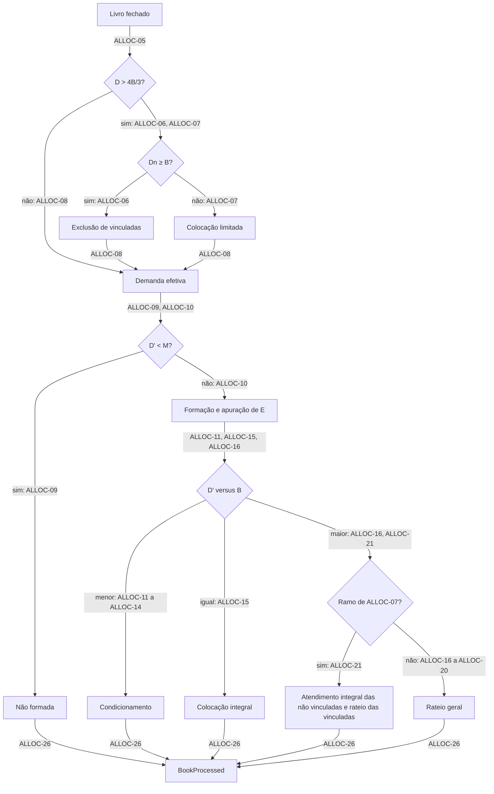

# Processamento do Livro e Alocação

| | |
|---|---|
| **Originating Context** | BookBuilding; affects Offering |

Requirement prefix: `ALLOC`. Propósito da plataforma, mapa de contextos, catálogo de eventos e fluxos: [PRD 0000](0000-platform-overview.md).

## Executive Summary

O processamento do livro determina o desfecho da oferta e a quantidade e o motivo do resultado de cada reserva. O fechamento inicia o cálculo determinístico de demanda, vedação a vinculadas, formação e alocação.

O critério de sucesso é reproduzir exatamente os cenários de aceitação e respeitar os limites quantitativos em todos os ramos.

## Context and Problem

O mesmo livro fechado deve produzir o mesmo resultado, com no máximo um desfecho emitido por oferta.

As regras precisam definir os casos de borda: demanda não vinculada abaixo da base, truncamento com resto e condicionamento que reduz a alocação depois da formação. Esta capability calcula o efeito dessas regras sobre cada reserva; ALLOC-08 e ALLOC-10 definem a demanda efetiva e a formação.

## Target User / JTBD

- Operador da corretora: fechar o livro e ter um desfecho correto, explicável reserva a reserva e reprodutível, sem intervenção manual.
- Investidor, indireto via livro: saber quantas cotas recebeu e por quê.
- Offering: consumir o desfecho do processamento.

## Proposed Solution

O fechamento do livro (BOOK-22, BOOK-15) dispara o processamento dentro do BookBuilding. A entrada é a definição publicada e o livro congelado de BOOK-16 (ALLOC-01). O cálculo consolida a demanda, determina a vedação aplicável, apura a formação e calcula a alocação.

O resultado completo informa o motivo e a quantidade por reserva (ALLOC-25, ALLOC-26) e é emitido como `BookProcessed`.

### Notação

| Símbolo | Significado |
|---|---|
| `B` | Quantidade base |
| `M` | Montante mínimo |
| `D` | Demanda total |
| `Dn` | Demanda das não vinculadas |
| `D'` | Demanda efetiva |
| `E` | Cotas efetivamente distribuídas |
| `q` | Quantidade reservada |
| `R` | Quantidade rateada |
| `Dr` | Demanda rateada |

### Etapas do processamento

O diagrama relaciona cada etapa aos requisitos que a definem.

## Domain Glossary

Oferta, base (`B`), mínimo (`M`) e conjunto de opções aceitas estão definidos no [PRD 0001](0001-offering-offer-lifecycle.md). Investidor, reserva, quantidade pedida (`q`), opção declarada e ordem de registro estão definidos no [PRD 0002](0002-book-building-bid-lifecycle.md).

| Termo | Definição |
|---|---|
| Livro fechado | Entrada congelada do livro (BOOK-15, BOOK-16); uma linha por reserva. |
| Demanda total (`D`) | Soma de pedidos do livro (ALLOC-05). |
| Demanda das não vinculadas (`Dn`) | Parcela sem declaração de vínculo (ALLOC-05); determina ALLOC-06 ou ALLOC-07. |
| Demanda efetiva (`D'`) | Demanda após exclusões (ALLOC-08); base da formação, do condicionamento e do rateio; em colocação limitada é igual a `D`. |
| Excesso superior a um terço | `D > B × 4/3`; fronteira da vedação em ALLOC-06 e ALLOC-07. |
| Colocação limitada | Exceção do art. 56, §§ 1º, III, e 3º (ALLOC-07), executada por ALLOC-21. |
| Formação | Desfecho determinado por ALLOC-09 e ALLOC-10; identificadores na tabela de ALLOC-26. |
| Cotas efetivamente distribuídas (`E`) | Quantidade apurada em ALLOC-10; numerador do proporcional de ALLOC-13, com denominador `B`; não é necessariamente a soma final alocada. |
| Distribuição parcial | `M ≤ D' < B`; ramo de ALLOC-11 a ALLOC-14. |
| Excesso de demanda | `D' > B`; ramo de ALLOC-16 a ALLOC-21. |
| Condicionamento | Opção declarada na reserva (BOOK-08) entre as aceitas pela oferta (OFF-25); efeito e motivo do resultado em ALLOC-11 a ALLOC-13. |
| Rateio proporcional | Divisão definida em ALLOC-16, com quantidade rateada `R` e demanda rateada `Dr`. |
| Resto do arredondamento | Diferença distribuída por ALLOC-17; `RoundingRemainder` é o espelho descritivo adotado, sem termo específico de mercado identificado nas fontes consultadas. Não designa sobras de subscrição (art. 65, § 2º, I). |
| Quantidade alocada | Cotas atribuídas à reserva, sujeitas a ALLOC-18 e ALLOC-22. |
| Desfecho | Conclusão sobre a oferta e seus resultados individuais (ALLOC-26). |

## Functional Requirements

A [notação](#notação) é a mesma em todos os ramos.

### Gatilho e entrada

- **ALLOC-01 (Must)** O processamento inicia com o fechamento do livro pelo operador (BOOK-22), quando o livro congela (BOOK-15), e usa como entrada exclusiva a definição publicada e o livro fechado (BOOK-16).
- **ALLOC-02 (Must)** Cada oferta produz no máximo um `BookProcessed`. Depois de emitido, novo processamento é rejeitado. Processamento que terminou sem emitir (ALLOC-NFR-02) pode ser repetido e, por ALLOC-04, produz o mesmo resultado.
- **ALLOC-03 (Must)** Se a oferta for revogada antes de o processamento concluir, ele é interrompido e nada é emitido. Revogação após a emissão não altera o resultado emitido.
- **ALLOC-04 (Must)** O processamento é determinístico: mesma oferta e mesmo livro fechado produzem exatamente o mesmo resultado.

### Consolidação e vedação

- **ALLOC-05 (Must)** `D` é a soma de `q` de todas as reservas do livro fechado; `Dn` é a soma de `q` das reservas sem declaração de vínculo.
- **ALLOC-06 (Must)** Se `D > B × 4/3` e `Dn ≥ B`, as reservas com declaração de vínculo são excluídas: quantidade alocada zero, motivo excluída por vinculação.
- **ALLOC-07 (Must)** Se `D > B × 4/3` e `Dn < B`, nenhuma reserva é excluída e o processamento segue em colocação limitada (ALLOC-21).
- **ALLOC-08 (Must)** `D'` é a soma de `q` das reservas não excluídas. As demais exceções do art. 56, § 1º (formadores de mercado, aplicação mínima obrigatória) não são modeladas.

### Formação

- **ALLOC-09 (Must)** Se `D' < M`, a oferta não se forma: desfecho não formada; toda reserva não excluída recebe zero com motivo oferta não formada.
- **ALLOC-10 (Must)** Se `D' ≥ M`, a oferta se forma e `E = min(D', B)`. `E` é apurado uma vez e não é recalculado após o condicionamento.

### Distribuição parcial (`M ≤ D' < B`)

- **ALLOC-11 (Must)** Opção 1, condicionada à colocação total da quantidade base: a reserva não é atendida, recebe quantidade alocada zero e motivo não atendida por condicionamento.
- **ALLOC-12 (Must)** Opção 2, condicionada ao montante mínimo com recebimento da totalidade: a reserva recebe `q`, motivo atendida integralmente.
- **ALLOC-13 (Must)** Opção 3, condicionada ao montante mínimo com recebimento proporcional: a reserva recebe `⌊q × E / B⌋`, truncado para baixo, motivo atendida parcialmente por proporcional. Zero é resultado válido e mantém esse motivo.
- **ALLOC-14 (Must)** Em oferta sem distribuição parcial (`M = B`) este ramo não ocorre: `D' < B` implica `D' < M`.

### Colocação integral (`D' = B`)

- **ALLOC-15 (Must)** Cada reserva não excluída recebe `q`, motivo atendida integralmente; a opção de condicionamento é ignorada.

### Excesso de demanda (`D' > B`)

- **ALLOC-16 (Must)** Cada reserva do conjunto rateado recebe `⌊q × R / Dr⌋`, com `Dr` a soma de `q` do conjunto rateado. No caso geral o conjunto é o das reservas não excluídas, `R = B` e `Dr = D'`. Motivo atendida parcialmente por rateio, mesmo quando ALLOC-17 leva a quantidade a `q`.
- **ALLOC-17 (Must)** O resto do arredondamento, `R` menos a soma de ALLOC-16, é distribuído uma cota por reserva do conjunto rateado, em ordem decrescente da parte fracionária de `q × R / Dr`. Empate é desfeito pela ordem de registro, mais antiga primeiro (BOOK-14).
- **ALLOC-18 (Must)** Nenhuma reserva recebe mais que `q`; se o resto alcançar esse limite em uma reserva, a cota vai para a próxima na ordem.
- **ALLOC-19 (Must)** Em excesso de demanda, a soma das quantidades alocadas é exatamente `B`.
- **ALLOC-20 (Must)** O condicionamento não se aplica em excesso de demanda; a opção declarada é ignorada.
- **ALLOC-21 (Must)** Em colocação limitada (ALLOC-07), cada reserva não vinculada recebe `q` com motivo atendida integralmente; o conjunto rateado é o das vinculadas, `R = B − Dn`, `Dr` é a soma de `q` das vinculadas, e ALLOC-16 a ALLOC-18 se aplicam a esse conjunto. ALLOC-19 vale para o total.

### Resultado

- **ALLOC-22 (Must)** Toda quantidade alocada é inteira e maior ou igual a zero.
- **ALLOC-23 (Must)** Em qualquer ramo, a soma das quantidades alocadas é menor ou igual a `B`.
- **ALLOC-24 (Must)** Investimento mínimo por reserva e máximo por posição valem no registro (BOOK-03, BOOK-04), não na alocação: rateio e proporcional podem alocar abaixo do mínimo, inclusive zero. O motivo é a regra aplicada, não a quantidade.
- **ALLOC-25 (Must)** O resultado por reserva carrega quantidade alocada e um motivo entre: atendida integralmente, atendida parcialmente por proporcional, atendida parcialmente por rateio, não atendida por condicionamento, excluída por vinculação, oferta não formada.
- **ALLOC-26 (Must)** O desfecho carrega `D`, `Dn`, `D'`, `E`, o ramo aplicado (inclusive colocação limitada) e a lista identificável de resultados por reserva. Informa o desfecho de ALLOC-09 ou ALLOC-10 e é emitido como `BookProcessed`, sujeito a ALLOC-02. `E` só é apurado no caso de ALLOC-10; na não formação é não aplicável.

| Desfecho (ALLOC-09, ALLOC-10) | Identifier |
|---|---|
| Formada | `Unconditional` |
| Não formada | `Lapsed` |

| Motivo (ALLOC-25) | Identifier |
|---|---|
| Atendida integralmente | `Filled` |
| Atendida parcialmente por proporcional | `PartiallyFilledByCondition` |
| Atendida parcialmente por rateio | `ScaledBack` |
| Não atendida por condicionamento | `CancelledByCondition` |
| Excluída por vinculação | `ExcludedRelatedParty` |
| Oferta não formada | `Void` |

| Ramo (ALLOC-26) | Identifier | Requisitos |
|---|---|---|
| Não formação | `NonFormation` | ALLOC-09 |
| Distribuição parcial | `PartialDistribution` | ALLOC-11 a ALLOC-14 |
| Colocação integral | `FullPlacement` | ALLOC-15 |
| Rateio geral | `GeneralScaleBack` | ALLOC-16 a ALLOC-20 |
| Colocação limitada | `LimitedPlacement` | ALLOC-21 |

Os identificadores dos ramos e dos motivos compostos são nomes descritivos do modelo que espelham os conceitos em português. As fontes consultadas não estabelecem uma enumeração equivalente para esse recorte; `ScaledBack` usa o termo de mercado citado em Declared Trade-offs.

## Domain Events

Produz `BookProcessed` (ALLOC-26), consumido pelo Offering. O evento identifica a oferta, o desfecho do processamento e o instante da conclusão, além das informações definidas em ALLOC-26.

Consome `OfferRevoked` (ALLOC-03).

## Non-functional Requirements

- **ALLOC-NFR-01** Aritmética exata: sem ponto flutuante; truncamento sempre para baixo.
- **ALLOC-NFR-02** Processamento atômico: ou emite `BookProcessed` completo, ou nada.
- **ALLOC-NFR-03** Resultado explicável: motivo mais `D`, `Dn`, `D'`, `E` e ramo permitem recalcular manualmente cada quantidade alocada.
- **ALLOC-NFR-04** Cada processamento é rastreável de ponta a ponta pelo identificador da oferta.

## Regulatory Considerations

Fontes: [CVM 160](https://conteudo.cvm.gov.br/export/sites/cvm/legislacao/resolucoes/anexos/100/resol160consolid.pdf) e [ICVM 400, revogada](https://conteudo.cvm.gov.br/export/sites/cvm/legislacao/instrucoes/anexos/400/inst400.pdf), consultadas em 2026-09-05.

- CVM 160, art. 56, caput, § 1º, III, e § 3º: vedação em excesso superior a um terço; exceção quando a exclusão derruba a demanda abaixo da quantidade ofertada; colocação limitada ao necessário, preservada a integral das não vinculadas → ALLOC-06, ALLOC-07, ALLOC-21. O excesso ignora lotes adicional e suplementar.
- CVM 160, art. 73, §§ 3º e 4º: restituição abaixo do mínimo, inclusive a quem condicionou à totalidade → ALLOC-09, ALLOC-11.
- CVM 160, art. 70: suspensão e cancelamento são atos da CVM por irregularidade → ALLOC-09. Por isso não formada, e não cancelada.
- CVM 160, art. 74 e parágrafo único: opção do investidor entre a totalidade e o mínimo; as condicionadas integram os "efetivamente distribuídos" → ALLOC-10, ALLOC-13. `E` é fixado antes do condicionamento.
- CVM 160, art. 49, III: o plano fixa o rateio com tratamento equitativo, sem impor critério → ALLOC-16, ALLOC-17.
- ICVM 400, art. 31, § 1º: origem da distinção entre totalidade e proporcional → ALLOC-13. Norma revogada; referência histórica.

## Non-goals

- Outros critérios de rateio (igualitário e sucessivo, cronológico puro, prioridade por lote mínimo, exclusão de reservas pequenas) e critérios por tranche.
- Garantia do investimento mínimo por investidor na alocação.
- Lote adicional e suplementar; sobras de subscrição e direito de preferência; alocação discricionária e tranche institucional.
- Exceções do art. 56 para formadores de mercado e aplicação mínima obrigatória.
- Efeito da categoria do investidor (art. 75); reprocessamento manual, aprovação ou ajuste pelo operador; liquidação, custódia e posição do cotista.

## Declared Trade-offs

### Processamento automático no fechamento, sem revisão do operador (ALLOC-01)

*Cost:* o operador não pode corrigir o livro congelado; um erro pode exigir revogar a oferta.

*Reason:* o recorte demonstra a alocação automática pelas regras publicadas, sem uma etapa de ajuste manual. Ver Weakest Point.

### `E` apurado antes do condicionamento, sem recálculo (ALLOC-10)

*Cost:* a oferta pode se formar com soma final alocada abaixo do montante mínimo.

*Reason:* o modelo adota a leitura do art. 74, parágrafo único, registrada em Regulatory Considerations e fixa a base do proporcional antes de aplicar as condições. `E` não representa necessariamente a soma final alocada.

### Vedação antes da formação (ALLOC-06 a ALLOC-09)

*Cost:* o cálculo precisa distinguir exclusão de vinculadas e colocação limitada, com conjuntos e resultados diferentes.

*Reason:* a ordem adotada preserva a exceção descrita em Regulatory Considerations; em ALLOC-06, a exclusão só ocorre quando `Dn ≥ B`.

### Colocação limitada como sub-ramo do excesso (ALLOC-21)

*Cost:* o rateio ganha dois parâmetros, `R` e o conjunto rateado.

*Reason:* em limitada `D' = D > B`, excesso por definição; reutiliza ALLOC-16 a ALLOC-18 e mantém ALLOC-19 como único invariante.

### Um único critério de rateio, proporcional (ALLOC-16)

*Cost:* ofertas com outro critério não são representáveis.

*Reason:* é o padrão de varejo; decisão do autor.

### Resto por maior parte fracionária, desempate pela ordem de registro (ALLOC-17)

*Cost:* reservas grandes tendem a ficar com o resto; fracionar aumenta as chances; o critério não está nos documentos típicos.

*Reason:* minimiza o desvio do proporcional exato, atende ao art. 49, III, e é determinístico e auditável.

### Limites por investidor só no registro (ALLOC-24)

*Cost:* o investidor pode receber uma cota ou nenhuma com mínimo de dez.

*Reason:* é o comportamento real do rateio; impor o mínimo é outro critério.

### `ScaledBack` como identificador do rateio (ALLOC-25)

*Cost:* atendida parcialmente vira dois status, `ScaledBack` e `PartiallyFilledByCondition`, e o operador precisa dos dois para explicar o resultado.

*Reason:* termo dos prospectos ("scale-back of oversubscriptions on a pro rata basis", comunicado da Euro Manganese); `ProRata` colidiria com a opção 3.

### Identificadores `Unconditional` e `Lapsed` para o desfecho (ALLOC-26)

*Cost:* `Unconditional` convive com as opções de condicionamento da reserva.

*Reason:* termos usados no Takeover Code, regra 31.2, e no prospecto da Shanghai FourSemi publicado na HKEX, identificados em [References](#references), em vez da tradução literal `Formed` e `NotFormed`. A aplicação desses termos à formação neste modelo é uma escolha terminológica, sem importar as regras dessas ofertas.

## Success Metrics

### Leading

- Todo cenário dos Acceptance Criteria é reproduzido por teste com igualdade exata.
- Em livros aleatórios, processar duas vezes dá resultado idêntico e ALLOC-18, ALLOC-19, ALLOC-22 e ALLOC-23 nunca são violados.
- Em colocação limitada toda não vinculada recebe `q`.

### Lagging

- O Offering consome `BookProcessed` usando somente ALLOC-26.
- O resultado de cada reserva é explicado somente por ALLOC-25.

### Guardrails

- Ninguém recebe mais do que reservou (ALLOC-18).
- Nada fracionário (ALLOC-22).
- O processamento não altera o pedido nem a definição.

## Acceptance Criteria

`B = 1000`, `M = 600`, reservas não vinculadas, salvo indicação.

`V` marca reserva vinculada; a ordem de listagem é a ordem de registro; `(n)` é a opção de condicionamento. O traço em `E` significa não aplicável (ALLOC-26).

Valores entre parênteses aproximam `q × R / Dr` apenas para leitura; os cálculos são exatos.

| Caso | Livro | `D`, `Dn`, `D'`, `E` | Ramo | Resultado |
|---|---|---|---|---|
| Parcial com proporcional | A 500 (3), C 300 (2) | 800, 800, 800, 800 | parcial (ALLOC-10 a ALLOC-13) | A 400 = ⌊500 × 800 / 1000⌋ proporcional; C 300 integral; soma 700 |
| Parcial com colocação total | A 100 (1), C 550 (2) | 650, 650, 650, 650 | parcial (ALLOC-10 a ALLOC-13) | A 0 condicionamento; C 550; formada mesmo com soma 550 abaixo de `M` |
| Proporcional truncado a zero | A 1 (3), C 699 (2) | 700, 700, 700, 700 | parcial (ALLOC-10 a ALLOC-13) | A 0 = ⌊1 × 700 / 1000⌋, motivo proporcional; C 699 |
| Proporcional truncado acima de zero | A 15 (1), C 15 (2), F 15 (3), G 655 (2) | 700, 700, 700, 700 | parcial (ALLOC-10 a ALLOC-13) | A 0 condicionamento; C 15 integral; F 10 = ⌊15 × 700 / 1000⌋ proporcional; G 655 integral; soma 680 |
| Duas reservas do mesmo investidor | A1 300 (1), A2 200 (2) do mesmo investidor; C 200 (2) | 700, 700, 700, 700 | parcial (ALLOC-10 a ALLOC-13) | A1 0 condicionamento; A2 200; C 200; resultado por reserva |
| Não formada | reservas somando 500 | 500, 500, 500, — | não formada (ALLOC-09) | todas 0, motivo oferta não formada |
| Não formada sem distribuição parcial | `M = B = 1000`, reservas somando 900 | 900, 900, 900, — | não formada (ALLOC-09) | todas 0 |
| Livro vazio | livro sem reservas | 0, 0, 0, — | não formada (ALLOC-09) | desfecho sem resultados por reserva |
| Exclusão de vinculadas e rateio | A 700, C 500, V 300 | 1500, 1200, 1200, 1000 | exclusão e rateio (ALLOC-06, ALLOC-16 a ALLOC-19) | V 0 excluída; A 583 (583,33), C 416 (416,67); resto 1 → C; A 583, C 417; soma 1000 |
| Colocação limitada | A 800, V 600 | 1400, 800, 1400, 1000 | limitada (ALLOC-21) | A 800 integral; V rateia 200 e recebe 200 por rateio; soma 1000 |
| Colocação limitada com resto | A 800, V1 400, V2 200 | 1400, 800, 1400, 1000 | limitada (ALLOC-21) | A 800; `R = 200`, `Dr = 600`: V1 133 (133,33), V2 66 (66,67); resto 1 → V2; V1 133, V2 67; soma 1000 |
| Colocação integral | A 600, C 400 | 1000, 1000, 1000, 1000 | integral (ALLOC-15) | A 600, C 400; opções ignoradas |
| Rateio sem resto | A 1000, C 1000 | 2000, 2000, 2000, 1000 | rateio (ALLOC-16 a ALLOC-19) | 500 e 500, sem resto |
| Rateio com resto | A 1000, C 999 | 1999, 1999, 1999, 1000 | rateio (ALLOC-16 a ALLOC-19) | A 500 (500,25), C 499 (499,75); resto 1 → C; 500 e 500 |
| Empate na fração | A 500, C 500, `B = 999` | 1000, 1000, 1000, 999 | rateio (ALLOC-16 a ALLOC-19) | 499 (499,5) cada; frações iguais; resto 1 → A, ordem de registro; A 500, C 499 |
| Empate no instante de registro | idem, aceitas no mesmo instante, A anterior na ordem de registro | 1000, 1000, 1000, 999 | rateio (ALLOC-16 a ALLOC-19) | A 500, C 499 |

- **Dado** um processamento em curso, **quando** a oferta é revogada, **então** nenhum `BookProcessed` é emitido (ALLOC-03).
- **Dada** uma oferta com `BookProcessed` emitido, **quando** novo processamento é solicitado, **então** é rejeitado (ALLOC-02).
- **Dado** um processamento interrompido por falha antes de emitir, **quando** é repetido, **então** emite o `BookProcessed` que o original produziria (ALLOC-02, ALLOC-04).

## Dependencies and Risks

| Item | Tipo | Impacto |
|---|---|---|
| Offering | Consumidor do desfecho | Mudança em ALLOC-26 ou nos identificadores do desfecho afeta o estado que a oferta assume. |
| Critério do resto | Desenho | Pode divergir do plano de distribuição de uma oferta real. |
| Ausência de revisão | Operação | Uma declaração errada no livro pode exigir revogar a oferta inteira. |

## Weakest Point

**Decisão:** processar automaticamente no fechamento e emitir o resultado sem revisão do operador (ALLOC-01).

**Risco:** uma declaração incorreta no livro congelado pode exigir a revogação da oferta inteira. O modelo não oferece correção de pedidos entre fechamento e emissão do resultado.

**Mitigação definida:** as validações ocorrem antes do fechamento, o histórico é preservado e o processamento é determinístico. A revogação torna as reservas sem efeito, mantendo o resultado anterior no histórico (BOOK-18).

**Critério de reavaliação:** se o caso de uso exigir corrigir o livro depois do fechamento, será necessário definir uma etapa de revisão, suas permissões e o efeito sobre o resultado. Essa etapa é uma mudança de produto e está fora do escopo atual.

## References

- [Resolução CVM 160](https://conteudo.cvm.gov.br/export/sites/cvm/legislacao/resolucoes/anexos/100/resol160consolid.pdf) — arts. 49, 56, 65, 73, 74 e 75; lida em 2026-09-05.
- [Instrução CVM 400, revogada](https://conteudo.cvm.gov.br/export/sites/cvm/legislacao/instrucoes/anexos/400/inst400.pdf) — art. 31, § 1º; lida em 2026-09-05.
- [Euro Manganese](https://www.newsfilecorp.com/release/252189/Completion-of-A1.5M-Security-Purchase-Plan) — comunicado com uso de scale-back, referência terminológica para `ScaledBack`, sem valor normativo para este modelo; lido em 2026-09-06.
- [The Takeover Code, regra 31.2](https://code.thetakeoverpanel.org.uk/tp/rules/rule-31/rule-31-2.html?date=2023-12-11&timeline=True) — 14ª edição, versão de 2023-12-11; usa `unconditional` e `lapses` como desfechos de oferta. Referência terminológica para `Unconditional` e `Lapsed`, sem valor normativo para este modelo; consultada em 2026-09-16.
- [Prospecto da Shanghai FourSemi Semiconductor Co., Ltd., publicado na HKEX](https://www1.hkexnews.hk/listedco/listconews/sehk/2026/0323/2026032300023.pdf) — datado de 2026-03-23, seção "Structure of the Global Offering — Conditions of the Global Offering", pp. 287–288 da numeração impressa. Usa `unconditional` e `lapse` nas condições da oferta; referência terminológica para `Unconditional` e `Lapsed`, sem valor normativo para este modelo. Trecho consultado em 2026-09-16.
