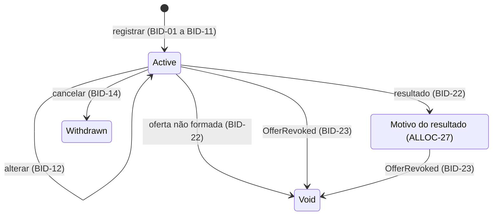

# Livro de Reservas

| | |
| --- | --- |
| **Requirement Prefix** | `BID` |
| **Affected Capabilities** | [Processamento do Livro](../book-processing/spec.md) |

## Context

O operador da corretora registra reservas em nome do investidor, altera ou cancela as reservas nas condições definidas, fecha o livro e consulta o resultado de cada reserva. Esta capability impede reservas inválidas e alterações depois do fechamento, porque o [Processamento do Livro](../book-processing/spec.md) precisa de reservas compatíveis com os limites e as opções da oferta, e quantidades inválidas ou alterações tardias comprometem o cálculo. O livro fechado é a entrada desse processamento.

O investidor (comitente) quer garantir participação com a quantidade e a condição que escolheu e saber o que aconteceu com a reserva. O operador precisa de um livro consistente com a oferta e da demanda acumulada para decidir e executar o fechamento, inclusive antecipado, e do resultado de cada reserva para explicar ao investidor quanto foi atendido e por quê. Por decisão do autor, o operador registra em nome do investidor; não há acesso direto nem identidade de investidor.

Categoria e vínculo entram como declarações na reserva, sem cadastro verificado. A opção de condicionamento e a declaração de vínculo constam do pedido de reserva, e a categoria é atestada por escrito pelo investidor, conforme as normas em References.

A oferta, seus limites, suas opções e seu estado vêm do [Ciclo de Vida da Oferta](../offer-lifecycle/spec.md), que é upstream: esta capability recebe a definição e o estado por eventos e não os altera. O contexto dono desta capability e do Processamento do Livro é o BookBuilding, nome justificado no [ADR 0001](../../adr/0001-bookbuilding-context-name.md), com código em `src/BookBuilding`.

O contrato consolida as decisões de produto do autor e a leitura das normas listadas em References.

## Scope

Entram o registro, a alteração e o cancelamento de reservas, o fechamento do livro, a aplicação do resultado do processamento e da revogação da oferta a cada reserva, a recepção dos eventos da oferta e a consulta do livro e das reservas de um investidor.

Ficam fora:

- cadastro, identidade e autorização de investidor, verificação de suitability (CVM 160, art. 64) e verificação das declarações, inclusive por política interna de compliance;
- depósito do montante reservado (art. 65, §§ 1º e 2º) e movimentação financeira;
- vedação a pessoas vinculadas, condicionamento e rateio, que pertencem ao [Processamento do Livro](../book-processing/spec.md), e efeito da categoria do investidor;
- reservas por mais de um intermediário, direito de desistência depois do fechamento e coleta de intenções de investimento sem período de reserva.

## Assumptions

- **A reserva no livro interno da corretora pode ser ajustada até o fechamento, e a aceitação formal enviada ao coordenador é o consolidado.** O art. 65, § 4º, da CVM 160 torna a reserva irrevogável salvo modificação ou revogação da oferta; a permissão de BID-12 a BID-14 depende de distinguir a reserva interna da aceitação formal. If false: será preciso distinguir registro e confirmação, criar um instante de confirmação e revisar BID-12 a BID-15, e a demanda usada no fechamento antecipado deixa de poder diminuir. Verified by: o autor, com a prática de uma corretora ou com um contrato de distribuição de referência. Confirmed? n
- **Enquanto a lacuna de autenticação e autorização do operador estiver aberta, a API aceita toda chamada como feita pelo operador, sem identidade individual, e o histórico (BID-16, BID-31) identifica o autor só como operador.** Nenhum serviço em `src` configura autenticação. Choice: o comportamento provisório que mantém o estado atual do código. If false: as operações passam a exigir identidade, e o histórico passa a registrar a identidade autenticada. Confirmed? n
- **A API do operador responde em JSON com os identificadores do Glossary e sinaliza rejeições com ProblemDetails: 400 para violação dos dados da reserva (BID-11), 404 para oferta, reserva ou investidor inexistente e 409 para operação não permitida no estado corrente da oferta, do livro ou da reserva.** Nenhuma decisão de produto fixa o formato das respostas nem os códigos; os serviços já registram ProblemDetails (`src/ServiceDefaults/ApiDefaultsExtensions.cs:23`) e versionamento por segmento de URL (`src/ServiceDefaults/ApiDefaultsExtensions.cs:19`). Choice: esses códigos e `v1` como primeira versão, com mudança incompatível publicada em nova versão. If false: mudam os códigos e o corpo das respostas antes de existir consumidor da API. Confirmed? n
- **A consulta de um livro sem reservas devolve demanda zero e lista vazia; depois do fechamento, a demanda acumulada é a do livro fechado; as listas de reservas seguem a ordem de registro.** Nenhuma decisão de produto define o estado vazio, a demanda depois do fechamento nem a ordenação de BID-26 e BID-27; a ordem de registro é a que o processamento usa no desempate. Choice: demanda zero e lista vazia, demanda do livro fechado e ordem de registro. If false: muda só a apresentação da consulta. Confirmed? n
- **Os dados do investidor que BID-32 mantém fora dos rastros de execução incluem o id.** BID-32 dizia só "dados do investidor", sem enumerá-los; o Glossary identifica o investidor por id e nome, e o requisito já declara suficientes os identificadores de reserva e de oferta. Choice: excluir também o id, a leitura mais restritiva. If false: o id do investidor passa a poder aparecer nos rastros, e BID-32 cobre só nome, categoria e declaração de vínculo. Confirmed? y (Autor, 2026-09-30)
- **Os identificadores em inglês do Glossary são propostas, exceto `Bid`, justificado em Trade-offs.** Nenhum tipo de domínio em `src/BookBuilding` os fixa, e a convenção do projeto pede o identificador canônico antes de o nome entrar no código. Choice: os identificadores da tabela. If false: o identificador rejeitado muda sem custo de migração enquanto nenhum tipo o usar. Confirmed? n

## Gaps

| Gap | Affects | Owner |
| --- | --- | --- |
| Autenticação e autorização do operador: quem pode registrar, alterar, cancelar, fechar o livro e consultar, e que identidade é registrada no histórico | BID-01, BID-12, BID-14, BID-16, BID-18, BID-26, BID-27, BID-31 | Autor |
| Reenvio da mesma requisição de registro: criar outra reserva, permitida por BID-04, ou reconhecer a repetição e devolver a reserva já criada | BID-01, BID-04 e a demanda acumulada (BID-26) | Autor |

## Glossary

Oferta, estados da oferta, período de reserva e opções aceitas são definidos no [Ciclo de Vida da Oferta](../offer-lifecycle/spec.md). O processamento, sua situação e os motivos do resultado são definidos no [Processamento do Livro](../book-processing/spec.md).

| Term | Identifier | Definition |
| --- | --- | --- |
| Investidor | `Investor` | Comitente identificado por id e nome, carregado previamente (BID-02) |
| Categoria do investidor | `InvestorCategory` | Classificação declarada na reserva (BID-05, BID-07); valores na tabela de categorias |
| Pessoa vinculada | `IsRelatedParty` | Condição declarada de vínculo com os participantes da oferta (BID-06, BID-07) |
| Reserva | `Bid` | Pedido individual de cotas de uma oferta; pode coexistir com outras reservas do investidor (BID-04, BID-08). Sinônimo: pedido |
| Status da reserva | `BidStatus` | Estado da reserva na tabela de estados; sinônimo: status |
| Oferta disponível | — | Oferta cujo `OfferPublished` o BookBuilding recebeu sem ter recebido `OfferRevoked` (BID-24, BID-25) |
| Livro de reservas | `Book` | Conjunto de reservas de uma oferta |
| Livro fechado | — | Reservas ativas no instante do fechamento (BID-20), com o conteúdo de BID-21. Sinônimo: livro congelado |
| Fechamento do livro | `Close` | Ação do operador que congela o livro no mesmo instante (BID-18, BID-20); admite antecipação em relação ao fim do período |
| Posição do investidor | `Position` | Soma das quantidades das reservas ativas do investidor na oferta, usada em BID-04 |
| Instante do registro | `PlacedAt` | Momento de aceitação da reserva (BID-17) |
| Ordem de registro | `Sequence` | Posição total e imutável de aceitação no livro (BID-17) |
| Opção de condicionamento | `ConditionOption` | Escolha entre as opções aceitas pela oferta (OFF-14), validada por BID-08 e BID-09 |
| Quantidade reservada | `Quantity` | Cotas pedidas pelo investidor (BID-03) |
| Quantidade alocada | `AllocatedQuantity` | Resultado quantitativo do processamento, aplicado por BID-22; zerado pela revogação (BID-23) |
| Demanda acumulada | `CurrentDemand` | Soma das quantidades reservadas das reservas ativas, antes do fechamento, ou das reservas do livro fechado, depois dele (BID-26) |
| Histórico da reserva | `History` | Registro de cada mudança e de cada status aplicado, com origem e instante (BID-16, BID-31) |

| Category | Identifier |
| --- | --- |
| Varejo | `Retail` |
| Qualificado | `Qualified` |
| Profissional | `Professional` |

Os identificadores das categorias espelham os termos da CVM 30, arts. 11 e 12; não há termo consagrado equivalente na comunidade anglófona.

## Requirements

Cada reserva é um pedido individual. Nos requisitos, "investidor" como ator significa o operador agindo em seu nome.

| State | Identifier | Meaning |
| --- | --- | --- |
| Ativa | `Active` | Reserva aceita, aguardando fechamento ou resultado (BID-01, BID-18, BID-20) |
| Cancelada pelo investidor | `Withdrawn` | Reserva retirada pelo investidor (BID-14); não entra no livro fechado |
| Resultado do processamento | `Filled`, `PartiallyFilledByCondition`, `ScaledBack`, `CancelledByCondition`, `ExcludedRelatedParty` | Motivo do resultado aplicado pelo processamento (BID-22, ALLOC-27) |
| Sem efeito | `Void` | Oferta revogada (BID-23) ou não formada, caso em que é o motivo do resultado (BID-22, ALLOC-12) |

### Registro

- **BID-01** — A reserva só é aceita contra oferta disponível, com livro ainda não fechado (BID-18) e com instante do registro dentro do período de reserva, intervalo fechado definido em OFF-11. Terminado o período, a oferta não aceita mais reservas, ainda que o livro não tenha sido fechado.
- **BID-02** — O investidor deve existir no conjunto carregado previamente por seed; esta capability não cria investidor.
- **BID-03** — A quantidade reservada é inteira e maior ou igual ao investimento mínimo por investidor.
- **BID-04** — A posição do investidor, incluindo a reserva sendo registrada ou alterada, é menor ou igual ao investimento máximo por investidor.
- **BID-05** — A categoria é obrigatória: varejo, qualificado ou profissional. Nenhuma regra depende dela.
- **BID-06** — A declaração de vínculo é obrigatória: vinculado ou não vinculado.
- **BID-07** — Categoria e vínculo são únicos por investidor em cada oferta: a nova reserva de investidor com reserva ativa repete as declarações vigentes, e declaração diferente é rejeitada.
- **BID-08** — Em oferta que admite distribuição parcial, cada reserva declara exatamente uma opção, pertencente ao conjunto aceito pela oferta (OFF-14), independentemente das opções das demais reservas do investidor. A opção é sempre declarada porque a opção 2 é também o efeito de não condicionar.
- **BID-09** — Em oferta que não admite distribuição parcial, a reserva omite a opção; se a informar, o registro é rejeitado.
- **BID-10** — Oferta indisponível, livro fechado ou instante fora do período (BID-01) e investidor inexistente (BID-02) rejeitam o registro sem validar os dados da reserva.
- **BID-11** — A rejeição por dados da reserva informa todas as violações de BID-03 a BID-09, com o atributo e a regra de cada uma.

### Alteração e cancelamento

A permissão de alterar e cancelar depende da premissa "A reserva no livro interno da corretora pode ser ajustada até o fechamento…".

- **BID-12** — Quantidade, declarações e opção de reserva ativa podem ser alteradas enquanto a oferta está disponível, o livro não foi fechado (BID-18) e o instante está dentro do período. A alteração é validada pelas regras do registro, exceto BID-07, substituída pela propagação de BID-13.
- **BID-13** — A alteração de categoria ou vínculo se aplica a todas as reservas ativas do investidor na oferta, e cada uma registra a mudança no histórico.
- **BID-14** — A reserva ativa pode ser cancelada enquanto a oferta está disponível, o livro não foi fechado (BID-18) e o instante está dentro do período: passa a `Withdrawn` e não entra no livro fechado; as demais reservas do investidor não são afetadas.
- **BID-15** — Alteração e cancelamento são rejeitados com o livro fechado, com a oferta indisponível, fora do período ou em reserva que não esteja `Active`; a reserva é irrevogável a partir do fechamento.
- **BID-16** — Toda alteração e todo cancelamento preservam o histórico: quem, quando e o que mudou.
- **BID-17** — Instante e ordem do registro são imutáveis. A ordem é total no livro: duas reservas nunca compartilham a posição, ainda que aceitas no mesmo instante.

### Fechamento

- **BID-18** — Fechar o livro é ação explícita do operador, permitida com a oferta disponível e em qualquer instante maior ou igual ao início do período de reserva, o que admite fechamento antecipado; o fim do período não fecha o livro por si. Fora dessas condições, o fechamento é rejeitado.
- **BID-19** — A tentativa de fechar livro já fechado é rejeitada.
- **BID-20** — No fechamento o livro congela no mesmo instante: as reservas ativas naquele instante formam o livro fechado, e nenhuma entra, muda ou sai depois.
- **BID-21** — O livro fechado entrega ao processamento todas as reservas que o compõem, cada uma identificável, com investidor, quantidade, declarações, opção, instante e ordem do registro.

### Resultado

- **BID-22** — Cada reserva do livro fechado recebe do processamento o status resultante e a quantidade alocada; o status é o motivo do resultado (ALLOC-27). Quantidade reservada, declarações e opção não mudam.

### Eventos da oferta

- **BID-23** — Quando o BookBuilding recebe `OfferRevoked`, toda reserva que não esteja `Withdrawn` passa a `Void`, qualquer que seja o status, inclusive um resultado já aplicado; reserva já `Void` permanece. A quantidade alocada vigente passa a zero, e o resultado anterior fica no histórico (BID-16, BID-31).
- **BID-24** — Se `OfferRevoked` chegar antes de `OfferPublished` da mesma oferta, o BookBuilding registra a oferta como revogada, e o `OfferPublished` que chegar depois é descartado e registrado como descartado.
- **BID-25** — Um `OfferPublished` de oferta já recebida é descartado e registrado como descartado, sem alterar a definição conhecida nem as reservas.

### Consulta

- **BID-26** — O operador consulta o livro a qualquer momento, com a demanda acumulada, a lista de reservas com status, se o livro está fechado, a situação do processamento depois do fechamento (ALLOC-01) e, depois da conclusão, o desfecho com `D`, `Dn`, `D'`, `E` e o ramo (ALLOC-28).
- **BID-27** — O operador consulta as reservas de um investidor, com status e, depois do processamento, quantidade alocada.

### Integridade e rastreabilidade

- **BID-28** — Registro, alteração e cancelamento são atômicos e aplicados um de cada vez por oferta: cada operação é validada contra a definição da oferta recebida e contra todas as reservas aceitas antes dela.
- **BID-29** — Fechamento e congelamento são uma única operação atômica: não existe reserva aceita com instante posterior ao fechamento.
- **BID-30** — A recepção de `OfferPublished` ou `OfferRevoked` que falha é repetida até o evento ser aplicado ou descartado (BID-23 a BID-25).
- **BID-31** — Toda mudança de reserva, todo status aplicado e todo evento descartado registram origem e instante.
- **BID-32** — O id e o nome do investidor, a categoria e a declaração de vínculo não aparecem em rastros de execução; identificadores de reserva e de oferta bastam.

## Acceptance Scenarios

Oferta disponível dentro do período, investimento mínimo 10 e máximo 500 e opções {1, 2, 3}; investidor existente, varejo e não vinculado, salvo indicação. Cada cenário é independente. Nos cenários de aplicação de resultado, a entrada é um livro já fechado e válido para os limites da respectiva oferta.

| Scenario | Input | Condition | Requirements | Result |
| --- | --- | --- | --- | --- |
| Primeira reserva | 50 cotas, opção 3 | Posição 50 | BID-01 a BID-06, BID-08 | `Active` |
| Reserva adicional | Reserva ativa de 50, opção 3; nova de 400, opção 1 | Posição 450 | BID-04, BID-08 | Nova reserva `Active`, com opção diferente da anterior |
| Posição acima do máximo | Reservas ativas de 50 e 400; nova de 60, opção 2 | Posição 510 | BID-04 | Registro rejeitado |
| Declaração conflitante | Reserva ativa não vinculada; nova declara vínculo | Divergência na oferta | BID-07 | Registro rejeitado |
| Rejeição múltipla | 5 cotas, opção 4, vínculo ausente | Três violações | BID-03, BID-06, BID-08, BID-11 | A rejeição lista as três |
| Estado antes dos dados | 5 cotas, opção 4 | Livro fechado | BID-10 | Registro rejeitado pelo livro fechado, sem lista de violações dos dados |
| Opção fora da condição | Reserva informa opção 1 | Oferta que não admite distribuição parcial | BID-09 | Registro rejeitado |
| Alteração preserva ordem | 50 cotas às 10h, ordem 7; alteração para 80 às 11h | Posição 80 | BID-12, BID-16, BID-17 | 80 cotas; histórico registrado; instante 10h e ordem 7 |
| Declaração alterada em cascata | Operador muda o vínculo em uma reserva | Duas reservas ativas do investidor | BID-12, BID-13 | Ambas recebem a declaração, e cada histórico registra a alteração |
| Cancelamento | Cancelamento de reserva ativa de 50 | Outra reserva ativa de 30 do investidor | BID-14 | A reserva passa a `Withdrawn`; a de 30 continua `Active`; demanda reduzida em 50 |
| Reserva fora das condições | Nova reserva | Oferta não publicada ou revogada, livro já fechado, ou instante depois do período | BID-01 | Registro rejeitado |
| Cancelamento com livro fechado | Cancelamento de reserva | Livro fechado | BID-15 | Cancelamento rejeitado |
| Alteração de reserva cancelada | Alteração de quantidade | Reserva `Withdrawn` | BID-15 | Alteração rejeitada |
| Fechamento antecipado | Período até amanhã; três ativas e uma `Withdrawn`; operador fecha hoje | Instante ≥ início do período | BID-18, BID-20 | Livro fechado com as três ativas |
| Fechamento antes do início | Operador fecha o livro | Instante anterior ao início do período | BID-18 | Fechamento rejeitado |
| Congelamento no fechamento | Operador fecha o livro | Reservas ativas, uma `Withdrawn` e duas aceitas no mesmo instante | BID-17, BID-18, BID-20, BID-21 | Só as ativas compõem a entrada do processamento; as aceitas no mesmo instante têm ordens distintas |
| Fechamento repetido | Operador fecha o livro | Livro já fechado | BID-19 | Fechamento rejeitado |
| Resultado por rateio | Reserva de 50; resultado 40 por rateio | 40/50 | BID-22 | `ScaledBack` com 40; quantidade reservada preservada |
| Proporcional zero | Reserva de 1 em oferta com investimento mínimo 1; resultado proporcional zero | 0/1 | BID-22 | `PartiallyFilledByCondition` com zero |
| Exclusão | Reserva vinculada; resultado por vinculação | Motivo excluída por vinculação | BID-22 | `ExcludedRelatedParty` com zero |
| Não formação | Desfecho não formada | Cada resultado zero, desfecho `Lapsed` | BID-22 | Reservas do livro fechado `Void` |
| Revogação com reservas ativas | `OfferRevoked` recebido | Reservas ativas | BID-23 | Todas `Void` |
| Revogação após resultado | Resultados de rateio geral `ScaledBack` 40/50 e 20/25; uma reserva `Withdrawn`; `OfferRevoked` recebido | Dois resultados vigentes | BID-23 | As duas com resultado ficam `Void` com zero e histórico; a `Withdrawn` é preservada |
| Revogação antes da publicação | `OfferRevoked` recebido; depois `OfferPublished` da mesma oferta; depois tentativa de reserva | Oferta desconhecida no BookBuilding | BID-01, BID-24, BID-31 | Oferta registrada como revogada; `OfferPublished` descartado e registrado; reserva rejeitada |
| Publicação repetida | `OfferPublished` recebido de novo | Oferta disponível com reservas ativas | BID-25, BID-31 | Definição e reservas inalteradas; repetição registrada como descartada |
| Falha na recepção da revogação | `OfferRevoked`; a primeira aplicação falha | Reservas ativas | BID-30 | A recepção é repetida, e as reservas passam a `Void` |
| Consulta da demanda | Reservas ativas de 50, 400 e 30 de investidores distintos | Soma 480 | BID-26 | Demanda 480, três `Active` e livro aberto |
| Consulta com processamento pendente | Operador consulta o livro | Livro fechado; processamento `Pending` | BID-26 | Livro fechado, situação `Pending` e reservas `Active` |

## Observable Decisions

| Surface or dimension | Landing |
| --- | --- |
| API do operador: operações | Registrar (BID-01), alterar (BID-12), cancelar (BID-14), fechar o livro (BID-18), consultar o livro (BID-26) e as reservas de um investidor (BID-27) |
| API do operador: formato da resposta, do erro e códigos | Premissa "A API do operador responde em JSON…"; precedência e conteúdo das rejeições em BID-10 e BID-11 |
| API do operador: versionamento e compatibilidade | Premissa "A API do operador responde em JSON…" |
| Consulta: estado vazio e ordenação | Premissa "A consulta de um livro sem reservas devolve demanda zero e lista vazia…" |
| Authorization | Lacuna "Autenticação e autorização do operador"; comportamento provisório na premissa "Enquanto a lacuna de autenticação e autorização do operador estiver aberta…" |
| Validation and limits | BID-01 a BID-11; a alteração reaplica as regras do registro (BID-12) |
| State transitions | Diagrama; BID-12 a BID-15, BID-18, BID-19, BID-22 e BID-23 |
| Failure and partial failure | BID-28 a BID-30 |
| Idempotency and duplication | Fechamento repetido é rejeitado (BID-19); `OfferRevoked` repetido mantém `Void` (BID-23); `OfferPublished` repetido é descartado (BID-25); lacuna "Reenvio da mesma requisição de registro" |
| Concurrency and ordering | BID-17, BID-28 e BID-29; eventos da oferta fora de ordem (BID-24) |
| Cross-capability consistency | Eventos da oferta (BID-23 a BID-25, BID-30), com entrega ao menos uma vez (OFF-28); resultado pelo processamento (BID-22) |
| Observability | BID-16, BID-31 e BID-32 |
| Data lifecycle | Histórico preservado (BID-16, BID-31); quantidade reservada, declarações, opção, instante e ordem nunca mudam por resultado ou revogação (BID-17, BID-22, BID-23); investidores carregados previamente (BID-02) |
| `n/a` | Rate limiting: plataforma demonstrativa operada só pela corretora; External dependency failure: sem integração externa |

## Trade-offs

| Decision | Cost | Reason |
| --- | --- | --- |
| Fechamento do livro como ação explícita do operador no BookBuilding, não derivado do fim do período (BID-18) | O livro fica aberto até o operador agir, e a recusa depois do fim do período depende de BID-01; a fase do livro não aparece no estado da oferta, e quem precisa dela consulta o BookBuilding (BID-26) | O fechamento antecipado (CVM 160, art. 76, II) exige ação explícita, e a ação fica onde estão a demanda que a motiva (BID-26) e o congelamento que ela produz (BID-20); fechar no Offering exigiria um evento a mais e abriria uma janela entre o fechamento e o congelamento |
| Alteração e cancelamento antes do fechamento, dentro do período e com a oferta disponível (BID-12 a BID-15) | A demanda acumulada pode diminuir antes do fechamento antecipado, e a permissão depende de uma premissa operacional não verificada | O modelo representa o livro interno da corretora e trata o consolidado como a aceitação enviada ao coordenador; o livro fechado (BID-20) e o histórico (BID-16) protegem o cálculo e a rastreabilidade |
| Categoria e vínculo como declarações na reserva, únicas por investidor em cada oferta (BID-05 a BID-07, BID-13) | Categorias diferentes em ofertas diferentes; declaração falsa passa; alterar uma declaração afeta todas as reservas ativas do investidor | É como a norma trata; evita cadastro; impede investidor metade vinculado |
| Várias reservas ativas por investidor, limite sobre a soma (BID-04) | O registro lê as demais reservas; fracionar aumenta as chances no resto do rateio | Permite lotes com opções distintas; o limite sobre a posição preserva o teto da oferta |
| Status resultante do processamento é o motivo do resultado (BID-22) | Um status por motivo, e `Void` agrega não formação e revogação, distinguíveis só pelo estado da oferta | Um conceito, um nome no mesmo contexto; "o que aconteceu com a minha reserva" tem resposta direta, e a quantidade reservada nunca muda |
| Instante e ordem imutáveis mesmo com alteração (BID-17) | Reservar cedo e aumentar no fim mantém a prioridade no desempate, com ganho máximo de uma cota | Campo imutável é auditável, e reiniciar puniria correções; a ordem, não o instante, desempata porque o processamento exige determinismo |
| Sem eventos por reserva | Nenhum contrato para reagir às reservas em tempo real; `BookClosed`, `BidPlaced`, `BidChanged` e `BidWithdrawn` ficam como candidatos | Evento sem consumidor é acoplamento implícito; o único evento do BookBuilding é o desfecho, `BookProcessed` |
| `Bid` como identificador da reserva | Em inglês geral sugere leilão ou preço, ausentes aqui | É o termo de comunicados de placement para o pedido que entra no livro e sofre scale-back; `Order` colide com a ordem de registro (BID-17), e `Application`, com o vocabulário de software |
| Recepção dos eventos da oferta sem ordem garantida (BID-24, BID-25) | Entre a revogação no Offering e a chegada de `OfferRevoked`, reservas são aceitas e o livro pode ser fechado e processado; tudo fica sem efeito quando o evento chega (BID-23) | A entrega é ao menos uma vez (OFF-28) e não garante ordem, como define Domain Events do [Ciclo de Vida da Oferta](../offer-lifecycle/spec.md); a revogação é terminal e torna ineficazes as aceitações (CVM 160, art. 68), então o estado final é o mesmo em qualquer ordem |

## References

- [Resolução CVM 160](https://conteudo.cvm.gov.br/export/sites/cvm/legislacao/resolucoes/anexos/100/resol160consolid.pdf), lida em 2026-09-05. Art. 65, § 4º: a reserva é irrevogável salvo modificação ou revogação (BID-12, BID-14, BID-15); a alteração até o fechamento é decisão do autor, sujeita à premissa "A reserva no livro interno da corretora pode ser ajustada até o fechamento…". Art. 65, § 6º, II e V: o pedido contém as condições da distribuição parcial e identifica a pessoa vinculada (BID-06, BID-08, BID-09). Art. 66: reservas não se aplicam a profissionais (BID-05), sem efeito no modelo. Art. 2º, XVI, e art. 56: a pessoa vinculada é declarada na reserva para a vedação em excesso de demanda (BID-06). Art. 2º, X e XI: profissional e qualificado atestam a condição por escrito (BID-05). Art. 75: a distribuição parcial não se aplica a ofertas exclusivas para profissionais (BID-05), sem distinção por categoria no modelo. Arts. 69, § 1º, e 65, § 5º: a desistência depois do fechamento nasce de modificação ou divergência de prospectos (BID-15); fica fora do Scope, porque a modificação exigiria cancelamento com prazo mínimo de cinco dias úteis. Art. 76, II: encerramento quando a totalidade é colocada antes do fim do prazo (BID-18), base do fechamento antecipado; o anúncio de encerramento fica fora do Scope. Art. 68: a revogação torna ineficazes as aceitações (BID-23). Art. 64 delimita o Scope.
- [Resolução CVM 30](https://conteudo.cvm.gov.br/export/sites/cvm/legislacao/resolucoes/anexos/001/resol030consolid.pdf), lida em 2026-09-05. Arts. 11 e 12: investidor profissional e qualificado atestam a condição por escrito (BID-05).
- Referências terminológicas em inglês para `Bid`, sem valor normativo, lidas em 2026-09-13: comunicados de placement da [Lloyds TSB Group](https://www.sec.gov/Archives/edgar/data/0001160106/000119163808001657/lloy200809196k2.htm), da [Argo Blockchain](https://www.sec.gov/Archives/edgar/data/1841675/000165495423009326/a4294g.htm) e da [Renalytix](https://www.sec.gov/Archives/edgar/data/1811115/000119312524230319/d896405dex992.htm), que usam, entre eles, "to bid in the Bookbuild" e "bids may be scaled down".
