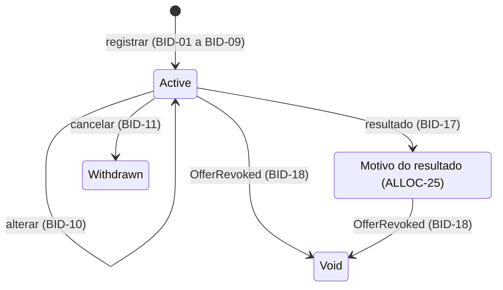

# Livro de Reservas

| | |
| --- | --- |
| **Requirement Prefix** | `BID` |
| **Affected Capabilities** | [Processamento do Livro](../book-processing/spec.md) |

## Context

O operador da corretora registra reservas em nome do investidor, altera ou cancela os pedidos nas condições definidas, fecha o livro e consulta o resultado de cada reserva. Esta capability impede reservas inválidas e alterações dos pedidos depois do fechamento, porque o [Processamento do Livro](../book-processing/spec.md) precisa de pedidos compatíveis com os limites e as opções da oferta, e quantidades inválidas ou alterações tardias comprometem o cálculo. O livro congelado no fechamento é a entrada desse processamento.

O investidor (comitente) quer garantir participação com a quantidade e a condição que escolheu e saber o que aconteceu com a reserva. O operador precisa de um livro consistente com a oferta e da demanda acumulada para decidir e executar o fechamento, inclusive antecipado, e do resultado de cada reserva para explicar ao investidor quanto foi atendido e por quê. Por decisão do autor, o operador registra em nome do investidor; não há acesso direto nem identidade de investidor.

Categoria e vínculo entram como declarações no pedido, sem cadastro verificado. A opção de condicionamento e a declaração de vínculo constam do pedido de reserva, e a categoria é atestada por escrito pelo investidor, conforme as normas em References.

A oferta, seus limites, suas opções e seu estado vêm do [Ciclo de Vida da Oferta](../offer-lifecycle/spec.md), que é upstream: esta capability consome a definição e o estado sem alterá-los. O fechamento do livro acontece no BookBuilding e não passa pelo Offering.

O contrato consolida as decisões de produto do autor e a leitura das normas listadas em References. O serviço `src/BookBuilding` ainda não implementa comportamento de negócio.

## Scope

Entram o registro, a alteração e o cancelamento de reservas, o fechamento e o congelamento do livro, a aplicação do resultado do processamento e da revogação da oferta a cada reserva e a consulta do livro e das reservas de um investidor.

Ficam fora:

- cadastro, identidade e autorização de investidor, verificação de suitability (CVM 160, art. 64) e verificação das declarações, inclusive por política interna de compliance;
- depósito do montante reservado (art. 65, §§ 1º e 2º) e movimentação financeira;
- vedação a pessoas vinculadas, condicionamento e rateio, que pertencem ao [Processamento do Livro](../book-processing/spec.md), e efeito da categoria do investidor;
- reservas por mais de um intermediário, direito de desistência depois do fechamento e coleta de intenções de investimento sem período de reserva.

## Assumptions

- **O pedido no livro interno da corretora pode ser ajustado até o fechamento, e a aceitação formal enviada ao coordenador é o consolidado.** O art. 65, § 4º, da CVM 160 torna a reserva irrevogável salvo modificação ou revogação da oferta; a permissão de BID-10 e BID-11 depende de distinguir o pedido interno da aceitação formal. Se for falsa, será preciso distinguir registro e confirmação, criar um instante de confirmação e revisar BID-10 a BID-12, e a demanda usada no fechamento antecipado deixa de poder diminuir. O autor verifica no regulamento da corretora ou no contrato de distribuição que permita a operação e defina o instante da aceitação irrevogável. Confirmed? n
- **Os identificadores do Glossary sem uso anterior são propostas.** O código ainda não tem modelo de domínio, e a convenção do projeto exige identificadores canônicos em inglês. Escolha: os identificadores da tabela, preservando os já adotados (`Bid`, `Book`, `IsRelatedParty`, as categorias e os status). Se algum for rejeitado, o glossário muda antes de o nome entrar no código. Confirmed? n
- **A consulta de um livro sem reservas devolve demanda zero e lista vazia, e as listas de reservas seguem a ordem de registro.** Nenhuma decisão de produto define o estado vazio nem a ordenação de BID-20 e BID-21; a ordem de registro é a ordem que o processamento usa no desempate. Se for falsa, muda só a apresentação da consulta. Confirmed? n

## Gaps

| Gap | Affects | Owner |
| --- | --- | --- |
| Autenticação e autorização do operador: quem pode registrar, alterar, cancelar, fechar o livro e consultar | BID-01, BID-10, BID-11, BID-20, BID-21, BID-22 | Autor |
| Reenvio da mesma requisição de registro: criar outra reserva, permitida por BID-04, ou reconhecer a repetição e devolver a reserva já criada | BID-01, BID-04 e a demanda acumulada (BID-20) | Autor |

## Glossary

Oferta, estados da oferta, período de reserva e opções aceitas são definidos no [Ciclo de Vida da Oferta](../offer-lifecycle/spec.md). O processamento do livro e os motivos do resultado são definidos no [Processamento do Livro](../book-processing/spec.md).

| Term | Identifier | Definition |
| --- | --- | --- |
| Investidor | `Investor` | Comitente identificado por id e nome, carregado previamente por seed (BID-02) |
| Categoria do investidor | `InvestorCategory` | Classificação declarada na reserva (BID-05, BID-07); valores na tabela de categorias |
| Pessoa vinculada | `IsRelatedParty` | Condição declarada de vínculo com os participantes da oferta (BID-06, BID-07) |
| Reserva | `Bid` | Pedido individual de cotas de uma oferta; pode coexistir com outros pedidos do investidor (BID-04, BID-08) |
| Livro de reservas | `Book` | Conjunto de pedidos de uma oferta |
| Livro fechado | — | Recorte congelado do livro no fechamento (BID-15), com o conteúdo de BID-16 |
| Fechamento do livro | `Close` | Ação do operador que congela o livro no mesmo instante (BID-22, BID-15); admite antecipação em relação ao fim do período |
| Posição do investidor | `Position` | Soma das quantidades ativas do investidor na oferta, usada em BID-04 |
| Instante do registro | `PlacedAt` | Momento de aceitação da reserva (BID-14) |
| Ordem de registro | `Sequence` | Posição total e imutável de aceitação no livro (BID-14) |
| Opção de condicionamento | `ConditionOption` | Escolha entre as opções aceitas pela oferta (OFF-25), validada por BID-08 |
| Quantidade reservada | `Quantity` | Cotas pedidas pelo investidor (BID-03, BID-15) |
| Quantidade alocada | `AllocatedQuantity` | Resultado quantitativo do processamento (ALLOC-25), aplicado por BID-17; zerado pela revogação (BID-18) |
| Demanda acumulada | `CurrentDemand` | Soma das quantidades ativas da oferta no instante da consulta (BID-20) |
| Histórico da reserva | `History` | Registro de cada mudança e de cada status aplicado, com origem e instante (BID-13, BID-25) |

| Category | Identifier |
| --- | --- |
| Varejo | `Retail` |
| Qualificado | `Qualified` |
| Profissional | `Professional` |

Os identificadores das categorias espelham os termos da CVM 30, arts. 11 e 12; não há termo consagrado equivalente na comunidade anglófona.

## Requirements

Cada reserva é um pedido individual. Um investidor pode manter várias reservas ativas na mesma oferta; o limite se aplica à soma, e as declarações de categoria e vínculo coincidem em todas (BID-04, BID-07). Nos requisitos, "investidor" como ator significa o operador agindo em seu nome.

| State | Identifier | Meaning |
| --- | --- | --- |
| Ativa | `Active` | Pedido aceito, aguardando fechamento ou resultado (BID-01, BID-15, BID-22) |
| Cancelada pelo investidor | `Withdrawn` | Pedido retirado pelo investidor (BID-11); não entra no livro fechado |
| Resultado do processamento | Identificador do motivo (ALLOC-25) | Status aplicado pelo resultado (BID-17): o motivo do resultado da reserva |
| Sem efeito | `Void` | Oferta revogada (BID-18); é também o motivo do resultado quando a oferta não se forma (ALLOC-09) |

### Registro

- **BID-01** A reserva só é aceita contra oferta `Open`, com livro ainda não fechado (BID-22) e com instante do registro dentro do período de reserva, intervalo fechado definido em OFF-23. Terminado o período, a oferta `Open` não aceita mais reservas, ainda que o livro não tenha sido fechado.
- **BID-02** O investidor deve existir; esta capability não cria investidor.
- **BID-03** A quantidade reservada é inteira e maior ou igual ao investimento mínimo por investidor.
- **BID-04** A posição do investidor, incluindo a reserva sendo registrada ou alterada, é menor ou igual ao investimento máximo por investidor.
- **BID-05** A categoria é obrigatória: varejo, qualificado ou profissional. Nenhuma regra depende dela.
- **BID-06** A declaração de vínculo é obrigatória: vinculado ou não vinculado.
- **BID-07** Categoria e vínculo são únicos por investidor em cada oferta: a nova reserva de investidor com reserva ativa repete as declarações vigentes, e declaração diferente é rejeitada.
- **BID-08** Em oferta com distribuição parcial, o pedido declara exatamente uma opção, pertencente ao conjunto aceito pela oferta (OFF-25). A opção é sempre declarada porque a opção 2 é também o efeito de não condicionar, e não existe reserva sem opção nessas ofertas. Em oferta sem distribuição parcial, o pedido omite a opção; se a informar, o registro é rejeitado. Reservas do mesmo investidor podem ter opções distintas.
- **BID-09** A rejeição informa todas as violações, com o atributo e a regra de cada uma.

### Alteração e cancelamento

A permissão de alterar e cancelar depende da premissa de ajuste do pedido registrada em Assumptions.

- **BID-10** Quantidade, declarações e opção de reserva ativa podem ser alteradas enquanto a oferta está `Open`, o livro não foi fechado (BID-22) e o instante está dentro do período, com a validação das regras do registro. A alteração de categoria ou vínculo se aplica a todas as reservas ativas do investidor na oferta, e cada uma registra a mudança no histórico.
- **BID-11** A reserva ativa pode ser cancelada enquanto a oferta está `Open`, o livro não foi fechado (BID-22) e o instante está dentro do período: passa a `Withdrawn` e não entra no livro fechado; as demais reservas do investidor não são afetadas.
- **BID-12** Com o livro fechado (BID-22), fora de oferta `Open` ou fora do período, alteração e cancelamento são rejeitados; a reserva é irrevogável a partir daí.
- **BID-13** Toda alteração e todo cancelamento preservam o histórico: quem, quando e o que mudou.
- **BID-14** Instante e ordem do registro são imutáveis. A ordem é total no livro: duas reservas nunca compartilham a posição, ainda que aceitas no mesmo instante.

### Fechamento e congelamento

- **BID-22** Fechar o livro é ação explícita do operador sobre livro de oferta `Open`, permitida em qualquer instante maior ou igual ao início do período de reserva, o que admite fechamento antecipado; o fim do período não fecha o livro por si. Livro já fechado não é fechado de novo, e a ação não muda o estado da oferta.
- **BID-15** No fechamento (BID-22) o livro congela no mesmo instante: as reservas ativas naquele instante formam o livro fechado, e nenhuma entra, muda ou sai depois.
- **BID-16** O livro fechado é a entrada exclusiva do processamento: todas as reservas que o compõem segundo BID-15, cada uma identificável, com investidor, quantidade, declarações, opção, instante e ordem do registro.

### Resultado

- **BID-17** Cada reserva do livro fechado recebe do processamento o status resultante e a quantidade alocada; o status é o motivo do resultado (ALLOC-25). Quantidade reservada, declarações e opção não mudam.

### Revogação

- **BID-18** Quando a oferta é revogada, toda reserva que não esteja `Withdrawn` passa a `Void`, qualquer que seja o status, inclusive um resultado já aplicado; reserva já `Void` permanece. A quantidade alocada vigente passa a zero, e o resultado anterior fica no histórico (BID-13, BID-25). A oferta não formada chega pelo resultado (BID-17), não por evento próprio.

### Consulta

- **BID-20** O operador consulta o livro a qualquer momento, com a demanda acumulada e a lista de reservas com status. É a base do fechamento antecipado (BID-22).
- **BID-21** O operador consulta as reservas de um investidor, com status e, depois do processamento, quantidade alocada.

### Integridade e rastreabilidade

- **BID-23** Registro, alteração e cancelamento são atômicos e validados contra a definição vigente da oferta; BID-04 e BID-07 leem as demais reservas ativas do investidor na mesma operação.
- **BID-24** Fechamento (BID-22) e congelamento (BID-15) são uma única operação atômica: não existe reserva aceita com instante posterior ao fechamento, e o processamento lê o livro idêntico ao congelado (BID-16).
- **BID-25** Toda mudança de reserva e todo status aplicado registram origem e instante.
- **BID-26** Dados do investidor não aparecem em rastros de execução; identificadores de reserva e de oferta bastam.

## Domain Events

Esta capability não produz eventos. Ela consome `OfferPublished` (BID-01) e `OfferRevoked` (BID-18), definidos no [Ciclo de Vida da Oferta](../offer-lifecycle/spec.md). Fechamento, congelamento, processamento e aplicação do resultado acontecem dentro do BookBuilding; o evento `BookProcessed`, que leva o desfecho ao Offering, é definido no [Processamento do Livro](../book-processing/spec.md).

## Acceptance Scenarios

Oferta `Open` dentro do período, investimento mínimo 10 e máximo 500 e opções {1, 2, 3}; investidor existente, varejo e não vinculado, salvo indicação. Cada cenário é independente. Nos cenários de aplicação de resultado, a entrada é um livro já fechado e válido para os limites da respectiva oferta.

| Scenario | Input | Condition | Requirements | Result |
| --- | --- | --- | --- | --- |
| Primeira reserva | 50 cotas, opção 3 | Posição 50 | BID-01 a BID-08 | `Active` |
| Reservas adicionais | Reserva ativa de 50; nova de 400, opção 1; depois tentativa de 60 | Posições 450 e 510 | BID-04, BID-08 | Segunda aceita; terceira rejeitada |
| Declaração conflitante | Reserva ativa não vinculada; nova declara vínculo | Divergência na oferta | BID-07 | Nova reserva rejeitada |
| Rejeição múltipla | 5 cotas, opção 4, vínculo ausente | Três violações | BID-03, BID-06, BID-08, BID-09 | A rejeição lista as três |
| Opção fora da condição | Reserva informa opção 1 | Oferta sem distribuição parcial | BID-08 | Registro rejeitado |
| Alteração preserva ordem | 50 cotas às 10h, ordem 7; alteração para 80 às 11h | Posição 80 | BID-10, BID-13, BID-14 | 80 cotas; histórico registrado; instante 10h e ordem 7 |
| Declaração alterada em cascata | Operador muda categoria ou vínculo em uma reserva | Duas reservas ativas do investidor | BID-07, BID-10 | Ambas recebem a declaração, e cada histórico registra a alteração |
| Reserva fora das condições | Nova reserva | Oferta em Draft ou `Revoked`, livro já fechado, ou oferta `Open` depois do período | BID-01, BID-22 | Registro rejeitado |
| Cancelamento com livro fechado | Cancelamento de reserva | Livro fechado | BID-12 | Cancelamento rejeitado |
| Resultado por rateio | Pedido 50; resultado 40 por rateio | 40/50 | BID-17 | `ScaledBack` com 40; pedido preservado |
| Proporcional zero | Pedido 1 em oferta com investimento mínimo 1; resultado proporcional zero | 0/1 | BID-17 | `PartiallyFilledByCondition` com zero |
| Exclusão | Resultado por vinculação, zero | Motivo excluída por vinculação | BID-17 | `ExcludedRelatedParty` com zero |
| Não formação | Desfecho não formada | Cada resultado zero, desfecho `Lapsed` | BID-17 | Reservas do livro fechado `Void` |
| Revogação com reservas ativas | Oferta revogada | Reservas ativas | BID-18 | Todas `Void` |
| Revogação após resultado | Resultados `Filled` 50/50 e `ScaledBack` 40/50; uma reserva `Withdrawn`; oferta revogada | Dois resultados vigentes | BID-18 | As duas com resultado ficam `Void` com zero e histórico; a `Withdrawn` é preservada |
| Consulta da demanda | Reservas ativas de 50, 400 e 30 de investidores distintos | Soma 480 | BID-20 | Demanda 480 e três `Active` |
| Fechamento antecipado | Período até amanhã; três ativas e uma `Withdrawn`; operador fecha hoje | Instante ≥ início do período | BID-15, BID-22 | Livro fechado com as três ativas; nova reserva rejeitada |
| Congelamento no fechamento | Operador fecha o livro | Reservas ativas, uma `Withdrawn` e duas aceitas no mesmo instante | BID-14 a BID-16, BID-22 | Só as ativas compõem a entrada do processamento; as aceitas no mesmo instante têm ordens distintas |
| Fechamento repetido | Operador fecha o livro | Livro já fechado | BID-22 | Fechamento rejeitado |

## Observable Decisions

| Surface or dimension | Landing |
| --- | --- |
| API do operador: operações | Registrar (BID-01), alterar (BID-10), cancelar (BID-11), fechar o livro (BID-22), consultar o livro (BID-20) e as reservas de um investidor (BID-21) |
| API do operador: formato do erro | BID-09 define o conteúdo; o corpo segue ProblemDetails, registrado pelo `ServiceDefaults` (`src/ServiceDefaults/ApiDefaultsExtensions.cs:23`) |
| API do operador: versionamento | Segmento de URL, registrado pelo `ServiceDefaults` (`src/ServiceDefaults/ApiDefaultsExtensions.cs:19`) |
| Consulta: estado vazio e ordenação | Premissa de consulta em Assumptions |
| Autorização | Lacuna de autenticação e autorização do operador |
| Validação e limites | BID-01 a BID-09; a alteração reaplica as regras do registro (BID-10) |
| Transições de estado | Diagrama; BID-10 a BID-12, BID-17, BID-18 e BID-22 |
| Falha e falha parcial | BID-23 e BID-24 |
| Idempotência e duplicação | Fechamento repetido é rejeitado (BID-22); revogação repetida mantém `Void` (BID-18); reenvio do registro é lacuna |
| Concorrência e ordenação | BID-14, BID-23 e BID-24 |
| Consistência entre capabilities | A definição e o estado da oferta seguem OFF-36; revogação por `OfferRevoked` (BID-18); resultado pelo processamento (BID-17) |
| Observabilidade | BID-13, BID-25 e BID-26 |
| Ciclo de vida dos dados | Histórico preservado (BID-13, BID-25); pedido, declarações, opção, instante e ordem nunca mudam por resultado ou revogação (BID-14, BID-17, BID-18); investidores carregados por seed (BID-02) |
| `n/a` | Tela: o operador usa a API; limite de taxa: plataforma demonstrativa operada só pela corretora; falha de dependência externa: sem integração externa |

## Trade-offs

| Decision | Cost | Reason |
| --- | --- | --- |
| Fechamento do livro como ação explícita do operador no BookBuilding, não derivado do fim do período (BID-22) | No Offering, a oferta fica `Open` entre o fechamento e o desfecho, sem estado que reflita a fase do livro, e quem precisa saber se o livro fechou pergunta ao BookBuilding; o livro fica aberto até o operador agir, e a recusa depois do fim do período depende de BID-01 | O fechamento antecipado (CVM 160, art. 76, II) exige ação explícita, e a ação fica onde estão a demanda que a motiva (BID-20) e o congelamento que ela produz (BID-15); fechar no Offering exigiria um evento a mais e abriria uma janela entre o fechamento e o congelamento |
| Alteração e cancelamento antes do fechamento, dentro do período e em oferta `Open` (BID-10 a BID-12) | A demanda acumulada pode diminuir antes do fechamento antecipado, e a permissão depende de uma premissa operacional não verificada | O modelo representa o livro interno da corretora e trata o consolidado como a aceitação enviada ao coordenador; o livro congelado (BID-15) e o histórico (BID-13) protegem o cálculo e a rastreabilidade |
| Categoria e vínculo como declarações na reserva, únicas por investidor em cada oferta (BID-05 a BID-07) | Categorias diferentes em ofertas diferentes; declaração falsa passa; alterar uma declaração afeta todas as reservas do investidor | É como a norma trata; evita cadastro; impede investidor metade vinculado |
| Várias reservas ativas por investidor, limite sobre a soma (BID-04) | O registro lê as demais reservas; fracionar aumenta as chances no resto do rateio | Permite lotes com opções distintas; o limite sobre a posição preserva o teto da oferta |
| Status resultante do processamento é o motivo do resultado (BID-17) | Um status por motivo, e `Void` agrega não formação e revogação, distinguíveis só pelo estado da oferta | Um conceito, um nome no mesmo contexto; "o que aconteceu com a minha reserva" tem resposta direta, e a quantidade reservada nunca muda |
| Instante e ordem imutáveis mesmo com alteração (BID-14) | Reservar cedo e aumentar no fim mantém a prioridade no desempate, com ganho máximo de uma cota | Campo imutável é auditável, e reiniciar puniria correções; a ordem, não o instante, desempata porque o processamento exige determinismo |
| Sem eventos por reserva | Nenhum contrato para reagir às reservas em tempo real; `BookClosed`, `BidPlaced`, `BidChanged` e `BidWithdrawn` ficam como candidatos | Evento sem consumidor é acoplamento implícito; o único evento do BookBuilding é o desfecho, `BookProcessed` |
| `BookBuilding` como nome do contexto | No mercado o termo inclui a descoberta de preço, que o modelo não tem: o preço é fixo (OFF-17) e a coleta de intenções está fora do Scope | É o nome que os comunicados de placement dão ao processo de abrir o livro, receber pedidos, fechar e alocar com scale-back, inclusive a preço único; `ReservationBook` seria espelho do português, e `Booking` significa registrar uma transação |
| `Bid` como identificador da reserva | Em inglês geral sugere leilão ou preço, ausentes aqui | É o termo desses comunicados para o pedido que entra no livro e sofre scale-back; `Order` colide com a ordem de registro (BID-14), e `Application`, com o vocabulário de software |

## References

- [Resolução CVM 160](https://conteudo.cvm.gov.br/export/sites/cvm/legislacao/resolucoes/anexos/100/resol160consolid.pdf), lida em 2026-09-05. Art. 65, § 4º: a reserva é irrevogável salvo modificação ou revogação (BID-10 a BID-12); a alteração até o fechamento é decisão do autor, sujeita à premissa de ajuste do pedido. Art. 65, § 6º, II e V: o pedido contém as condições da distribuição parcial e identifica a pessoa vinculada (BID-06, BID-08). Art. 66: reservas não se aplicam a profissionais (BID-05), sem efeito no modelo. Art. 2º, XVI, e art. 56: a pessoa vinculada é declarada na reserva para a vedação em excesso de demanda (BID-06). Art. 2º, X e XI: profissional e qualificado atestam a condição por escrito (BID-05). Art. 75: a distribuição parcial não se aplica a ofertas exclusivas para profissionais (BID-05), sem distinção por categoria no modelo. Arts. 69, § 1º, e 65, § 5º: a desistência depois do fechamento nasce de modificação ou divergência de prospectos (BID-12); fica fora do Scope, porque a modificação exigiria cancelamento com prazo mínimo de cinco dias úteis. Art. 76, II: encerramento quando a totalidade é colocada antes do fim do prazo (BID-22), base do fechamento antecipado; o anúncio de encerramento fica fora do Scope. Art. 64 delimita o Scope.
- [Resolução CVM 30](https://conteudo.cvm.gov.br/export/sites/cvm/legislacao/resolucoes/anexos/001/resol030consolid.pdf), lida em 2026-09-05. Arts. 11 e 12: investidor profissional e qualificado atestam a condição por escrito (BID-05).
- Referências terminológicas em inglês, sem valor normativo, que sustentam `BookBuilding` e `Bid`, lidas em 2026-09-13: comunicados de placement da [Lloyds TSB Group](https://www.sec.gov/Archives/edgar/data/0001160106/000119163808001657/lloy200809196k2.htm), da [Argo Blockchain](https://www.sec.gov/Archives/edgar/data/1841675/000165495423009326/a4294g.htm) e da [Renalytix](https://www.sec.gov/Archives/edgar/data/1811115/000119312524230319/d896405dex992.htm), com "the Bookbuild will establish a single price", "to bid in the Bookbuild" e "bids may be scaled down".
