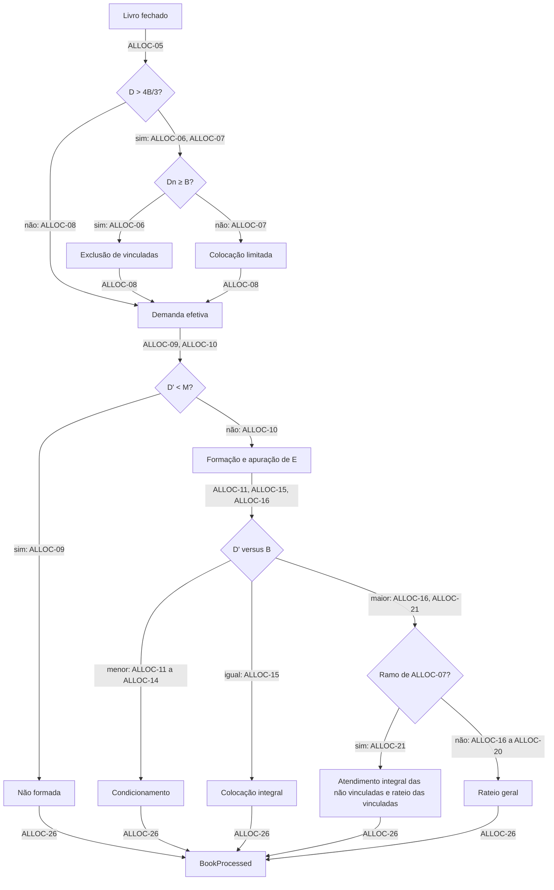

# Processamento do Livro

| | |
| --- | --- |
| **Requirement Prefix** | `ALLOC` |
| **Affected Capabilities** | [Ciclo de Vida da Oferta](../offer-lifecycle/spec.md), [Livro de Reservas](../bid-lifecycle/spec.md) |

## Context

O processamento do livro determina o desfecho da oferta e a quantidade e o motivo do resultado de cada reserva. O fechamento do livro dispara um cálculo determinístico que consolida a demanda, aplica a vedação a pessoas vinculadas, apura a formação e calcula a alocação. O mesmo livro fechado precisa produzir o mesmo resultado, com no máximo um desfecho emitido por oferta.

O operador da corretora fecha o livro e precisa de um desfecho correto, explicável reserva a reserva e reprodutível, sem intervenção manual. O investidor, indiretamente pelo [Livro de Reservas](../bid-lifecycle/spec.md), quer saber quantas cotas recebeu e por quê. O [Ciclo de Vida da Oferta](../offer-lifecycle/spec.md) consome o desfecho e o assume como estado final da oferta.

As regras definem os casos de borda: demanda das não vinculadas abaixo da base, truncamento com resto e condicionamento que reduz a alocação depois da formação. O critério de sucesso é reproduzir exatamente os cenários de aceitação e respeitar os limites quantitativos em todos os ramos.

A entrada vem de duas capabilities: a definição publicada da oferta, do [Ciclo de Vida da Oferta](../offer-lifecycle/spec.md), e o livro fechado, do [Livro de Reservas](../bid-lifecycle/spec.md). O processamento acontece dentro do BookBuilding, e o resultado de cada reserva é aplicado pelo Livro de Reservas (BID-18).

O contrato consolida as decisões de produto do autor e a leitura das normas listadas em References. O serviço `src/BookBuilding` ainda não implementa comportamento de negócio.

## Scope

Entram o disparo pelo fechamento, a consolidação da demanda, a vedação a pessoas vinculadas, a apuração da formação, a alocação em cada ramo, o resultado por reserva, a emissão de `BookProcessed` e a interrupção pela revogação da oferta.

Ficam fora:

- outros critérios de rateio (igualitário e sucessivo, cronológico puro, prioridade por lote mínimo, exclusão de reservas pequenas) e critérios por tranche;
- garantia do investimento mínimo por investidor na alocação;
- lote adicional e suplementar, sobras de subscrição e direito de preferência, alocação discricionária e tranche institucional;
- as exceções do art. 56 da CVM 160 para formadores de mercado e aplicação mínima obrigatória;
- efeito da categoria do investidor (art. 75), reprocessamento manual, aprovação ou ajuste pelo operador, liquidação, custódia e posição do cotista.

## Assumptions

- **Os identificadores do Glossary sem uso anterior são propostas.** O código ainda não tem modelo de domínio, e a convenção do projeto exige identificadores canônicos em inglês. Escolha: os identificadores da tabela, preservando os já adotados (`RoundingRemainder`, os desfechos, os motivos e os ramos). Se algum for rejeitado, o glossário muda antes de o nome entrar no código. Confirmed? n

## Glossary

Oferta, quantidade base, montante mínimo e opções aceitas são definidos no [Ciclo de Vida da Oferta](../offer-lifecycle/spec.md). Investidor, reserva, quantidade reservada, opção declarada e ordem de registro são definidos no [Livro de Reservas](../bid-lifecycle/spec.md). Os símbolos entre parênteses são a notação dos requisitos e dos cenários.

| Term | Identifier | Definition |
| --- | --- | --- |
| Quantidade base (`B`) | `BaseQuantity` | Definida em OFF-06 |
| Montante mínimo (`M`) | `MinimumQuantity` | Definido em OFF-10 |
| Quantidade reservada (`q`) | `Quantity` | Cotas pedidas na reserva (BID-03) |
| Livro fechado | — | Entrada congelada do livro (BID-16, BID-17), uma linha por reserva |
| Demanda total (`D`) | `TotalDemand` | Soma dos pedidos do livro fechado (ALLOC-05) |
| Demanda das não vinculadas (`Dn`) | `NonRelatedDemand` | Parcela da demanda sem declaração de vínculo (ALLOC-05); decide entre ALLOC-06 e ALLOC-07 |
| Demanda efetiva (`D'`) | `EffectiveDemand` | Demanda depois das exclusões (ALLOC-08); base da formação, do condicionamento e do rateio; em colocação limitada é igual a `D` |
| Excesso superior a um terço | — | `D > B × 4/3`; fronteira da vedação em ALLOC-06 e ALLOC-07 |
| Colocação limitada | `LimitedPlacement` | Exceção do art. 56, §§ 1º, III, e 3º (ALLOC-07), executada por ALLOC-21 |
| Formação | — | Apuração do desfecho por ALLOC-09 e ALLOC-10; identificadores na tabela de desfechos |
| Cotas efetivamente distribuídas (`E`) | `DistributedQuantity` | Quantidade apurada em ALLOC-10; numerador do proporcional de ALLOC-13, com denominador `B`; não é necessariamente a soma final alocada |
| Distribuição parcial | `PartialDistribution` | `M ≤ D' < B`; ramo de ALLOC-11 a ALLOC-14 |
| Excesso de demanda | — | `D' > B`; ramo de ALLOC-16 a ALLOC-21 |
| Condicionamento | `ConditionOption` | Opção declarada na reserva (BID-08) entre as aceitas pela oferta (OFF-12); efeito e motivo em ALLOC-11 a ALLOC-13 |
| Rateio proporcional | — | Divisão definida em ALLOC-16 |
| Quantidade rateada (`R`) | `ScaleBackQuantity` | Cotas divididas pelo rateio (ALLOC-16, ALLOC-21) |
| Demanda rateada (`Dr`) | `ScaleBackDemand` | Soma de `q` do conjunto rateado (ALLOC-16, ALLOC-21) |
| Resto do arredondamento | `RoundingRemainder` | Diferença distribuída por ALLOC-17; espelho descritivo, sem termo específico de mercado nas fontes consultadas. Não designa sobras de subscrição (CVM 160, art. 65, § 2º, I) |
| Quantidade alocada | `AllocatedQuantity` | Cotas atribuídas à reserva, sujeitas a ALLOC-18 e ALLOC-22 |
| Resultado da reserva | `BidResult` | Quantidade alocada e motivo de uma reserva (ALLOC-25) |
| Desfecho | `Outcome` | Conclusão sobre a oferta e seus resultados individuais (ALLOC-26) |

## Requirements

O fechamento do livro (BID-15, BID-16) dispara o processamento dentro do BookBuilding. O cálculo consolida a demanda, determina a vedação aplicável, apura a formação, calcula a alocação e emite o resultado completo como `BookProcessed`.

### Gatilho e entrada

- **ALLOC-01** O processamento inicia com o fechamento do livro pelo operador (BID-15), quando o livro congela (BID-16), e usa como entrada exclusiva a definição publicada da oferta e o livro fechado (BID-17).
- **ALLOC-02** Cada oferta produz no máximo um `BookProcessed`. Depois de emitido, novo processamento é rejeitado. Um processamento que terminou sem emitir (ALLOC-28) pode ser repetido e, por ALLOC-04, produz o mesmo resultado.
- **ALLOC-03** Se a oferta for revogada antes de o processamento concluir, ele é interrompido e nada é emitido. Revogação depois da emissão não altera o resultado emitido.
- **ALLOC-04** O processamento é determinístico: a mesma oferta e o mesmo livro fechado produzem exatamente o mesmo resultado.

### Consolidação e vedação

- **ALLOC-05** `D` é a soma de `q` de todas as reservas do livro fechado; `Dn` é a soma de `q` das reservas sem declaração de vínculo.
- **ALLOC-06** Se `D > B × 4/3` e `Dn ≥ B`, as reservas com declaração de vínculo são excluídas: quantidade alocada zero, motivo `ExcludedRelatedParty`.
- **ALLOC-07** Se `D > B × 4/3` e `Dn < B`, nenhuma reserva é excluída, e o processamento segue em colocação limitada (ALLOC-21).
- **ALLOC-08** `D'` é a soma de `q` das reservas não excluídas. As demais exceções do art. 56, § 1º (formadores de mercado, aplicação mínima obrigatória) não são modeladas.

### Formação

- **ALLOC-09** Se `D' < M`, a oferta não se forma: desfecho `Lapsed`, e toda reserva não excluída recebe zero com motivo `Void`.
- **ALLOC-10** Se `D' ≥ M`, a oferta se forma (desfecho `Unconditional`) e `E = min(D', B)`. `E` é apurado uma vez e não é recalculado depois do condicionamento.

### Distribuição parcial (`M ≤ D' < B`)

- **ALLOC-11** Opção 1, condicionada à colocação total da quantidade base: a reserva não é atendida, recebe zero e motivo `CancelledByCondition`.
- **ALLOC-12** Opção 2, condicionada ao montante mínimo com recebimento da totalidade: a reserva recebe `q`, motivo `Filled`.
- **ALLOC-13** Opção 3, condicionada ao montante mínimo com recebimento proporcional: a reserva recebe `⌊q × E / B⌋`, truncado para baixo, motivo `PartiallyFilledByCondition`. Zero é resultado válido e mantém esse motivo.
- **ALLOC-14** Em oferta sem distribuição parcial (`M = B`) este ramo não ocorre: `D' < B` implica `D' < M`.

### Colocação integral (`D' = B`)

- **ALLOC-15** Cada reserva não excluída recebe `q`, motivo `Filled`; a opção de condicionamento é ignorada.

### Excesso de demanda (`D' > B`)

- **ALLOC-16** Cada reserva do conjunto rateado recebe `⌊q × R / Dr⌋`, com `Dr` a soma de `q` do conjunto rateado. No caso geral o conjunto é o das reservas não excluídas, `R = B` e `Dr = D'`. O motivo é `ScaledBack`, mesmo quando ALLOC-17 leva a quantidade a `q`.
- **ALLOC-17** O resto do arredondamento, `R` menos a soma de ALLOC-16, é distribuído uma cota por reserva do conjunto rateado, em ordem decrescente da parte fracionária de `q × R / Dr`. O empate é desfeito pela ordem de registro, mais antiga primeiro (BID-14).
- **ALLOC-18** Nenhuma reserva recebe mais que `q`; se o resto alcançar esse limite em uma reserva, a cota vai para a próxima na ordem.
- **ALLOC-19** Em excesso de demanda, a soma das quantidades alocadas é exatamente `B`.
- **ALLOC-20** O condicionamento não se aplica em excesso de demanda; a opção declarada é ignorada.
- **ALLOC-21** Em colocação limitada (ALLOC-07), cada reserva não vinculada recebe `q` com motivo `Filled`; o conjunto rateado é o das vinculadas, `R = B − Dn`, `Dr` é a soma de `q` das vinculadas, e ALLOC-16 a ALLOC-18 se aplicam a esse conjunto. ALLOC-19 vale para o total.

### Resultado

- **ALLOC-22** Toda quantidade alocada é inteira e maior ou igual a zero.
- **ALLOC-23** Em qualquer ramo, a soma das quantidades alocadas é menor ou igual a `B`.
- **ALLOC-24** Investimento mínimo por reserva e máximo por posição valem no registro (BID-03, BID-04), não na alocação: rateio e proporcional podem alocar abaixo do mínimo, inclusive zero. O motivo é a regra aplicada, não a quantidade.
- **ALLOC-25** O resultado por reserva carrega a quantidade alocada e um motivo da tabela de motivos.
- **ALLOC-26** O desfecho carrega `D`, `Dn`, `D'`, `E`, o ramo aplicado, inclusive colocação limitada, e a lista identificável de resultados por reserva. Informa o desfecho de ALLOC-09 ou ALLOC-10 e é emitido como `BookProcessed`, sujeito a ALLOC-02. `E` só é apurado no caso de ALLOC-10; na não formação é não aplicável.

| Outcome | Identifier | Meaning |
| --- | --- | --- |
| Formada | `Unconditional` | `D' ≥ M` (ALLOC-10) |
| Não formada | `Lapsed` | `D' < M` (ALLOC-09) |

| Reason | Identifier | Meaning |
| --- | --- | --- |
| Atendida integralmente | `Filled` | Recebe `q` (ALLOC-12, ALLOC-15, ALLOC-21) |
| Atendida parcialmente por proporcional | `PartiallyFilledByCondition` | Opção 3 em distribuição parcial (ALLOC-13) |
| Atendida parcialmente por rateio | `ScaledBack` | Integra o conjunto rateado (ALLOC-16, ALLOC-21) |
| Não atendida por condicionamento | `CancelledByCondition` | Opção 1 em distribuição parcial (ALLOC-11) |
| Excluída por vinculação | `ExcludedRelatedParty` | Vedação a pessoas vinculadas (ALLOC-06) |
| Oferta não formada | `Void` | Não formação (ALLOC-09) |

| Branch | Identifier | Meaning |
| --- | --- | --- |
| Não formação | `NonFormation` | ALLOC-09 |
| Distribuição parcial | `PartialDistribution` | ALLOC-11 a ALLOC-14 |
| Colocação integral | `FullPlacement` | ALLOC-15 |
| Rateio geral | `GeneralScaleBack` | ALLOC-16 a ALLOC-20 |
| Colocação limitada | `LimitedPlacement` | ALLOC-21 |

Os identificadores dos ramos e dos motivos compostos são nomes descritivos do modelo, sem enumeração equivalente nas fontes consultadas; `ScaledBack`, `Unconditional` e `Lapsed` usam termos de mercado justificados em Trade-offs.

### Integridade e rastreabilidade

- **ALLOC-27** A aritmética é exata, sem ponto flutuante, e todo truncamento é para baixo.
- **ALLOC-28** O processamento é atômico: ou emite `BookProcessed` completo, ou nada.
- **ALLOC-29** O motivo, `D`, `Dn`, `D'`, `E` e o ramo permitem recalcular manualmente cada quantidade alocada.
- **ALLOC-30** Cada processamento é rastreável de ponta a ponta pelo identificador da oferta.

## Domain Events

| Event | Trigger | Content | Consumers |
| --- | --- | --- | --- |
| `BookProcessed` | Conclusão do processamento (ALLOC-26), no máximo uma vez por oferta (ALLOC-02) e nunca depois de revogação em curso (ALLOC-03) | Oferta, desfecho (`Unconditional` ou `Lapsed`), instante da conclusão, `D`, `Dn`, `D'`, `E` quando apurado, ramo e resultado de cada reserva (ALLOC-25) | [Ciclo de Vida da Oferta](../offer-lifecycle/spec.md), que assume o desfecho como estado da oferta (OFF-20 a OFF-22); um evento emitido antes de uma revogação pode chegar depois dela, e a oferta o descarta (OFF-22) |

O processamento consome `OfferRevoked` (ALLOC-03), definido no [Ciclo de Vida da Oferta](../offer-lifecycle/spec.md).

## Acceptance Scenarios

`B = 1000` e `M = 600`, com reservas não vinculadas, salvo indicação. `V` marca reserva vinculada; a ordem de listagem é a ordem de registro; `(n)` é a opção de condicionamento. A condição traz `D`, `Dn`, `D'` e `E`, nessa ordem, e o ramo; o traço em `E` significa não aplicável (ALLOC-26). Valores entre parênteses aproximam `q × R / Dr` só para leitura; os cálculos são exatos.

| Scenario | Input | Condition | Requirements | Result |
| --- | --- | --- | --- | --- |
| Parcial com proporcional | A 500 (3), C 300 (2) | 800, 800, 800, 800; parcial | ALLOC-10 a ALLOC-13 | A 400 = ⌊500 × 800 / 1000⌋ proporcional; C 300 integral; soma 700 |
| Parcial com colocação total | A 100 (1), C 550 (2) | 650, 650, 650, 650; parcial | ALLOC-10 a ALLOC-13 | A 0 por condicionamento; C 550; formada mesmo com soma 550 abaixo de `M` |
| Proporcional truncado a zero | A 1 (3), C 699 (2) | 700, 700, 700, 700; parcial | ALLOC-10 a ALLOC-13 | A 0 = ⌊1 × 700 / 1000⌋, motivo proporcional; C 699 |
| Proporcional truncado acima de zero | A 15 (1), C 15 (2), F 15 (3), G 655 (2) | 700, 700, 700, 700; parcial | ALLOC-10 a ALLOC-13 | A 0 por condicionamento; C 15 integral; F 10 = ⌊15 × 700 / 1000⌋ proporcional; G 655 integral; soma 680 |
| Duas reservas do mesmo investidor | A1 300 (1) e A2 200 (2) do mesmo investidor; C 200 (2) | 700, 700, 700, 700; parcial | ALLOC-10 a ALLOC-13 | A1 0 por condicionamento; A2 200; C 200; resultado por reserva |
| Não formada | Reservas somando 500 | 500, 500, 500, —; não formação | ALLOC-09 | Todas 0, motivo `Void` |
| Não formada sem distribuição parcial | `M = B = 1000`; reservas somando 900 | 900, 900, 900, —; não formação | ALLOC-09 | Todas 0 |
| Livro vazio | Livro sem reservas | 0, 0, 0, —; não formação | ALLOC-09 | Desfecho sem resultados por reserva |
| Exclusão de vinculadas e rateio | A 700, C 500, V 300 | 1500, 1200, 1200, 1000; exclusão e rateio | ALLOC-06, ALLOC-16 a ALLOC-19 | V 0 excluída; A 583 (583,33), C 416 (416,67); resto 1 → C; A 583, C 417; soma 1000 |
| Colocação limitada | A 800, V 600 | 1400, 800, 1400, 1000; limitada | ALLOC-21 | A 800 integral; V rateia 200 e recebe 200 por rateio; soma 1000 |
| Colocação limitada com resto | A 800, V1 400, V2 200 | 1400, 800, 1400, 1000; limitada | ALLOC-21 | A 800; `R = 200`, `Dr = 600`: V1 133 (133,33), V2 66 (66,67); resto 1 → V2; V1 133, V2 67; soma 1000 |
| Colocação integral | A 600, C 400 | 1000, 1000, 1000, 1000; integral | ALLOC-15 | A 600, C 400; opções ignoradas |
| Rateio sem resto | A 1000, C 1000 | 2000, 2000, 2000, 1000; rateio | ALLOC-16 a ALLOC-19 | 500 e 500, sem resto |
| Rateio com resto | A 1000, C 999 | 1999, 1999, 1999, 1000; rateio | ALLOC-16 a ALLOC-19 | A 500 (500,25), C 499 (499,75); resto 1 → C; 500 e 500 |
| Empate na fração | A 500, C 500; `B = 999` | 1000, 1000, 1000, 999; rateio | ALLOC-16 a ALLOC-19 | 499 (499,5) cada; frações iguais; resto 1 → A pela ordem de registro; A 500, C 499 |
| Empate no instante de registro | Idem, aceitas no mesmo instante, A anterior na ordem de registro | 1000, 1000, 1000, 999; rateio | ALLOC-16 a ALLOC-19 | A 500, C 499 |
| Revogação durante o processamento | Oferta revogada | Processamento em curso | ALLOC-03 | Nenhum `BookProcessed` emitido |
| Processamento repetido após emissão | Novo processamento solicitado | `BookProcessed` já emitido | ALLOC-02 | Processamento rejeitado |
| Repetição após falha | Processamento repetido | Original interrompido por falha antes de emitir | ALLOC-02, ALLOC-04 | Emite o `BookProcessed` que o original produziria |

## Observable Decisions

| Surface or dimension | Landing |
| --- | --- |
| Evento `BookProcessed` | ALLOC-26 e Domain Events |
| Consulta do resultado | Pelo [Livro de Reservas](../bid-lifecycle/spec.md): status e quantidade alocada por reserva (BID-18, BID-20, BID-21) |
| Validação e limites | ALLOC-18, ALLOC-22, ALLOC-23 e ALLOC-24 |
| Falha e falha parcial | ALLOC-28; repetição depois de falha (ALLOC-02, ALLOC-04) |
| Idempotência e duplicação | ALLOC-02 e ALLOC-04 |
| Concorrência e ordenação | Revogação durante o processamento (ALLOC-03); desempate pela ordem de registro (ALLOC-17) |
| Transições de estado | O processamento não tem estado próprio; o desfecho segue ALLOC-09 e ALLOC-10, e os status das reservas, BID-18 |
| Consistência entre capabilities | Entrada exclusiva (ALLOC-01), com a definição sujeita a OFF-25 e o livro fechado de BID-17; desfecho assumido pela oferta (OFF-20 a OFF-22) |
| Observabilidade | ALLOC-29 e ALLOC-30 |
| Ciclo de vida dos dados | O resultado fica nas reservas (BID-18) e, depois de revogação, no histórico delas (BID-19) |
| `n/a` | API, tela, autorização e limite de taxa: o processamento não expõe operação própria e é disparado pelo fechamento (BID-15); falha de dependência externa: sem integração externa |

## Trade-offs

| Decision | Cost | Reason |
| --- | --- | --- |
| Processamento automático no fechamento, sem revisão do operador (ALLOC-01) | O operador não corrige o livro congelado: uma declaração errada pode exigir revogar a oferta inteira; corrigir depois do fechamento exigiria uma etapa de revisão, com permissões e efeito sobre o resultado | O recorte demonstra a alocação automática pelas regras publicadas; as validações ocorrem antes do fechamento, o histórico é preservado e o processamento é determinístico |
| `E` apurado antes do condicionamento, sem recálculo (ALLOC-10) | A oferta pode se formar com soma final alocada abaixo do montante mínimo | O modelo adota a leitura do art. 74, parágrafo único, da CVM 160: as condicionadas integram os efetivamente distribuídos, e a base do proporcional é fixada antes das condições |
| Vedação antes da formação (ALLOC-06 a ALLOC-09) | O cálculo distingue exclusão de vinculadas e colocação limitada, com conjuntos e resultados diferentes | A ordem preserva a exceção do art. 56, § 1º, III; a exclusão só ocorre quando `Dn ≥ B` |
| Colocação limitada como sub-ramo do excesso (ALLOC-21) | O rateio ganha dois parâmetros, `R` e o conjunto rateado | Em colocação limitada `D' = D > B`, excesso por definição; reutiliza ALLOC-16 a ALLOC-18 e mantém ALLOC-19 como único invariante |
| Um único critério de rateio, proporcional (ALLOC-16) | Ofertas com outro critério não são representáveis | É o padrão de varejo; decisão do autor |
| Resto por maior parte fracionária, desempate pela ordem de registro (ALLOC-17) | Reservas grandes tendem a ficar com o resto; fracionar aumenta as chances; o critério não está nos documentos típicos e pode divergir do plano de distribuição de uma oferta real | Minimiza o desvio do proporcional exato, atende ao art. 49, III, e é determinístico e auditável |
| Limites por investidor só no registro (ALLOC-24) | O investidor pode receber uma cota ou nenhuma com investimento mínimo de dez | É o comportamento real do rateio; impor o mínimo seria outro critério |
| `ScaledBack` como identificador do rateio (ALLOC-25) | Atendida parcialmente vira dois status, `ScaledBack` e `PartiallyFilledByCondition`, e o operador precisa dos dois para explicar o resultado | Termo dos prospectos ("scale-back of oversubscriptions on a pro rata basis"); `ProRata` colidiria com a opção 3 |
| `Unconditional` e `Lapsed` como identificadores do desfecho (ALLOC-26) | `Unconditional` convive com as opções de condicionamento da reserva | Termos do Takeover Code e de prospectos listados em References, em vez da tradução literal `Formed` e `NotFormed`; a escolha é terminológica e não importa as regras dessas ofertas |

## References

- [Resolução CVM 160](https://conteudo.cvm.gov.br/export/sites/cvm/legislacao/resolucoes/anexos/100/resol160consolid.pdf), lida em 2026-09-05. Art. 56, caput, § 1º, III, e § 3º: vedação a pessoas vinculadas em excesso superior a um terço, exceção quando a exclusão derruba a demanda abaixo da quantidade ofertada e colocação limitada ao necessário, preservada a integral das não vinculadas (ALLOC-06, ALLOC-07, ALLOC-21); o excesso ignora lotes adicional e suplementar. Art. 73, §§ 3º e 4º: restituição abaixo do mínimo, inclusive a quem condicionou à totalidade (ALLOC-09, ALLOC-11). Art. 70: suspensão e cancelamento são atos da CVM por irregularidade (ALLOC-09); por isso o desfecho é não formada, e não cancelada. Art. 74 e parágrafo único: opção do investidor entre a totalidade e o mínimo, e as condicionadas integram os efetivamente distribuídos (ALLOC-10, ALLOC-13). Art. 49, III: o plano fixa o rateio com tratamento equitativo, sem impor critério (ALLOC-16, ALLOC-17). Arts. 65 e 75 delimitam o Glossary e o Scope.
- [Instrução CVM 400](https://conteudo.cvm.gov.br/export/sites/cvm/legislacao/instrucoes/anexos/400/inst400.pdf), revogada, lida em 2026-09-05. Art. 31, § 1º: origem da distinção entre totalidade e proporcional (ALLOC-13); referência histórica.
- [Euro Manganese](https://www.newsfilecorp.com/release/252189/Completion-of-A1.5M-Security-Purchase-Plan), lido em 2026-09-06: comunicado com uso de scale-back; referência terminológica para `ScaledBack`, sem valor normativo.
- [The Takeover Code, regra 31.2](https://code.thetakeoverpanel.org.uk/tp/rules/rule-31/rule-31-2.html?date=2023-12-11&timeline=True), 14ª edição, versão de 2023-12-11, consultada em 2026-09-16: usa `unconditional` e `lapses` como desfechos de oferta; referência terminológica para `Unconditional` e `Lapsed`, sem valor normativo.
- [Prospecto da Shanghai FourSemi Semiconductor Co., Ltd., publicado na HKEX](https://www1.hkexnews.hk/listedco/listconews/sehk/2026/0323/2026032300023.pdf), datado de 2026-03-23, seção "Structure of the Global Offering — Conditions of the Global Offering", pp. 287–288 da numeração impressa, consultado em 2026-09-16: usa `unconditional` e `lapse` nas condições da oferta; referência terminológica para `Unconditional` e `Lapsed`, sem valor normativo.
