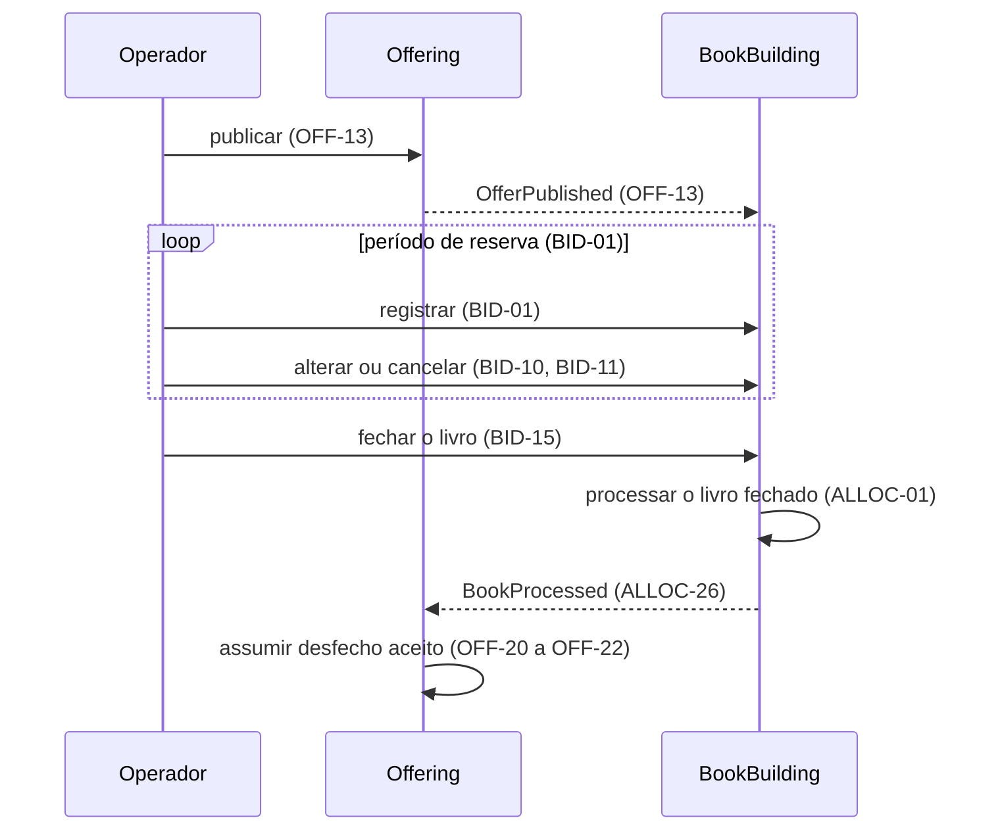
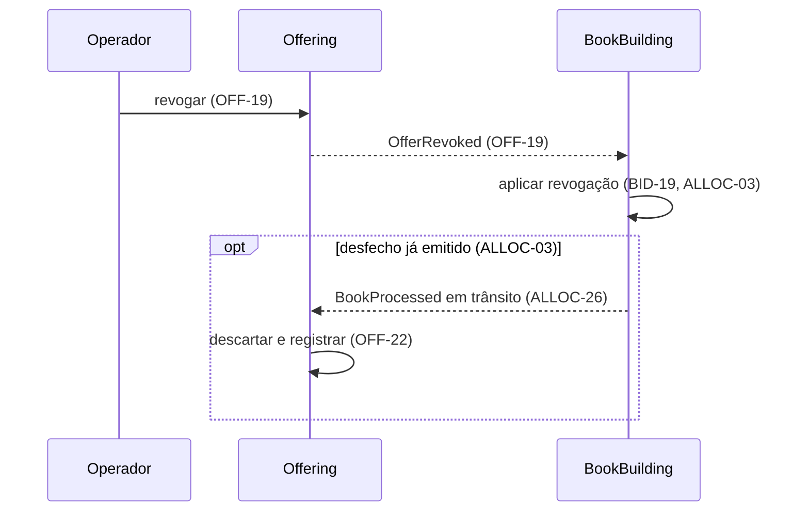

# Ciclo de Vida da Oferta

| | |
| --- | --- |
| **Requirement Prefix** | `OFF` |
| **Affected Capabilities** | [Livro de Reservas](../bid-lifecycle/spec.md), [Processamento do Livro](../book-processing/spec.md) |

## Context

A plataforma modela a distribuição de cotas de classe fechada por uma corretora a investidores finais, e o operador da corretora registra as decisões do investidor. A finalidade é demonstrativa, sem operação em produção; liquidação financeira e integrações externas ficam fora.

A oferta é a emissão de cotas de uma classe fechada, vendida como um único conjunto. Na Resolução CVM 175 o fundo se organiza em classes e subclasses; como a classe fechada não admite resgate, a distribuição é o único momento de decisão de investimento que o modelo cobre.

As capabilities do BookBuilding dependem da oferta. O [Livro de Reservas](../bid-lifecycle/spec.md) precisa do estado, dos limites e das opções da oferta para aceitar uma reserva, e o [Processamento do Livro](../book-processing/spec.md) precisa de quantidade base e montante mínimo fixos. Se esses parâmetros mudassem depois da publicação, os pedidos e o resultado ficariam inconsistentes. Por isso esta capability impede publicações inválidas, alterações da definição publicada e transições fora do ciclo, e a publicação valida e congela a definição.

O operador de distribuição da corretora é o consumidor primário: cadastra a oferta a partir dos documentos aprovados, publica, revoga quando necessário e acompanha o desfecho. As capabilities do BookBuilding obtêm a definição publicada e o estado corrente e confiam que a definição não muda. O investidor não interage com esta capability; o ponto de contato dele é a reserva.

O Offering, dono desta capability, é upstream: o BookBuilding consome a definição e o estado da oferta sem alterá-los, e mudanças incompatíveis de contrato partem do Offering. O desfecho do livro faz o caminho inverso: o BookBuilding o apura e o Offering o assume como estado final da oferta (OFF-20 a OFF-22). A comunicação entre os dois contextos ocorre por eventos, e cada contexto mantém sua própria persistência.

O contrato consolida as decisões de produto do autor e a leitura das normas listadas em References. O serviço `src/Offering` ainda não implementa comportamento de negócio.

## Scope

Entram a elaboração da oferta em Draft, a definição e seus atributos, a publicação com validação, a imutabilidade da definição publicada, a revogação, a recepção do desfecho do livro e a apresentação da oferta aos demais contextos.

Ficam fora:

- séries como nível de processamento, tranches, lote adicional (CVM 160, art. 50), outros critérios de rateio, efeito da categoria do investidor, direito de preferência e sobras de subscrição;
- liquidação financeira, anúncio de encerramento (art. 76) e integrações externas: a oferta não tem estado posterior ao desfecho, e a plataforma não conhece o prazo real da revogação, que depende da liquidação;
- modificação de atributos (arts. 67, I e II, e 69), redução da quantidade base e suspensão de oferta publicada;
- cadastro de fundos, classes, subclasses e investidores, documentos da oferta e registro na CVM (arts. 57 e 65);
- calendário de dias úteis: o período de reserva é um intervalo de instantes;
- eventos para Formada e Não formada: `OfferBecameUnconditional` e `OfferLapsed` são candidatos, condicionados à existência de consumidores.

## Assumptions

- **Os identificadores do Glossary sem uso anterior são propostas.** O código ainda não tem modelo de domínio, e a convenção do projeto exige identificadores canônicos em inglês. Escolha: os identificadores da tabela, preservando os já adotados (`Draft`, `Open`, `Unconditional`, `Lapsed`, `Revoked` e as opções `1`, `2` e `3`). Se algum for rejeitado, o glossário muda antes de o nome entrar no código. Confirmed? n

## Gaps

| Gap | Affects | Owner |
| --- | --- | --- |
| Normalização da identificação das cotas: se espaços nas bordas de fundo, classe, subclasse e número da emissão são removidos ou rejeitam a publicação, e qual operação usa a comparação sem distinção de caixa, já que não há unicidade nem validação contra cadastro | OFF-04; a validação da publicação (OFF-13, OFF-14) e a identificação entregue aos consumidores (OFF-17) | Autor |
| Conjunto de opções informado em oferta sem distribuição parcial: rejeitar a publicação ou ignorar o conjunto; o caso com opções vazias já está definido | OFF-11; a validação da publicação e a definição entregue aos consumidores (OFF-17) | Autor |
| Autenticação e autorização do operador: quem pode criar, publicar e revogar ofertas | OFF-01, OFF-13, OFF-19 | Autor |

## Glossary

Reserva, investidor e fechamento do livro são definidos no [Livro de Reservas](../bid-lifecycle/spec.md). Formação, demanda efetiva e cotas efetivamente distribuídas são definidas no [Processamento do Livro](../book-processing/spec.md).

| Term | Identifier | Definition |
| --- | --- | --- |
| Oferta | `Offer` | Emissão de cotas de uma classe fechada, distribuída como um conjunto |
| Fundo, classe, subclasse | `Fund`, `ShareClass`, `ShareSubclass` | Identificação do objeto da emissão (OFF-04) |
| Número da emissão | `IssueNumber` | Identificação ordinal da emissão de cotas (OFF-04) |
| Nome da oferta | `Name` | Rótulo descritivo, sem função de chave (OFF-03) |
| Draft | `Draft` | Definição em elaboração (OFF-01, OFF-02, OFF-17) |
| Oferta publicada | — | Oferta cuja definição foi comprometida pela publicação (OFF-13, OFF-16) |
| Publicação | `Publish` | Ação que valida a definição e leva a oferta a `Open` (OFF-13) |
| Revogação | `Revoke` | Ação que torna a oferta ineficaz (OFF-19) |
| Desfecho do livro | `Outcome` | Formada (`Unconditional`) ou Não formada (`Lapsed`), apurado pelo [Processamento do Livro](../book-processing/spec.md) (ALLOC-26) e assumido como estado da oferta (OFF-20 a OFF-22) |
| Preço por cota | `UnitPrice` | Valor unitário da emissão (OFF-05) |
| Quantidade base | `BaseQuantity` | Número de cotas inicialmente ofertado (OFF-06) |
| Montante mínimo | `MinimumQuantity` | Limiar de formação expresso em cotas (OFF-10) |
| Distribuição parcial | `PartialDistribution` | Colocação abaixo da base, sujeita ao montante mínimo; admitida quando o montante mínimo é menor que a quantidade base (OFF-10, OFF-11) |
| Investimento mínimo e máximo | `MinimumInvestment`, `MaximumInvestment` | Limites em cotas por investidor (OFF-07, OFF-08) |
| Período de reserva | `BidPeriod` | Intervalo fechado de instantes, com início e fim (OFF-09) |
| Condicionamento | — | Escolha do investidor para o caso de distribuição parcial |
| Opção de condicionamento | `ConditionOption` | Valor do conjunto aceito pela oferta (OFF-12), escolhido na reserva |
| Opções aceitas | `AcceptedConditionOptions` | Conjunto de opções de condicionamento que a oferta aceita (OFF-12) |

## Requirements

O operador prepara a oferta em Draft e a publica depois de validar a definição; a definição publicada é imutável. O fechamento do livro não muda o estado da oferta: ela continua `Open` até receber o desfecho. O diagrama mostra todas as transições permitidas (OFF-18).

| State | Identifier | Meaning |
| --- | --- | --- |
| Draft | `Draft` | Minuta em elaboração (OFF-01, OFF-02, OFF-17) |
| Aberta | `Open` | Oferta publicada sem desfecho recebido; período de reserva em OFF-09 |
| Formada | `Unconditional` | Desfecho formada recebido (OFF-21); fim do ciclo de sucesso, ainda revogável (OFF-19) |
| Não formada | `Lapsed` | Terminal: desfecho não formada recebido (OFF-20) |
| Revogada | `Revoked` | Terminal por revogação (OFF-19) |

### Draft

- **OFF-01** Toda oferta nasce como Draft; não há criação em outro estado.
- **OFF-02** Draft aceita qualquer combinação de atributos, inclusive ausentes ou inconsistentes, e pode ser editado e descartado sem restrição.

### Definição e atributos

- **OFF-03** O nome é obrigatório e não vazio; é rótulo, não chave.
- **OFF-04** A identificação das cotas é obrigatória: fundo, classe e número da emissão; a subclasse é opcional. Cada campo é texto sem espaços nas bordas e comparado sem distinção de caixa, sem validação contra cadastro nem unicidade. A normalização está em Gaps.
- **OFF-05** O preço por cota é estritamente positivo, decimal exato com até 8 casas.
- **OFF-06** A quantidade base é inteira e maior ou igual a 1.
- **OFF-07** O investimento mínimo por investidor é inteiro, maior ou igual a 1 e menor ou igual ao máximo.
- **OFF-08** O investimento máximo por investidor é inteiro e menor ou igual à quantidade base.
- **OFF-09** O período de reserva tem início e fim definidos, com fim posterior ao início; o início pode estar no passado na publicação. O intervalo é fechado: um instante pertence ao período quando início ≤ instante ≤ fim, e o período terminou quando instante > fim.

### Distribuição parcial e opções

- **OFF-10** O montante mínimo está presente, é inteiro, maior ou igual a 1 e menor ou igual à quantidade base.
- **OFF-11** Com montante mínimo igual à quantidade base, a oferta não admite distribuição parcial e o conjunto de opções não se aplica. O tratamento de um conjunto informado nesse caso está em Gaps.
- **OFF-12** Em oferta com distribuição parcial, o conjunto de opções aceitas contém obrigatoriamente as opções 1 e 2 e, a critério do ofertante, a 3. Conjunto sem a 1 ou sem a 2 é rejeitado.

O efeito de cada opção na alocação pertence ao [Processamento do Livro](../book-processing/spec.md) (ALLOC-11 a ALLOC-13).

| Option | Identifier | Meaning |
| --- | --- | --- |
| Colocação total da base | `1` | Condicionada à colocação de toda a quantidade base |
| Mínimo com recebimento integral | `2` | Condicionada ao montante mínimo, recebendo a totalidade reservada |
| Mínimo com recebimento proporcional | `3` | Condicionada ao montante mínimo, recebendo o proporcional |

### Publicação e imutabilidade

- **OFF-13** Publicar é ação explícita, distinta da edição: valida todos os atributos como uma unidade e só leva a oferta a `Open` se nenhuma regra for violada.
- **OFF-14** A rejeição da publicação informa todas as violações, com o atributo e a regra de cada uma.
- **OFF-15** A publicação é rejeitada se o fim do período de reserva já passou no instante da publicação.
- **OFF-16** Nenhum atributo de oferta publicada pode ser alterado em estado posterior a Draft.
- **OFF-17** Somente ofertas fora de Draft são apresentadas aos demais contextos, sempre com o estado corrente.

### Estados

- **OFF-18** As únicas transições são as do diagrama. Qualquer outra é rejeitada, com o estado corrente e a transição tentada.

### Revogação

- **OFF-19** Revogar é ação explícita do operador, permitida em `Open` e `Unconditional`. Draft é descartado, não revogado; `Lapsed` e `Revoked` não são revogadas.

### Desfecho

- **OFF-20** Oferta `Open` que recebe o desfecho não formada passa a `Lapsed`, terminal: não há liquidação, e a restituição ocorre fora da plataforma.
- **OFF-21** Oferta `Open` que recebe o desfecho formada passa a `Unconditional`. É o fim do ciclo de sucesso: a liquidação ocorre fora da plataforma e não é registrada, e a oferta permanece revogável (OFF-19).
- **OFF-22** O desfecho só é aceito em `Open`, o que o torna único por oferta. Recebido em qualquer outro estado, inclusive `Revoked` ou depois de outro desfecho, é ignorado sem alterar a oferta e registrado como descartado.

### Integridade e rastreabilidade

- **OFF-23** A validação da publicação e cada transição de estado são atômicas.
- **OFF-24** Toda transição registra quem ou qual contexto a disparou e quando; o desfecho descartado (OFF-22) também.
- **OFF-25** A definição e o estado corrente são os mesmos para todos os consumidores em qualquer instante; não há versão intermediária visível. O transporte dos eventos entre contextos precisa satisfazer este requisito.
- **OFF-26** O preço por cota é armazenado e devolvido sem arredondamento binário.

### Interação com o BookBuilding

A publicação abre o período de reservas no BookBuilding, e o desfecho do livro volta ao Offering. As condições de cada operação estão nos requisitos citados.

A revogação parte do Offering (OFF-19) e se propaga ao BookBuilding (BID-19, ALLOC-03). Os dois contextos convergem ao mesmo estado final em qualquer ordem de entrega: um desfecho já emitido que chegue depois da revogação é descartado (OFF-22).

## Domain Events

| Event | Trigger | Content | Consumers |
| --- | --- | --- | --- |
| `OfferPublished` | Publicação aceita (OFF-13) | Oferta, estado resultante `Open`, instante da publicação e definição completa | [Livro de Reservas](../bid-lifecycle/spec.md), que passa a aceitar reservas (BID-01) |
| `OfferRevoked` | Revogação (OFF-19) | Oferta, estado resultante `Revoked` e instante da revogação | [Livro de Reservas](../bid-lifecycle/spec.md), que torna as reservas sem efeito (BID-19); [Processamento do Livro](../book-processing/spec.md), que interrompe um processamento em curso (ALLOC-03) |

A oferta consome `BookProcessed`, definido pelo [Processamento do Livro](../book-processing/spec.md), e o assume como estado final nas condições de OFF-20 a OFF-22. Repetição e ordem de entrega dos eventos dependem do transporte, que precisa satisfazer OFF-25.

## Acceptance Scenarios

Base válida: identificação completa, nome preenchido, preço 100, quantidade base 1000, montante mínimo 600, investimento mínimo 10 e máximo 500, período futuro e opções {1, 2, 3}. Cada cenário parte de um Draft independente, salvo indicação.

| Scenario | Input | Condition | Requirements | Result |
| --- | --- | --- | --- | --- |
| Publicação válida | Base válida; dois Drafts com o mesmo nome | Limites coerentes | OFF-03, OFF-13, OFF-17 | Ambas `Open`; atributos publicados iguais aos informados |
| Violações combinadas | Base válida sem número da emissão; investimento mínimo 500 e máximo 10; montante mínimo 1001 | 500 > 10; 1001 > 1000 | OFF-04, OFF-07, OFF-10, OFF-14 | Draft preservado; três violações, com atributo e regra |
| Período em curso | Início ontem; fim amanhã | Publicação dentro do intervalo | OFF-09, OFF-15 | `Open` |
| Período expirado | Fim ontem | Instante > fim | OFF-15 | Publicação rejeitada |
| Preço exato | Preço 96,53420001 | Oito casas decimais | OFF-05, OFF-26 | A consulta devolve 96,53420001 |
| Sem distribuição parcial | Montante mínimo 1000; opções vazias | Montante mínimo = quantidade base | OFF-11 | Publicação aceita |
| Opções incompletas | Montante mínimo 600; opções vazias ou {1, 3} | Falta opção obrigatória | OFF-12 | Publicação rejeitada |
| Opções obrigatórias | Montante mínimo 600; opções {1, 2} | Opção 3 omitida | OFF-12 | Publicação aceita |
| Edição após publicação | Alteração de um atributo | Oferta `Open` | OFF-16 | Alteração rejeitada; definição idêntica |
| Draft oculto | Consulta de ofertas por outro contexto | Oferta em Draft | OFF-17 | O Draft não aparece |
| Desfecho não formada | `BookProcessed` com desfecho `Lapsed` | Oferta `Open` | OFF-20 | `Lapsed` |
| Desfecho formada | `BookProcessed` com desfecho `Unconditional` | Oferta `Open` | OFF-21 | `Unconditional` |
| Revogação de oferta aberta | Operador revoga | Oferta `Open` | OFF-19 | `Revoked` |
| Revogação de oferta formada | Operador revoga | Oferta `Unconditional` | OFF-19 | `Revoked` |
| Desfecho fora de Aberta | `BookProcessed` | Oferta `Revoked`, `Unconditional` ou `Lapsed` | OFF-22, OFF-24 | Oferta inalterada; desfecho registrado como descartado |
| Transição inválida | Transição solicitada; ou revogação | Oferta terminal; ou revogação de Draft ou de `Lapsed` | OFF-18 | Rejeição com o estado corrente e a transição tentada |

## Observable Decisions

| Surface or dimension | Landing |
| --- | --- |
| API do operador: operações | Criar, editar e descartar Draft (OFF-01, OFF-02), publicar (OFF-13), revogar (OFF-19) e consultar (OFF-17) |
| API do operador: formato do erro | OFF-14 e OFF-18 definem o conteúdo; o corpo segue ProblemDetails, registrado pelo `ServiceDefaults` (`src/ServiceDefaults/ApiDefaultsExtensions.cs:23`) |
| API do operador: versionamento | Segmento de URL, registrado pelo `ServiceDefaults` (`src/ServiceDefaults/ApiDefaultsExtensions.cs:19`) |
| Autorização | Lacuna de autenticação e autorização do operador |
| Validação e limites | OFF-03 a OFF-12 e OFF-15; OFF-02 dispensa validação em Draft |
| Transições de estado | OFF-18 e o diagrama; OFF-19 e OFF-20 a OFF-22 |
| Falha e falha parcial | OFF-23 |
| Idempotência e duplicação | Um desfecho repetido chega fora de `Open` e é descartado (OFF-22); publicar ou revogar de novo é transição fora do diagrama (OFF-18) |
| Concorrência e ordenação | OFF-23; o desfecho que chega depois da revogação é descartado (OFF-22) |
| Consistência entre capabilities | OFF-25 e os eventos em Domain Events |
| Observabilidade | OFF-24 |
| Ciclo de vida dos dados | Draft descartável (OFF-02); definição publicada imutável (OFF-16) |
| `n/a` | Tela: o operador usa a API; limite de taxa: plataforma demonstrativa operada só pela corretora; falha de dependência externa: sem integração externa |

## Trade-offs

| Decision | Cost | Reason |
| --- | --- | --- |
| Identificação completa das cotas sem cadastro nem unicidade (OFF-04) | Erro de digitação e oferta duplicada passam | É o nome real da oferta; unicidade sobre texto sem cadastro seria garantia falsa |
| Nome como rótulo (OFF-03) | Ninguém localiza a oferta pelo nome com segurança | O mercado identifica a oferta pela emissão |
| Série fora do escopo, com caminho previsto | Emissão com várias séries não é representável | Com a identificação das cotas, cada série entra como uma oferta |
| Publicação com período já em curso (OFF-09) | A demanda do trecho anterior à publicação não existe no livro | A oferta vai a mercado pelos documentos; rejeitar não protege nenhuma invariante |
| Publicação valida tudo, Draft não valida nada (OFF-02, OFF-13) | Sem sinal incremental durante a elaboração | Separa elaboração de compromisso |
| Montante mínimo em cotas (OFF-10) | Os documentos da oferta usam reais | O art. 73 admite as duas formas; com preço fixo são equivalentes, e cotas eliminam arredondamento |
| Conjunto de opções com dois valores obrigatórios (OFF-12) | Estrutura de conjunto para um grau de liberdade | Preserva a regra de que a opção da reserva pertence ao conjunto aceito e prepara o art. 75 |
| `Revoked` e `Lapsed` como estados distintos, sem campo de motivo (OFF-19, OFF-20) | Dois insucessos com o mesmo efeito no livro, distinguíveis só pelo estado da oferta | Bases regulatórias diferentes (art. 68 e art. 73, § 3º) e origens diferentes: ação do operador e desfecho do processamento |
| Desfecho assumido como estado final da oferta (OFF-20 a OFF-22) | A formação vive em dois lugares, apurada no BookBuilding e espelhada aqui; o Offering, upstream, muda de estado por evento do contexto que o consome; a oferta fica `Open` entre o fechamento do livro e o desfecho; uma falha de entrega pode deixar os contextos divergentes até o desfecho chegar | Sem liquidação modelada, não há operação da plataforma depois do desfecho, então ele encerra o ciclo; o espelho é escrito uma vez, só em `Open` (OFF-22), e nunca recalculado |
| Sem estado de encerramento nem registro de liquidação | `Unconditional` permanece revogável sem prazo, porque a plataforma não sabe quando a oferta encerrou; bloquear a revogação após a liquidação exigiria registrar esse fato externo e revisar o ciclo | A liquidação está fora do modelo; um estado terminal que dependesse dela seria alimentado por informação externa digitada pelo operador |

## References

- [Resolução CVM 160](https://conteudo.cvm.gov.br/export/sites/cvm/legislacao/resolucoes/anexos/100/resol160consolid.pdf), lida em 2026-09-05. Art. 73: o ato define o tratamento da distribuição parcial e o mínimo, em quantidade ou montante, e o § 3º exige restituição integral quando o mínimo não é atingido (OFF-10, OFF-20). Art. 74: o investidor opta entre a totalidade e o mínimo (OFF-12). Arts. 67, III, e 68: a revogação deferida pela CVM torna ineficazes a oferta e as aceitações (OFF-19); o deferimento não é modelado. Arts. 50, 57, 65, 67, I e II, 69, 75 e 76 delimitam o Scope.
- [Resolução CVM 175](https://conteudo.cvm.gov.br/export/sites/cvm/legislacao/resolucoes/anexos/100/resol175consolid.pdf), lida em 2026-09-05. Art. 5º, §§ 5º e 7º: o fundo se organiza em classes e subclasses (OFF-04).
