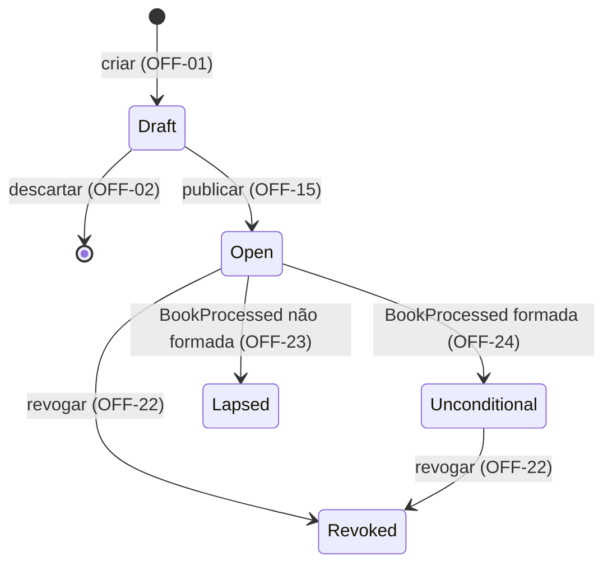
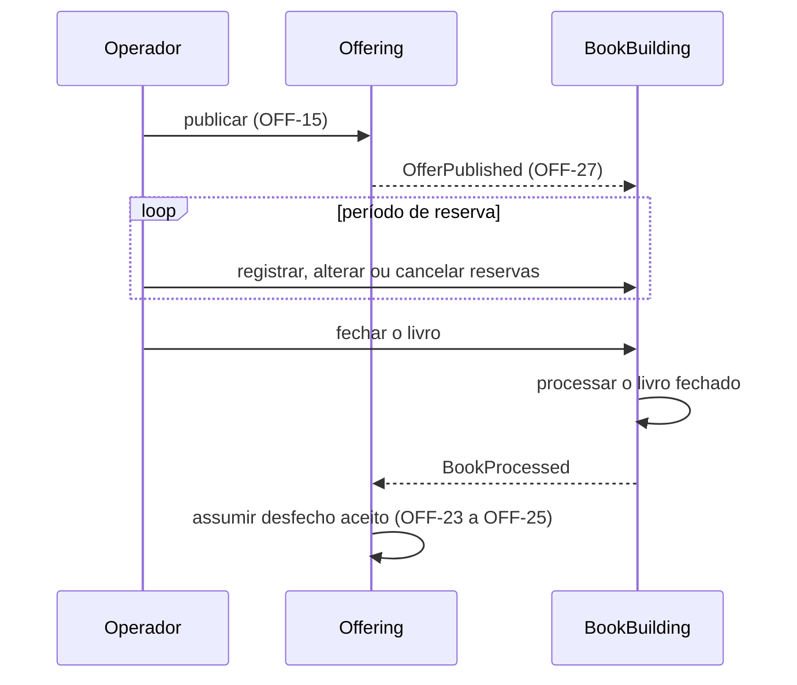
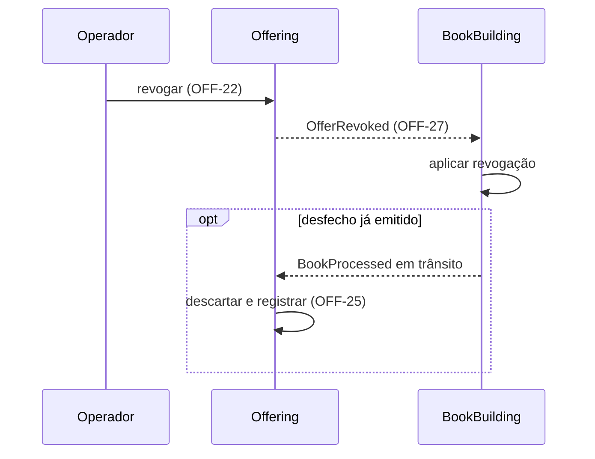

# Ciclo de Vida da Oferta

| | |
| --- | --- |
| **Requirement Prefix** | `OFF` |
| **Affected Capabilities** | [Livro de Reservas](../bid-book/spec.md), [Processamento do Livro](../book-processing/spec.md) |

## Context

A plataforma modela a distribuição de cotas de classe fechada por uma corretora a investidores finais, e o operador da corretora registra as decisões do investidor. A finalidade é demonstrativa, sem operação em produção.

A oferta é a emissão de cotas de uma classe fechada, vendida como um único conjunto. Na Resolução CVM 175 o fundo se organiza em classes e subclasses; como a classe fechada não admite resgate, a distribuição é o único momento de decisão de investimento que o modelo cobre.

As capabilities do BookBuilding dependem da oferta. O [Livro de Reservas](../bid-book/spec.md) precisa do estado, dos limites e das opções da oferta para aceitar uma reserva, e o [Processamento do Livro](../book-processing/spec.md) precisa de quantidade base e montante mínimo fixos. Se esses parâmetros mudassem depois da publicação, os pedidos e o resultado ficariam inconsistentes. Por isso esta capability impede publicações inválidas, alterações da definição publicada e transições fora do ciclo.

O operador de distribuição da corretora é o consumidor primário: cadastra a oferta a partir dos documentos aprovados, publica, revoga quando necessário e acompanha o desfecho. As capabilities do BookBuilding recebem a definição publicada e o estado da oferta e confiam que a definição não muda. O investidor não interage com esta capability; o ponto de contato dele é a reserva.

O Offering, dono desta capability, é upstream: o BookBuilding consome a definição e o estado da oferta sem alterá-los, e mudanças incompatíveis de contrato partem do Offering. O desfecho do livro faz o caminho inverso: o BookBuilding o apura e o Offering o assume como estado final da oferta (OFF-23 a OFF-25). Cada contexto mantém sua própria persistência, e os dois se comunicam por eventos.

O contrato consolida as decisões de produto do autor e a leitura das normas listadas em References. O código do contexto fica em `src/Offering`.

## Scope

Entram a elaboração da oferta em Draft, a definição e seus atributos, a publicação com validação, a imutabilidade da definição publicada, a consulta pelo operador, a revogação, a emissão dos eventos da oferta e a recepção do desfecho do livro.

Ficam fora:

- séries como nível de processamento, tranches, lote adicional (CVM 160, art. 50), outros critérios de rateio, efeito da categoria do investidor, direito de preferência e sobras de subscrição;
- liquidação financeira, restituição aos investidores, anúncio de encerramento (art. 76) e integrações externas: a oferta não tem estado posterior ao desfecho, e a plataforma não conhece o prazo real da revogação, que depende da liquidação;
- modificação de atributos (arts. 67, I e II, e 69), redução da quantidade base e suspensão de oferta publicada;
- cadastro de fundos, classes, subclasses e investidores, documentos da oferta e registro na CVM (arts. 57 e 65);
- calendário de dias úteis: o período de reserva é um intervalo de instantes;
- eventos para Formada e Não formada: `OfferBecameUnconditional` e `OfferLapsed` são candidatos, condicionados à existência de consumidores.

## Assumptions

- **Os identificadores em inglês do Glossary são propostas.** Nenhum tipo de domínio em `src/Offering` os fixa, e a convenção do projeto pede o identificador canônico antes de o nome entrar no código. Escolha: os identificadores da tabela. Se um for rejeitado, o nome muda sem custo de migração enquanto nenhum tipo o usar. Confirmed? n
- **A API do operador responde em JSON com os identificadores do Glossary e sinaliza rejeições com ProblemDetails: 400 para violação de validação, 404 para oferta inexistente e 409 para operação não permitida no estado corrente.** Nenhuma decisão de produto fixa o formato das respostas nem os códigos; os serviços já registram ProblemDetails (`src/ServiceDefaults/ApiDefaultsExtensions.cs:23`) e versionamento por segmento de URL (`src/ServiceDefaults/ApiDefaultsExtensions.cs:19`). Escolha: esses códigos, com as violações de OFF-16 listadas no corpo, e `v1` como primeira versão, com mudança incompatível publicada em nova versão. Se for falsa, mudam os códigos e o corpo das respostas antes de existir consumidor da API. Confirmed? n
- **A lista de ofertas do operador (OFF-20) inclui todos os estados, segue a ordem de criação e é vazia quando não há ofertas.** Nenhuma decisão de produto define a apresentação da lista; o operador precisa ver os Drafts para editá-los (OFF-02). Se for falsa, muda só a apresentação da consulta. Confirmed? n

## Gaps

| Gap | Affects | Owner |
| --- | --- | --- |
| Tratamento dos espaços nas bordas da identificação das cotas: removê-los na publicação ou rejeitar a publicação | OFF-05; a validação da publicação (OFF-15, OFF-16) e a definição levada por `OfferPublished` | Autor |
| Comparação entre identificações das cotas: se alguma operação as compara e, nesse caso, com ou sem distinção de caixa | Nenhum requisito atual; define o comportamento de uma futura busca ou conferência de duplicidade | Autor |
| Conjunto de opções informado em oferta que não admite distribuição parcial: rejeitar a publicação ou ignorar o conjunto; o caso com opções vazias já está definido | OFF-13; a validação da publicação e a definição levada por `OfferPublished` | Autor |
| Autenticação e autorização do operador: quem pode criar, editar, publicar, revogar e consultar ofertas, e que identidade é registrada como autor das transições | OFF-01, OFF-02, OFF-15, OFF-20, OFF-22, OFF-31 | Autor |

## Glossary

Reserva, investidor e fechamento do livro são definidos no [Livro de Reservas](../bid-book/spec.md). Formação e desfecho são definidos no [Processamento do Livro](../book-processing/spec.md).

| Term | Identifier | Definition |
| --- | --- | --- |
| Oferta | `Offer` | Emissão de cotas de uma classe fechada, distribuída como um conjunto |
| Identificação das cotas | — | Fundo, classe, subclasse e número da emissão (OFF-04 a OFF-06) |
| Fundo, classe, subclasse | `Fund`, `ShareClass`, `ShareSubclass` | Objeto da emissão (OFF-04) |
| Número da emissão | `IssueNumber` | Identificação ordinal da emissão de cotas (OFF-04) |
| Nome da oferta | `Name` | Rótulo descritivo, sem função de chave (OFF-03, OFF-06) |
| Draft | `Draft` | Definição em elaboração (OFF-01, OFF-02) |
| Oferta publicada | — | Oferta cuja definição foi comprometida pela publicação (OFF-15, OFF-18) |
| Publicação | `Publish` | Ação que valida a definição e leva a oferta a `Open` (OFF-15) |
| Revogação | `Revoke` | Ação que torna a oferta ineficaz (OFF-22) |
| Desfecho do livro | `Outcome` | Formada (`Unconditional`) ou Não formada (`Lapsed`), apurado pelo [Processamento do Livro](../book-processing/spec.md) e assumido como estado da oferta (OFF-23 a OFF-25) |
| Preço por cota | `UnitPrice` | Valor unitário da emissão (OFF-07) |
| Quantidade base | `BaseQuantity` | Número de cotas inicialmente ofertado (OFF-08) |
| Montante mínimo | `MinimumQuantity` | Limiar de formação expresso em cotas (OFF-12) |
| Distribuição parcial admitida | `AllowsPartialDistribution` | A oferta admite colocação abaixo da base, sujeita ao montante mínimo, quando o montante mínimo é menor que a quantidade base (OFF-13) |
| Investimento mínimo e máximo | `MinimumInvestment`, `MaximumInvestment` | Limites em cotas por investidor (OFF-09, OFF-10) |
| Período de reserva | `BidPeriod` | Intervalo fechado de instantes, com início e fim (OFF-11) |
| Opção de condicionamento | `ConditionOption` | Condição que o investidor escolhe na reserva para o caso de distribuição parcial; valor do conjunto aceito pela oferta (OFF-14) |
| Opções aceitas | `AcceptedConditionOptions` | Conjunto de opções de condicionamento que a oferta aceita (OFF-14) |

## Requirements

O diagrama mostra todas as transições permitidas (OFF-21). O fechamento do livro não muda o estado da oferta, que continua `Open` até receber o desfecho.

| State | Identifier | Meaning |
| --- | --- | --- |
| Draft | `Draft` | Minuta em elaboração (OFF-01, OFF-02, OFF-19) |
| Aberta | `Open` | Oferta publicada sem desfecho recebido; período de reserva em OFF-11 |
| Formada | `Unconditional` | Desfecho formada recebido (OFF-24); fim do ciclo de sucesso, ainda revogável (OFF-22) |
| Não formada | `Lapsed` | Terminal: desfecho não formada recebido (OFF-23) |
| Revogada | `Revoked` | Terminal por revogação (OFF-22) |

### Draft

- **OFF-01** Toda oferta nasce como Draft; não há criação em outro estado.
- **OFF-02** Draft aceita qualquer combinação de atributos, inclusive ausentes ou inconsistentes, e pode ser editado e descartado sem restrição.

### Definição e atributos

Os requisitos desta seção e da seguinte são as regras que a publicação valida (OFF-15); em Draft vale OFF-02.

- **OFF-03** O nome está presente e não é vazio.
- **OFF-04** A identificação das cotas está presente: fundo, classe e número da emissão são obrigatórios, e a subclasse é opcional.
- **OFF-05** A identificação das cotas de uma oferta publicada não tem espaços nas bordas. O tratamento dos espaços informados está em Gaps.
- **OFF-06** A publicação não exige que o nome nem a identificação das cotas sejam únicos entre as ofertas e não valida a identificação contra cadastro.
- **OFF-07** O preço por cota está presente, é estritamente positivo e é decimal exato com até 8 casas.
- **OFF-08** A quantidade base está presente, é inteira e é maior ou igual a 1.
- **OFF-09** O investimento mínimo por investidor está presente, é inteiro, maior ou igual a 1 e menor ou igual ao investimento máximo.
- **OFF-10** O investimento máximo por investidor está presente, é inteiro e é menor ou igual à quantidade base.
- **OFF-11** O período de reserva tem início e fim presentes, com fim posterior ao início; o início pode estar no passado na publicação. O intervalo é fechado: um instante pertence ao período quando início ≤ instante ≤ fim, e o período terminou quando instante > fim.

### Distribuição parcial e opções

- **OFF-12** O montante mínimo está presente, é inteiro, maior ou igual a 1 e menor ou igual à quantidade base.
- **OFF-13** Com montante mínimo igual à quantidade base, a oferta não admite distribuição parcial e o conjunto de opções não se aplica. O tratamento de um conjunto informado nesse caso está em Gaps.
- **OFF-14** Em oferta que admite distribuição parcial, o conjunto de opções aceitas contém obrigatoriamente as opções 1 e 2 e, a critério do ofertante, a 3. Conjunto sem a 1 ou sem a 2 é rejeitado.

O efeito de cada opção na alocação pertence ao [Processamento do Livro](../book-processing/spec.md).

| Option | Identifier | Meaning |
| --- | --- | --- |
| Colocação total da base | `1` | Condicionada à colocação de toda a quantidade base |
| Mínimo com recebimento integral | `2` | Condicionada ao montante mínimo, recebendo a totalidade reservada |
| Mínimo com recebimento proporcional | `3` | Condicionada ao montante mínimo, recebendo o proporcional |

### Publicação e consulta

- **OFF-15** Publicar é ação explícita, distinta da edição: valida todos os atributos como uma unidade e só leva a oferta a `Open` se nenhuma regra for violada.
- **OFF-16** A rejeição da publicação informa todas as violações de OFF-03 a OFF-14 e de OFF-17, com o atributo e a regra de cada uma.
- **OFF-17** A publicação é rejeitada se o fim do período de reserva já passou no instante da publicação.
- **OFF-18** A alteração de atributo de oferta publicada é rejeitada, com o estado corrente, e a definição permanece a publicada.
- **OFF-19** Nenhum evento é emitido para oferta em Draft; os demais contextos só conhecem a oferta a partir de `OfferPublished`.
- **OFF-20** O operador consulta qualquer oferta e lista as ofertas, inclusive em Draft, com os atributos e o estado corrente.

### Estados

- **OFF-21** As únicas transições são as do diagrama. Qualquer outra transição solicitada pelo operador é rejeitada, com o estado corrente e a transição tentada; o desfecho recebido fora de `Open` segue OFF-25.

### Revogação

- **OFF-22** Revogar é ação explícita do operador, permitida em `Open` e `Unconditional`.

### Desfecho

- **OFF-23** Oferta `Open` que recebe o desfecho não formada passa a `Lapsed`, terminal.
- **OFF-24** Oferta `Open` que recebe o desfecho formada passa a `Unconditional`, fim do ciclo de sucesso.
- **OFF-25** O desfecho só é aceito em `Open`, o que o torna único por oferta. Recebido em qualquer outro estado, inclusive `Revoked` ou depois de outro desfecho, é ignorado sem alterar a oferta e registrado como descartado.

### Integridade, eventos e rastreabilidade

- **OFF-26** A validação da publicação e cada transição de estado são atômicas.
- **OFF-27** A publicação e a revogação aceitas registram o evento correspondente na mesma operação atômica: não existe publicação ou revogação sem o evento, nem evento de operação rejeitada ou desfeita.
- **OFF-28** Cada evento registrado é entregue aos consumidores ao menos uma vez, inclusive depois de falha do Offering ou do transporte.
- **OFF-29** A recepção de `BookProcessed` que falha é repetida até o desfecho ser aplicado (OFF-23, OFF-24) ou descartado (OFF-25).
- **OFF-30** As operações sobre a mesma oferta (edição, publicação, revogação e recepção do desfecho) são aplicadas uma de cada vez: cada uma parte do estado deixado pela anterior.
- **OFF-31** Toda transição registra quem ou qual contexto a disparou e quando; o desfecho descartado (OFF-25) também.
- **OFF-32** O preço por cota é armazenado e devolvido sem arredondamento binário.

### Interação com o BookBuilding

Os diagramas mostram a ordem lógica entre os contextos; as regras do BookBuilding estão nas specs dele.

A revogação parte do Offering (OFF-22) e chega ao BookBuilding por `OfferRevoked`. Como os eventos podem chegar repetidos e fora de ordem, cada contexto converge ao mesmo estado final pelas próprias regras de recepção; no Offering, o desfecho emitido antes de a revogação chegar ao BookBuilding é descartado (OFF-25).

## Domain Events

| Event | Trigger | Content | Consumers |
| --- | --- | --- | --- |
| `OfferPublished` | Publicação aceita (OFF-15, OFF-27) | Oferta, estado resultante `Open`, instante da publicação e definição completa | [Livro de Reservas](../bid-book/spec.md), que passa a aceitar reservas e descarta a repetição; [Processamento do Livro](../book-processing/spec.md), que usa a definição publicada como entrada |
| `OfferRevoked` | Revogação aceita (OFF-22, OFF-27) | Oferta, estado resultante `Revoked` e instante da revogação | [Livro de Reservas](../bid-book/spec.md), que torna as reservas sem efeito, inclusive quando o evento chega antes de `OfferPublished`; [Processamento do Livro](../book-processing/spec.md), que interrompe o processamento pendente |

A entrega é ao menos uma vez (OFF-28), sem garantia de ordem: um consumidor pode receber o mesmo evento mais de uma vez e pode receber `OfferRevoked` antes de `OfferPublished` da mesma oferta. A oferta consome `BookProcessed`, definido pelo [Processamento do Livro](../book-processing/spec.md) (ALLOC-28), nas condições de OFF-23 a OFF-25.

## Acceptance Scenarios

Base válida: identificação completa, nome preenchido, preço 100, quantidade base 1000, montante mínimo 600, investimento mínimo 10 e máximo 500, período futuro e opções {1, 2, 3}. Cada cenário parte de um Draft independente, salvo indicação.

| Scenario | Input | Condition | Requirements | Result |
| --- | --- | --- | --- | --- |
| Publicação válida | Base válida; dois Drafts com o mesmo nome | Limites coerentes | OFF-03, OFF-06, OFF-15 | Ambas `Open`; atributos publicados iguais aos informados |
| Identificação repetida | Base válida; dois Drafts com a mesma identificação das cotas | Nenhuma validação contra cadastro | OFF-06 | Ambas `Open` |
| Violações combinadas | Base válida sem número da emissão; preço 0; investimento mínimo 500 e máximo 10 | 0 não é positivo; 500 > 10 | OFF-04, OFF-07, OFF-09, OFF-16 | Draft preservado; três violações, com atributo e regra |
| Período em curso | Início ontem; fim amanhã | Publicação dentro do intervalo | OFF-11, OFF-17 | `Open` |
| Período expirado | Início anteontem; fim ontem | Período válido; instante > fim | OFF-17 | Publicação rejeitada |
| Preço exato | Preço 96,53420001 | Oito casas decimais | OFF-07, OFF-32 | A consulta devolve 96,53420001 |
| Sem distribuição parcial | Montante mínimo 1000; opções vazias | Montante mínimo = quantidade base | OFF-13 | Publicação aceita |
| Opções incompletas | Montante mínimo 600; opções vazias ou {1, 3} | Falta opção obrigatória | OFF-14 | Publicação rejeitada |
| Opções obrigatórias | Montante mínimo 600; opções {1, 2} | Opção 3 omitida | OFF-14 | Publicação aceita |
| Edição após publicação | Alteração de um atributo | Oferta `Open` | OFF-18 | Alteração rejeitada com o estado `Open`; definição idêntica |
| Draft sem evento | Criação e edição de um Draft | Oferta em Draft | OFF-19 | Nenhum evento emitido |
| Consulta de Draft | Operador consulta a oferta | Oferta em Draft com atributos incompletos | OFF-20 | Atributos informados e estado Draft |
| Evento da publicação | Publicação aceita | Base válida | OFF-27 | `OfferPublished` com a definição publicada |
| Publicação rejeitada sem evento | Publicação com violação | Preço 0 | OFF-27 | Nenhum `OfferPublished` |
| Entrega após falha | Offering falha logo depois de confirmar a publicação | Evento registrado e ainda não entregue | OFF-28 | `OfferPublished` é entregue depois da recuperação |
| Desfecho não formada | `BookProcessed` com desfecho `Lapsed` | Oferta `Open` | OFF-23 | `Lapsed` |
| Desfecho formada | `BookProcessed` com desfecho `Unconditional` | Oferta `Open` | OFF-24 | `Unconditional` |
| Falha na recepção do desfecho | `BookProcessed` formada; a primeira aplicação falha | Oferta `Open` | OFF-29 | A recepção é repetida, e a oferta passa a `Unconditional` uma única vez |
| Revogação de oferta aberta | Operador revoga | Oferta `Open` | OFF-22, OFF-27 | `Revoked` e `OfferRevoked` emitido |
| Revogação de oferta formada | Operador revoga | Oferta `Unconditional` | OFF-22 | `Revoked` |
| Revogação concorrente com desfecho | Operador revoga enquanto chega `BookProcessed` formada | Oferta `Open` | OFF-25, OFF-30 | Em qualquer ordem, o estado final é `Revoked` e `OfferRevoked` é emitido uma vez |
| Desfecho fora de Aberta | `BookProcessed` | Oferta `Revoked`, `Unconditional` ou `Lapsed` | OFF-25, OFF-31 | Oferta inalterada; desfecho registrado como descartado |
| Transição inválida | Transição solicitada pelo operador | Oferta terminal; ou revogação de Draft ou de `Lapsed` | OFF-21 | Rejeição com o estado corrente e a transição tentada |

## Observable Decisions

| Surface or dimension | Landing |
| --- | --- |
| API do operador: operações | Criar, editar e descartar Draft (OFF-01, OFF-02), publicar (OFF-15), revogar (OFF-22), consultar e listar (OFF-20) |
| API do operador: formato da resposta, do erro e códigos | Premissa do contrato HTTP; conteúdo das rejeições em OFF-16, OFF-18 e OFF-21 |
| API do operador: versionamento e compatibilidade | Premissa do contrato HTTP |
| Consulta: estado vazio e ordenação | Premissa da lista de ofertas |
| Autorização | Lacuna de autenticação e autorização do operador |
| Validação e limites | OFF-03 a OFF-14 e OFF-17; OFF-02 dispensa validação em Draft |
| Transições de estado | OFF-21 e o diagrama; OFF-22 a OFF-25 |
| Falha e falha parcial | OFF-26 a OFF-29 |
| Idempotência e duplicação | Desfecho repetido é descartado (OFF-25); publicar ou revogar de novo é transição fora do diagrama (OFF-21); os consumidores tratam eventos repetidos (Domain Events) |
| Concorrência e ordenação | OFF-30; eventos sem ordem garantida (Domain Events) |
| Consistência entre capabilities | OFF-27 a OFF-29 e as regras de recepção dos consumidores (Domain Events) |
| Observabilidade | OFF-31 |
| Ciclo de vida dos dados | Draft descartável (OFF-02); definição publicada imutável (OFF-18) |
| `n/a` | Tela: o operador usa a API; limite de taxa: plataforma demonstrativa operada só pela corretora; falha de dependência externa: sem integração externa |

## Trade-offs

| Decision | Cost | Reason |
| --- | --- | --- |
| Identificação completa das cotas sem cadastro nem unicidade (OFF-04, OFF-06) | Erro de digitação e oferta duplicada passam | É o nome real da oferta; unicidade sobre texto sem cadastro seria garantia falsa |
| Nome como rótulo (OFF-03, OFF-06) | Ninguém localiza a oferta pelo nome com segurança | O mercado identifica a oferta pela emissão |
| Série fora do escopo, com caminho previsto (OFF-04) | Emissão com várias séries não é representável | Com a identificação das cotas, cada série entra como uma oferta |
| Publicação com período já em curso (OFF-11) | A demanda do trecho anterior à publicação não existe no livro | A oferta vai a mercado pelos documentos; rejeitar não protege nenhuma invariante |
| Publicação valida tudo, Draft não valida nada (OFF-02, OFF-15) | Sem sinal incremental durante a elaboração | Separa elaboração de compromisso |
| Montante mínimo em cotas (OFF-12) | Os documentos da oferta usam reais | O art. 73 admite as duas formas; com preço fixo são equivalentes, e cotas eliminam arredondamento |
| Conjunto de opções com dois valores obrigatórios (OFF-14) | Estrutura de conjunto para um grau de liberdade | Preserva a regra de que a opção da reserva pertence ao conjunto aceito e prepara o art. 75 |
| `Revoked` e `Lapsed` como estados distintos, sem campo de motivo (OFF-22, OFF-23) | Dois insucessos com o mesmo efeito no livro, distinguíveis só pelo estado da oferta | Bases regulatórias diferentes (art. 68 e art. 73, § 3º) e origens diferentes: ação do operador e desfecho do processamento |
| Desfecho assumido como estado final da oferta (OFF-23 a OFF-25) | A formação vive em dois lugares, apurada no BookBuilding e espelhada aqui; o Offering, upstream, muda de estado por evento do contexto que o consome; nenhum estado da oferta reflete o livro fechado; os contextos divergem até o desfecho chegar | Sem liquidação modelada, não há operação da plataforma depois do desfecho, então ele encerra o ciclo; o espelho é escrito uma vez, só em `Open` (OFF-25), e nunca recalculado |
| Sem estado de encerramento nem registro de liquidação (OFF-22, OFF-24) | `Unconditional` permanece revogável sem prazo, porque a plataforma não sabe quando a oferta encerrou; bloquear a revogação depois da liquidação exigiria registrar esse fato externo e revisar o ciclo | A liquidação está fora do modelo; um estado terminal que dependesse dela seria alimentado por informação externa digitada pelo operador |
| Entrega ao menos uma vez, sem ordem garantida, com convergência nos consumidores (OFF-27 a OFF-29) | Cada consumidor precisa de regras para repetição e ordem; entre a revogação e a chegada de `OfferRevoked`, o BookBuilding ainda aceita reservas e pode fechar e processar o livro, que depois ficam sem efeito | Não depende de ordenação do transporte, que ainda não foi escolhido; como a revogação é terminal e a definição publicada é imutável, regras de precedência bastam para convergir; consistência imediata entre dois serviços com persistência própria exigiria transação distribuída |

## References

- [Resolução CVM 160](https://conteudo.cvm.gov.br/export/sites/cvm/legislacao/resolucoes/anexos/100/resol160consolid.pdf), lida em 2026-09-05. Art. 73: o ato define o tratamento da distribuição parcial e o mínimo, em quantidade ou montante, e o § 3º exige restituição integral quando o mínimo não é atingido (OFF-12, OFF-23). Art. 74: o investidor opta entre a totalidade e o mínimo (OFF-14). Arts. 67, III, e 68: a revogação deferida pela CVM torna ineficazes a oferta e as aceitações (OFF-22); o deferimento não é modelado. Arts. 50, 57, 65, 67, I e II, 69, 75 e 76 delimitam o Scope.
- [Resolução CVM 175](https://conteudo.cvm.gov.br/export/sites/cvm/legislacao/resolucoes/anexos/100/resol175consolid.pdf), lida em 2026-09-05. Art. 5º, §§ 5º e 7º: o fundo se organiza em classes e subclasses (OFF-04).
